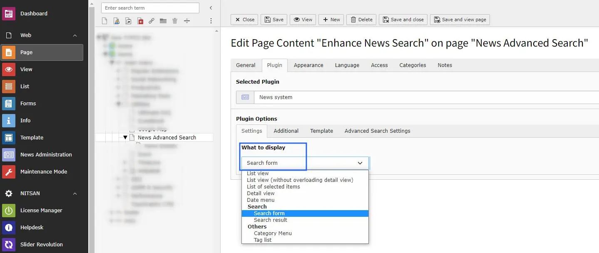
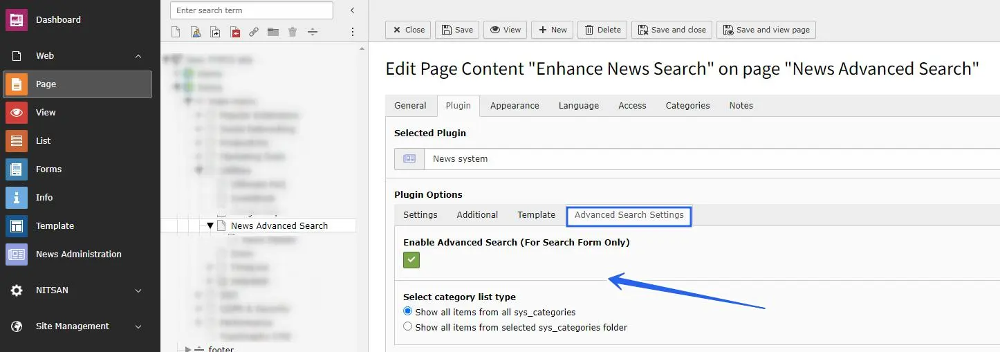
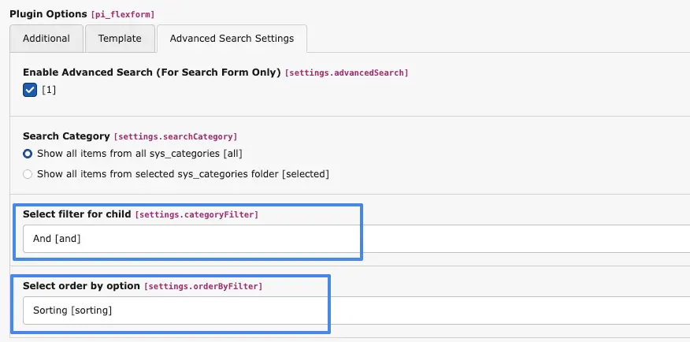

Add the News System plugin from the **Add New Element** popup.

# 1.1 Add News Form

- **News System** -> Select the News form in the News System plugin and save.
  After that, you will see the **Advance Search Settings** tab.

# 1.2 Advance Search Settings

- **Enable Advance Search** -> Enable this checkbox to show the search form on the frontend.
- **Category List** -> Choose one option:
  show categories from all system category folders, or show categories only from selected folders.
- **Select filter for child category** -> You have two options: `OR` and `AND`.
  With `OR`, child categories are matched in OR mode.
  With `AND`, child categories are matched in AND mode.

Example:

1. **Choose "OR" for child category filter**, the result will be:

> - [Child Category 1 OR Child Category 2] AND [Child Category 1 OR Child Category 1]

2. **Choose "AND" for child category filter**, the result will be:

> - [Child Category 1 AND Child Category 2] AND [Child Category 1 AND Child Category 2]

Note: between main categories, the relation is always `AND`.

- **Select order by option** -> A select box is provided with options for **Sorting** and **Parent**.
  When the user selects **Sorting**, the categories are displayed based on the defined sorting order.
  When the user selects **Parent**, the categories are displayed based on their parent-child hierarchy.

That is all. Your advanced search form is now shown on your website.
