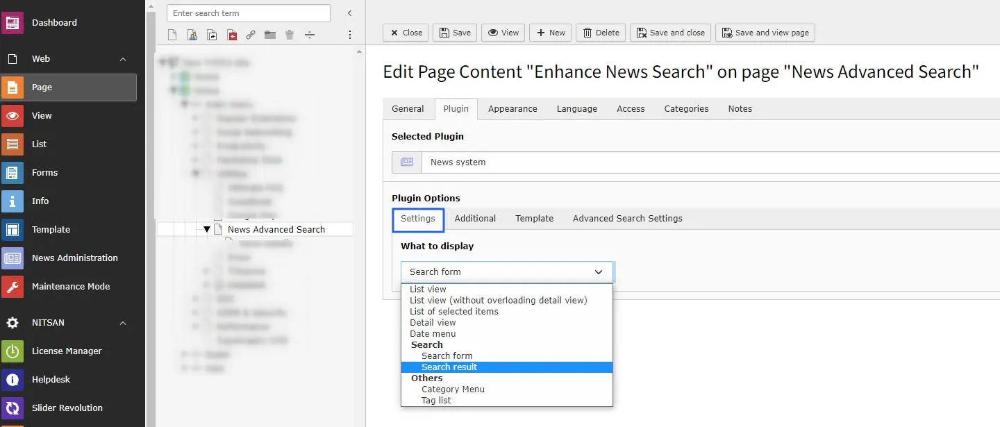

Add News System plugin & select the search option from setting tab.

**Title** : Set title of the location.

**Map**: Set Location Name and click on update button. If found, location will be highlighted on map below it.

**Image for Marker**: You can set marker image for this location.

**Lat/Long & Address**: Latitude, Longitude and Address textboxes will be auto-generated with location selected above.

**Infocontent**: Set the address you want to display with Location title in plugin

**View Goole Map Link**: Check this if you want to display Google Map link along with Location details.

**Interaction**: Set how location popup will behave in Plugin.
