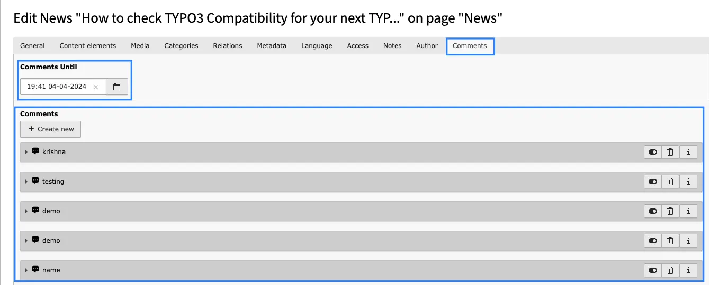
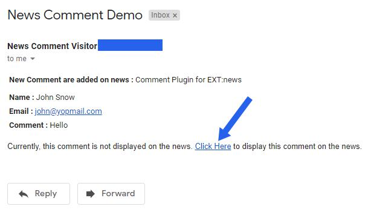

## Comment Moderation

If "Set Approval by admin" is checked in Constants then Comments added by visitors will not be displayed automatically on News Page. Admin need to approve these comments to display on News page.

**Comment until:** Users are allowed to leave comments up until the specified date.Eg if admin set any date eg.12:00 01-01-2030,user can comment until that date and time,after that date user will not be able to add comments in that new.

Admin can approve comments by following ways:

**1. Approve Comment from News at backend:** All comments added in any News are stored in Comments tab of News record in backend. By default, comment is disabled and thus it is not displayed at News page. Once Admin enables the comment at News record, that comment will be visible at News page.

**2. Approve Comment from email sent to Admin:** If Email Configuration is set at constants then Admin will get email for every comment posted. Admin can approve comment from link available at the bottom of Email

That’s it, Now you can enjoy comments of your website visitors :)
