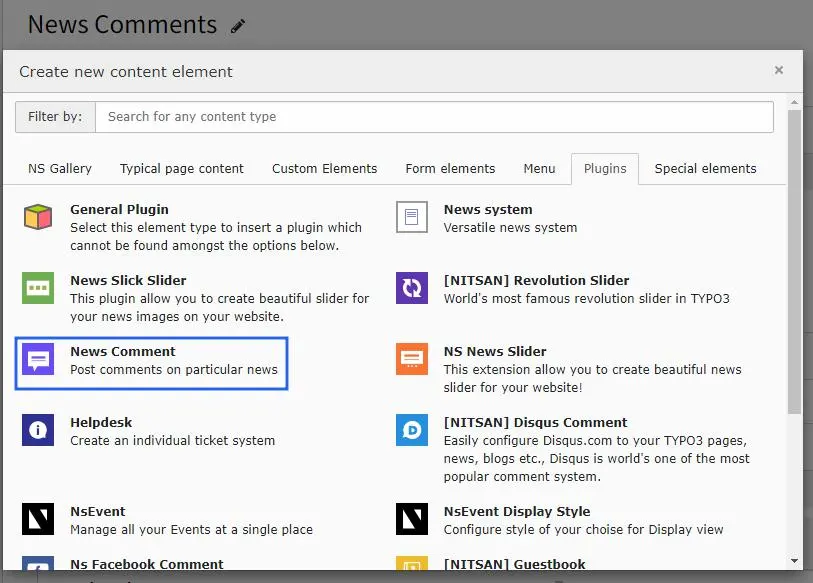
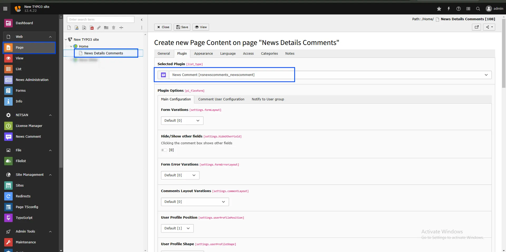
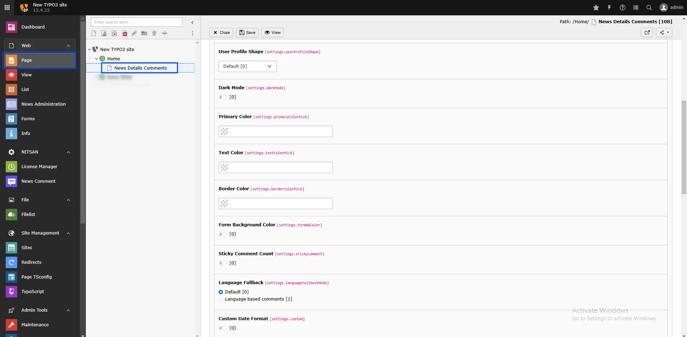
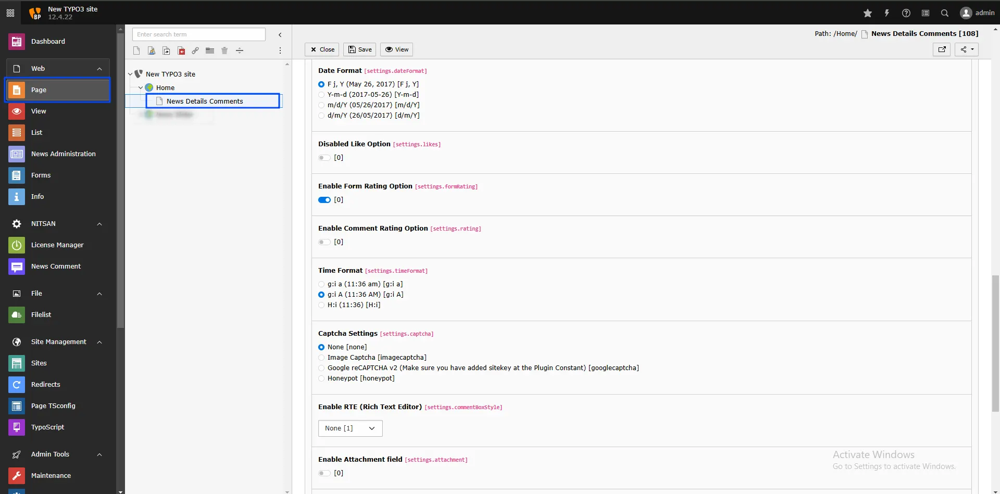
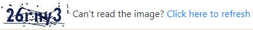
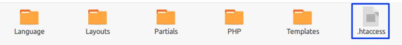
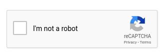
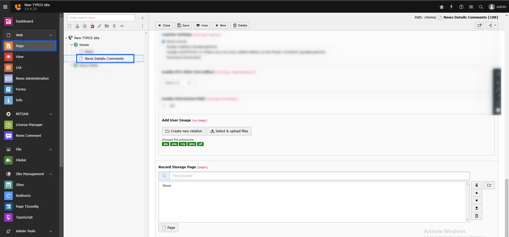

## Adding the Comment Plugin

You can add the News Comment plugin from the "Add Element" wizard.

Once added, configure the settings for the Comment plugin as follows:

**Main Configuration**

**Form Layout Variations:** Defines the overall layout style of the form.

**Hide/Show Other Fields:** Toggles additional fields when the comment box is clicked.

**Form Error Variations:** Sets the style for displaying form error messages.

**Comments Layout Variations:** Controls the layout style of the displayed comments.

**User Profile Position:** Determines the position of the user profile display.

**User Profile Shape:** Specifies the shape of the user profile display.

**Dark Mode:** Enables dark mode for the form.

**Primary Color:** Sets the main color for form elements.

**Text Color:** Determines the color of the form’s text.

**Border Color:** Sets the border color of the form fields.

**Form Background Color:** Specifies the form's background color.

**Sticky Comment Count:** Shows the number of comments on the sticky comment icon.

**Language Fallback:** This option helps display comments in different site languages.

**Custom Date Format:** Enables custom date formatting for comments.

**Date Format:** Selects the format for displaying dates (e.g., F j, Y or Y-m-d).

**Disabled Like Option:** Hides the like/unlike buttons on comments.

**Enable Form Rating Option:** Allows users to rate the form itself.

**Enable Comment Rating Option:** Enables rating for individual comments.

**Time Format:** Sets the display format for time (e.g., ga or H).

**Captcha Settings:** Configures CAPTCHA to prevent spam, with options including:

- **None:** Disables CAPTCHA.

- **Image Captcha:** Displays an image-based CAPTCHA for users.

  If using the free version with CAPTCHA enabled, the image CAPTCHA will appear in the comment form.

<Note>

If you select Image Captcha, you need to rename `_.htaccess` to `.htaccess` in the folder `/typo3conf/ext/ns_news_comments/Resources/Private/`.

</Note>

- **Google reCAPTCHA v2:** Shows Google reCAPTCHA v2. Ensure you add your site key in the plugin constants.

**Enable RTE (Rich Text Editor):** Allows rich text editing in the comment box.

**Enable Attachment Field:** Adds an attachment upload option to the comment form.

**Add User Image:** Allows users to upload a profile image with their comments.

**Record Storage Page:** Defines the page where form records will be stored.
