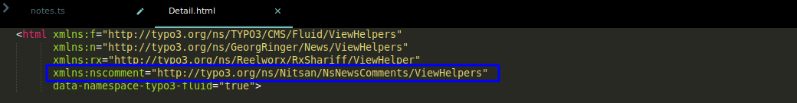
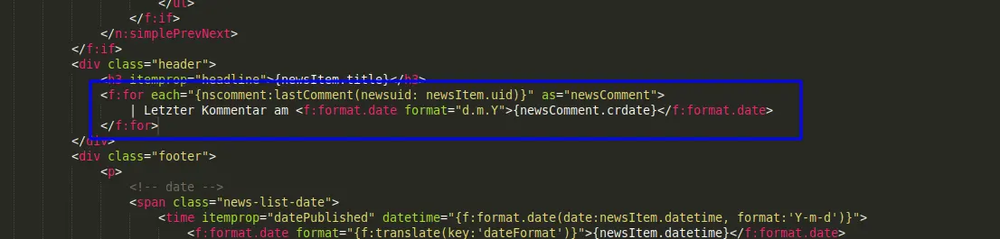
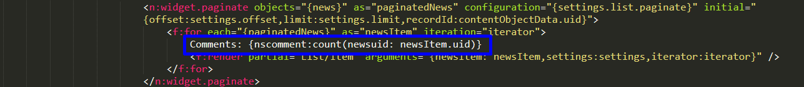
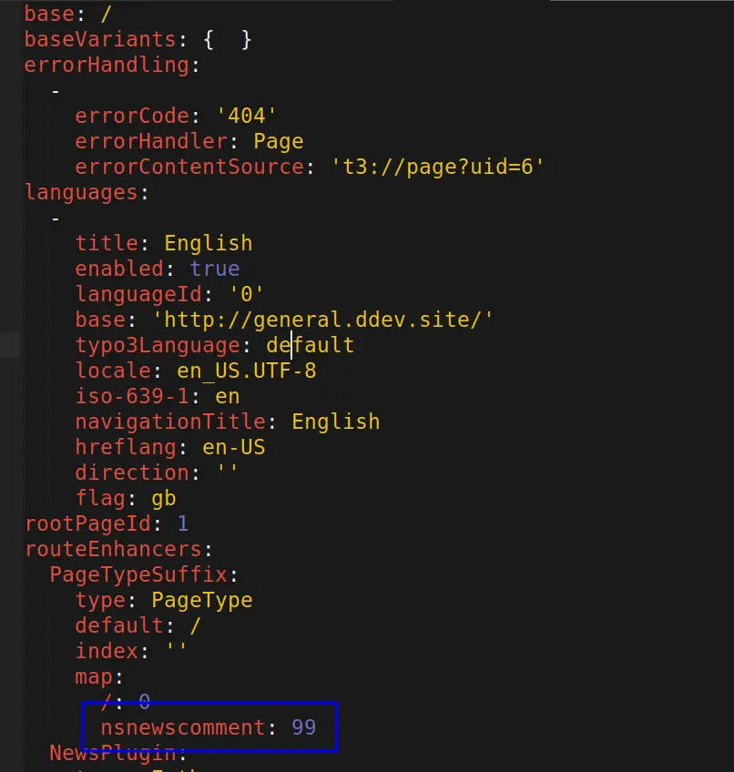

## ViewHelpers

We have added a few ViewHelpers with this extension to get date of last comment in a News and to get count of number of comments in each News.

For this, you have to add a Namespace of ViewHelper.

```language
xmlns:nscomment="http://typo3.org/ns/Nitsan/NsNewsComments/ViewHelpers"
```

Check this for more details:



## Get Date of Last comment in a News

To get date of last comment in a news, add following code.

```language
<f:for each="{nscomment:lastComment(newsuid: newsItem.uid)}" as="newsComment">
 | Last Comment on <f:format.date format="d.m.Y">{newsComment.crdate}</f:format.date>
</f:for>
```

Check this for more details:



## Get count of number of comments in a News

To get date of last comment in a news, add following code in List.html

```language
Comments: {nscomment:count(newsuid: newsItem.uid)}
```

Check this for more details:



<Note>
Above ViewHelpers are supported in V8, V9 & V10 only.
</Note>

## Routing in TYPO3 9 & 10

Since version 9.5, TYPO3 supports speaking URLs and if you have used the typeNum for any Ajax related work then you also need to add **routeEnhancers** like **routeEnhancers > PageTypeSuffix > map > nsnewscomment: 99** in your site configuration.

```YAML
routeEnhancers:
  PageTypeSuffix:
    type: PageType
    default: /
    index: ''
    map:
      /: 0
      nsnewscomment: 99
```


