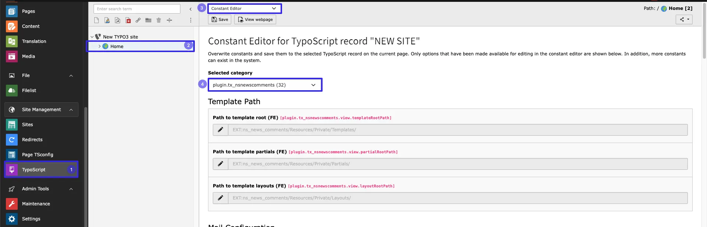
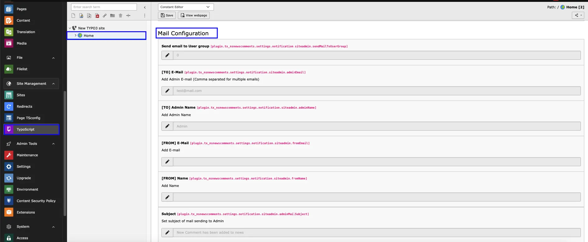
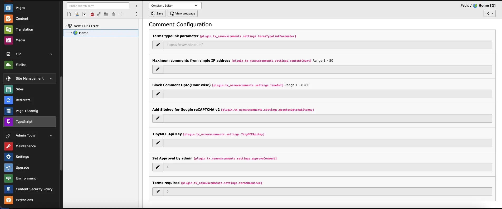
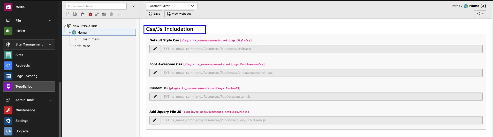
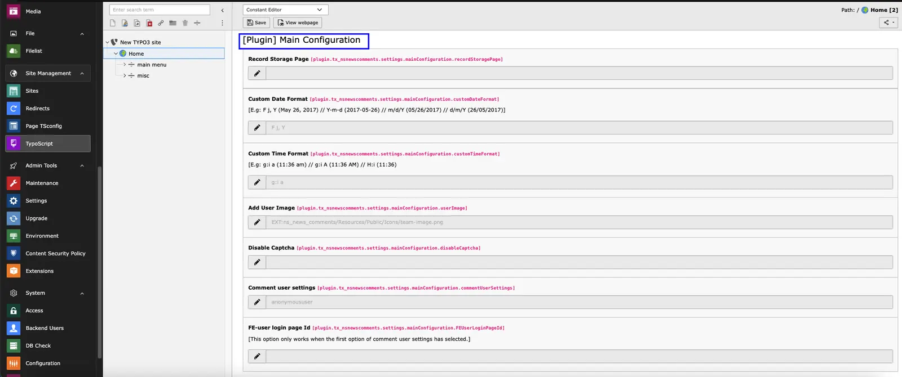
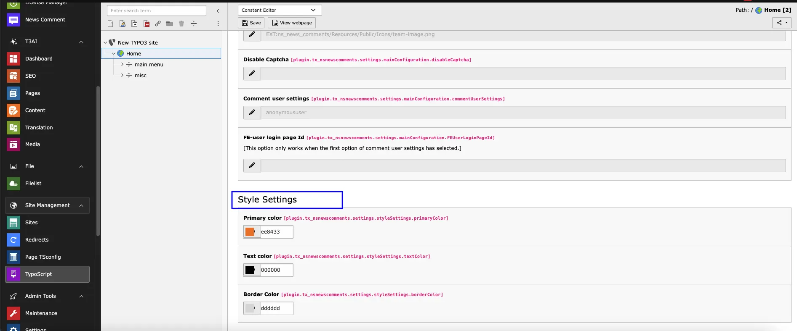

## Default settings from Constants

First of all, Configure Default settings in Constants

- Step 1: Go to Typoscrip.
- Step 2: Select root page.
- Step 3: Select Constant Editor from drop-down.
- Step 3: Select Constant Editor > PLUGIN.TX_NSNEWSCOMMENTS.

**Email Configuration**

Here, you can configure the emails received by Admin when visitor add comment.

- **Enable Mail:** Check this checkbox to enable Email to Admin whenever any comment is posted.
- **[TO] E-Mail:** Set the Email address where Email should be sent. Generally it is Admin's email.
- **[TO] Admin Name:** Set the Admin name.
- **[FROM] E-Mail:** Set From Email for email sent to Admin
- **[FROM] Name:** Set Sender Name for email sent to Admin
- **Subject:** Set Email Subject.

**Comment Configuration**

- **Terms typolink parameter:** Set the Terms page URL for above checkbox.
- **Maximum Comments from single IP address:** Set Maximum allow comment from Single IP address for Spam protection
- **Block Comment Upto(Hour wise):** Block comments for defined time interval,it will protect site from adding unnecessary comments
- **Add Sitekey for Google reCAPTCHA v2:** Set Google reCaptcha v2 sitekey. You can get it from here: https://www.google.com/recaptcha/admin/create
- **TinyMCE API key:** Add TinyMCE API key for RTE Style, Here is Ref link for generating API key https://www.tiny.cloud/blog/how-to-get-tinymce-cloud-up-in-less-than-5-minutes/
- **Set Approval by admin:** If this checkbox is checked, only those comments will be published which are enabled by Admin/System user. When visitor add any comment, by default, it will be disabled in backend. Once Admin/system user enables it, it will be displayed on page. If checkbox is unchecked, all comments posted by visitors will be displayed immediately on page.
- **Terms required:** Check this checkbox to add Terms checkbox in Comment form. This will be required field.

**CSS/JS Settings**

Here, you can set your own CSS & JS for this extension.

**Main Configuration**

**Style Settings**

Here you can set default settings of Comments plugin. If any of the field in Comment plugin is not defined, value set here will be used.
