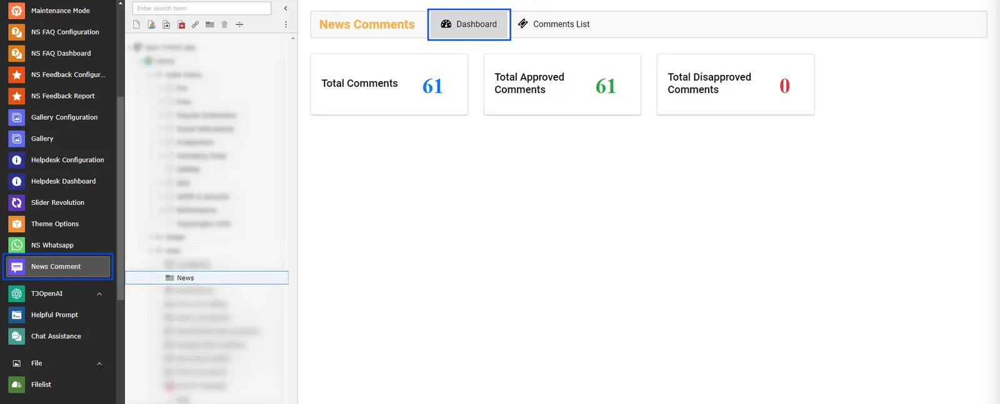
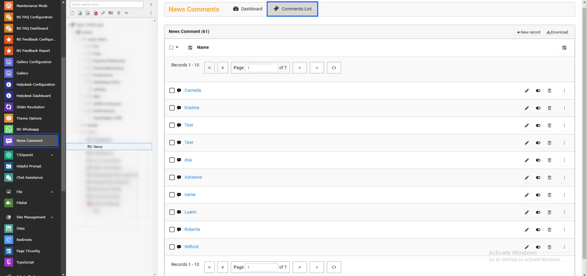

If "Set Approval by admin" is checked in Constants then Comments added by visitors will not be displayed automatically on News Page. Admin Can Approve comments from BE module.
Admin can approve comments by following ways:

<Steps>
  <Step title="Step 1">
Select News Module from Sidebar
  </Step>
  <Step title="Step 2">
Select "News" Folder where News added

You'll see two tabs Dashboard and Comment List, Let's check it one by one how it works.
  </Step>
</Steps>

## Dashboard

In Dashboard you'll see total number of comments,total approved comments and total disapproved comments.

## Comments List

In this you can admin can approve/disapprove and can delete comments.

That’s it, Now you can enjoy comments of your website visitors :)
