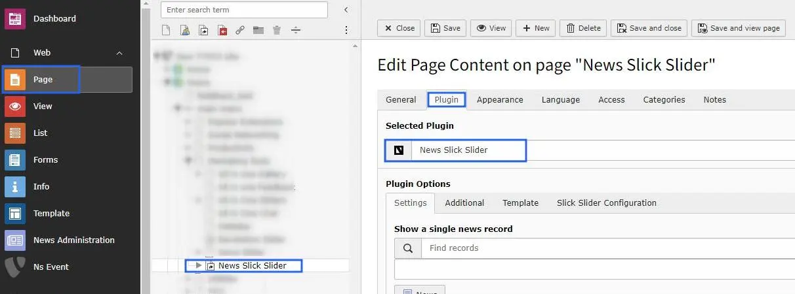
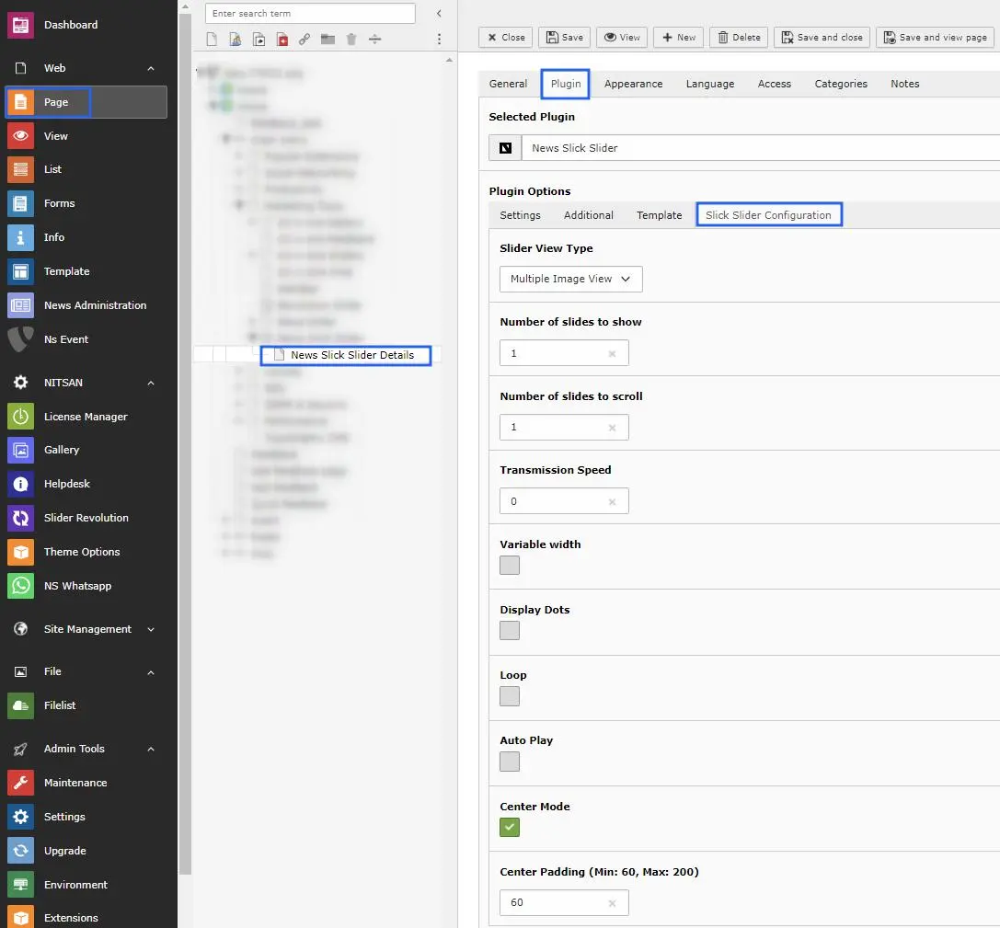
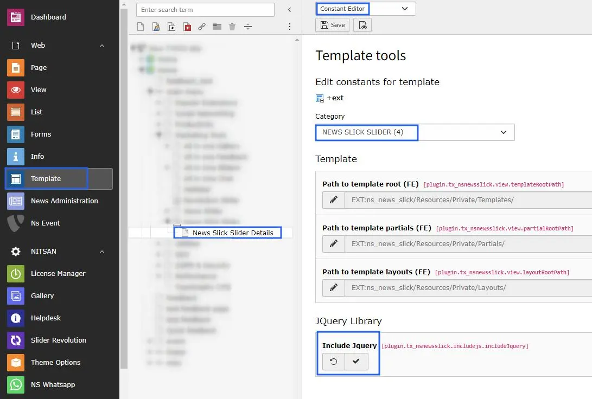

Add News Slick slider Plugin from Add New Element popup into news detail page.

# General Settings of News Slick Slider

- **Step1** -> There are 3 types; single, multiple & responsive image view, choose one of them & apply changes accordingly.
- **Step2** -> Setup number of slides to show on front end.
- **Step3** -> Setup how many slides you want to slide when scroll slider.
- **Step4** -> Choose slider transmission speed.
- **Step5** -> Enable option variable width, if you want.
- **Step6** -> Enable checkbox if you need to display the dots below to the slider.
- **Step7** -> Enable Loop checkbox to set loop upon slider images.
- **Step8** -> If you need to autoplay the slider images then enable the autoplay checkbox.
- **Step9** -> Center mode option facilitates to setup padding on slider.
- **Step10** -> Once you enable the center mode checkbox then you can apply the padding according to your needs.

One more thing i would to share that, You may include the Jquery from constant editor, and can setup the template path. that's it.!

Now check your news record on news detail page with awesome slick slider.!
