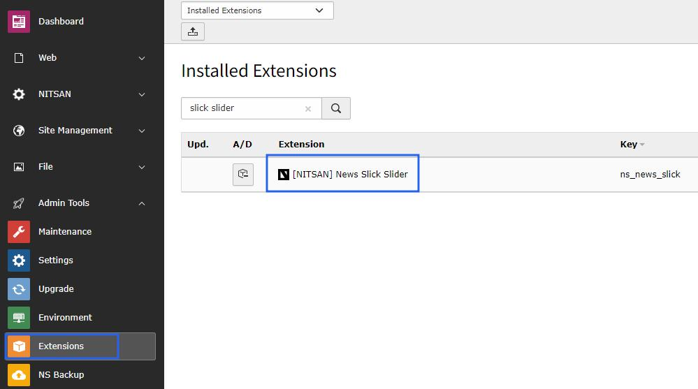
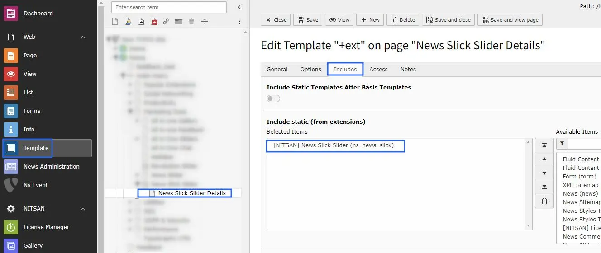
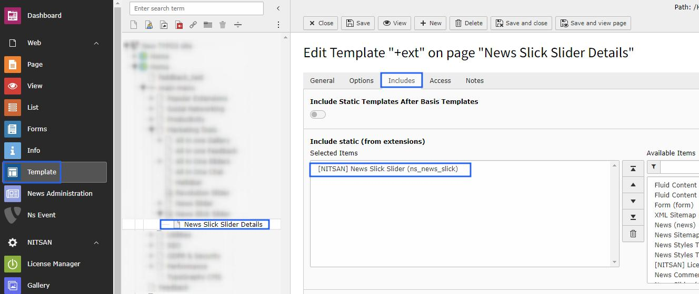

# Installation

Just install this extension the usual way like any other TYPO3 extension..

## For Premium Version - License Activation

To activate license and install this premium TYPO3 product, Please refer this documentation [License documentation](/License/Index)

## For Free Version

In the TYPO3 backend you can use the extension manager (EM).

Step 1. Switch to the module “Extension Manager”.

Step 2. Get the extension.

Step 3. Get it from the Extension Manager: Press the “Retrieve/Update” button and search for the extension key ns_news_slick and import the extension from the repository.

Step 4. Get it from t3planet.de You can always get the current version from https://t3planet.de/news-slick-slider-typo3-extension by downloading. Upload the file afterwards in the Extension Manager.

## Activate the TypoScript

The extension ships some static TypoScript code which needs to be included.

Step 1. Switch to the root page of your site.

Step 2. Switch to the Template module and select Info/Modify.

Step 3. Click the link Edit the whole template record and switch to the tab Includes.

Step 4. Select [NITSAN] News slick slider at the field Include static (from extensions):

Step 5. Include [NITSAN] News slick slider at the last place.

## How to Install TYPO3 Extension ns_newsslickslider

**Extension Installation Via without Composer mode**
https://www.youtube.com/watch?v=SN5HoFQcDM4

**Extension Via Composer**
https://www.youtube.com/watch?v=_7ILu4lwU-k

## Figures

