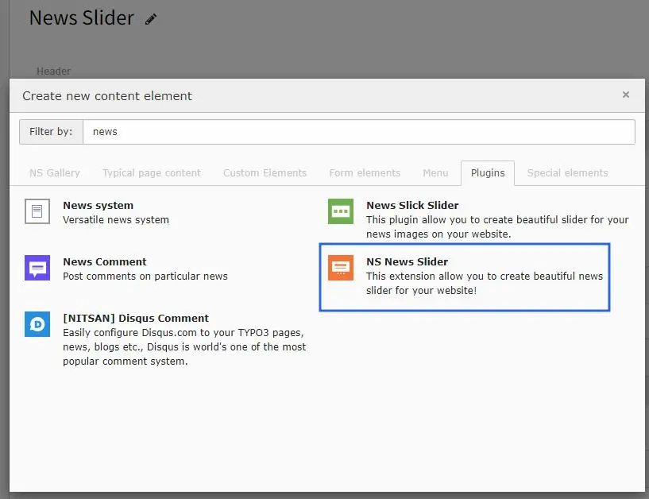
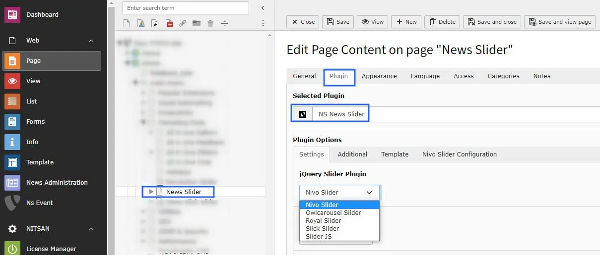

## 1. Add News Slider Plugin

## 2. Select jQuery Slider Plugin

Here you need to select the jquery Plugin for News Slider. Also configure settings related to News (like Storage folder, categories, etc.) in Settings, Additional and Template tabs.

