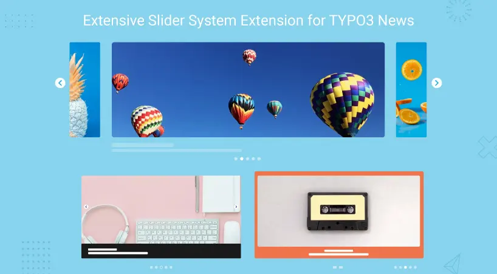

## NS News Slider

## What does it do?

[NITSAN] News Slider Plugin allows you to add, manage and display news, widget, and vertical news scrolling widget on your website. This extension can be used to show the latest news on your website. ns_news_slider is one of the ways to effectively increase the dynamics of the online web space with news archives, scrolling news and thumbnails. Add, manage and remove the news section on your CMS website.

## Helpful Links

<Note>

- **Product:** https://t3planet.de/news-slider-typo3-extension
- **TYPO3 Backend Live Demo:** https://demo.t3planet.de/live-typo3/t3t-extensions/typo3/?TYPO3_AUTOLOGIN_USER=editor-news-slider
- **Front End Demo:** https://demo.t3planet.de/t3t-extensions/news-slider
- To make any domain-related changes or whitelist any development and staging domains, please reach our support center: https://t3planet.de/support

</Note>
