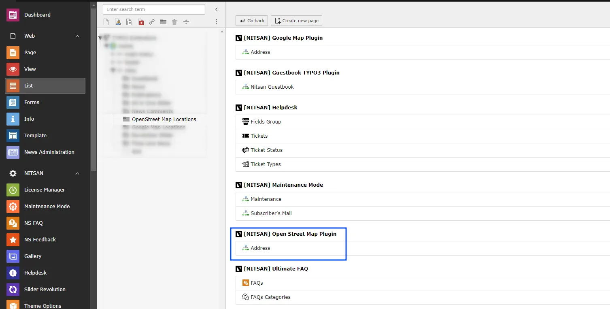
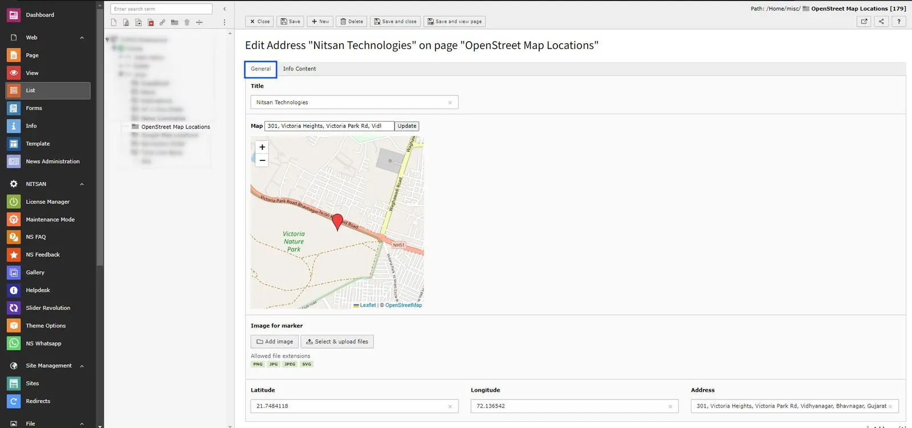
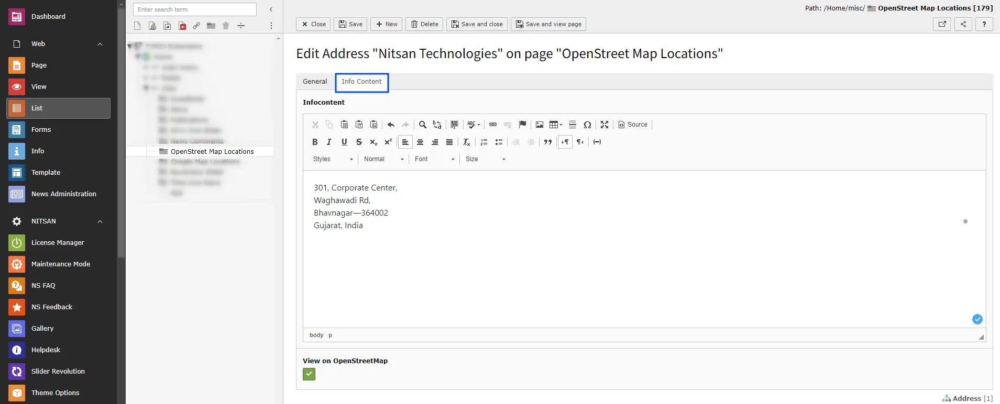

Now, you need to create Locations to display on Map.

You can do it by performing following steps:

Step 1: Create a Storage Folder for Map Locations.

Step 2: Create Map Location in above storage folder.

Now you can fill all the details of location.

**Title** : Set title of the location.

**Map**: Set Location Name and click on update button. If found, location will be highlighted on map below it.

**Image for Marker**: You can set marker image for this location.

**Lat/Long & Address**: Latitude, Longitude and Address textboxes will be auto-generated with location selected above.

**Infocontent**: Set the address you want to display with Location title in plugin

**View OpenStreet Map Link**: Check this if you want to display OpenStreet Map link along with Location details.

This way, create all the locations you want to display on Map.
