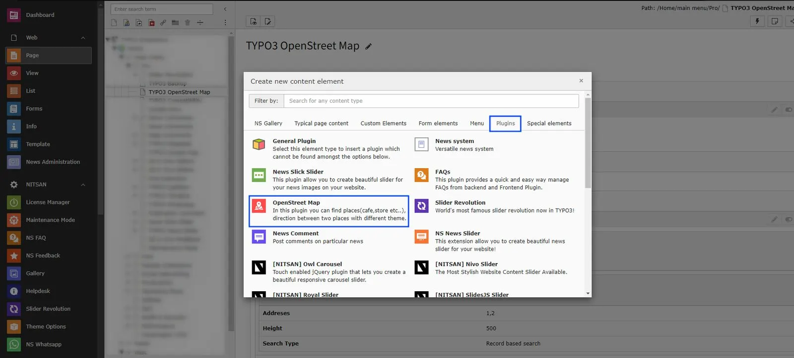
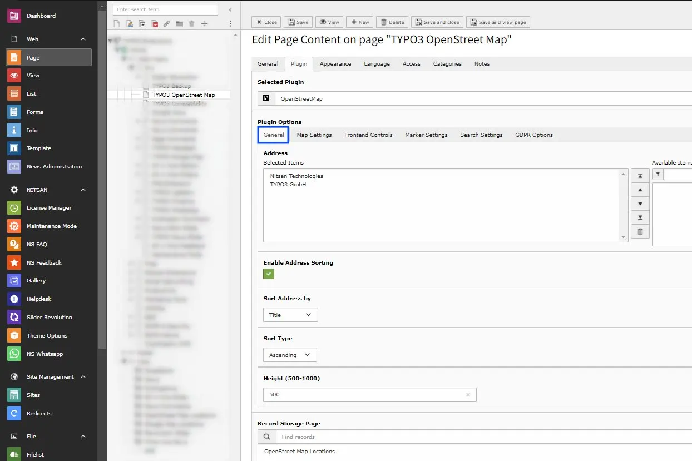
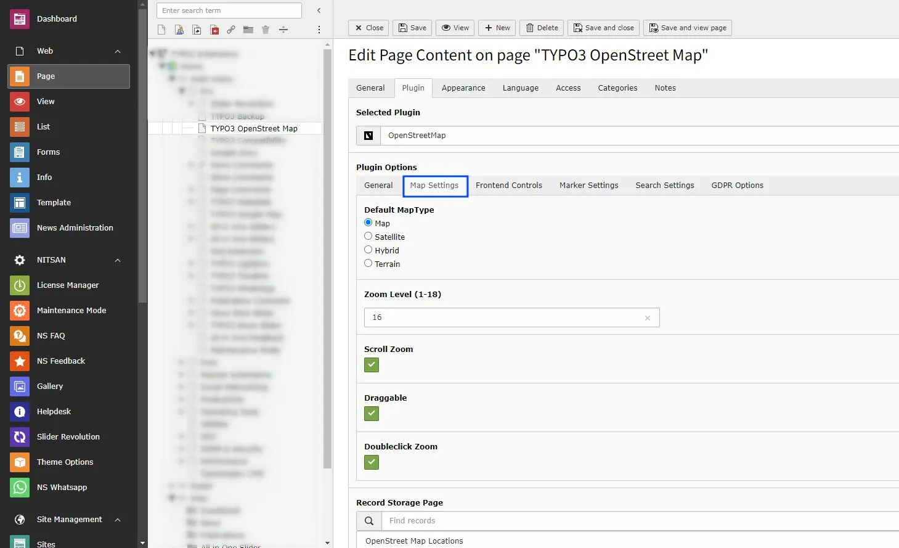
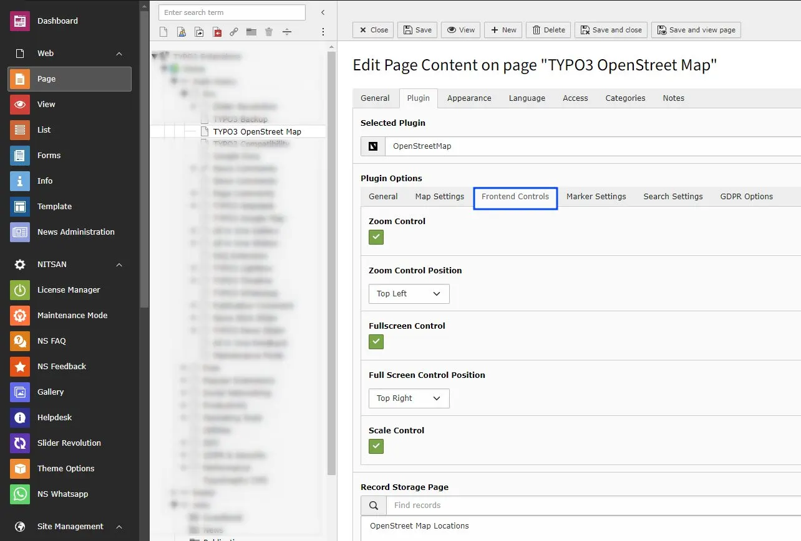
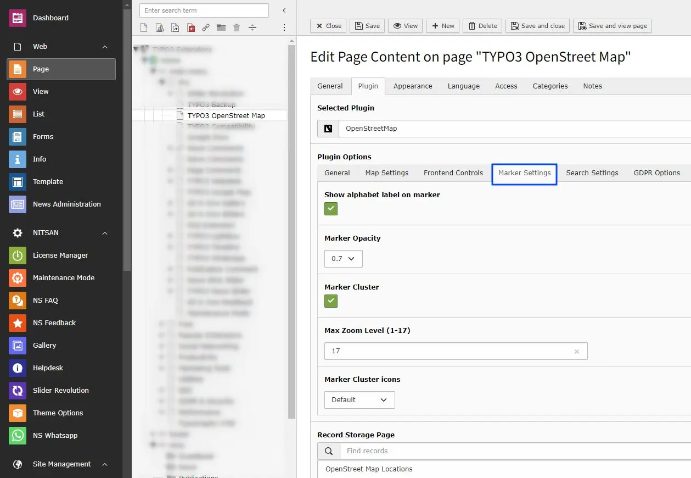
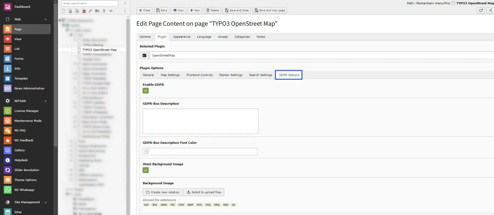
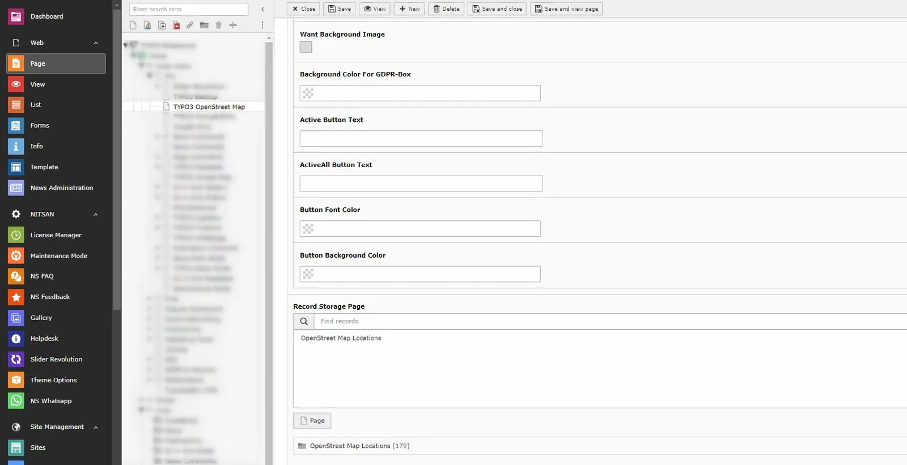
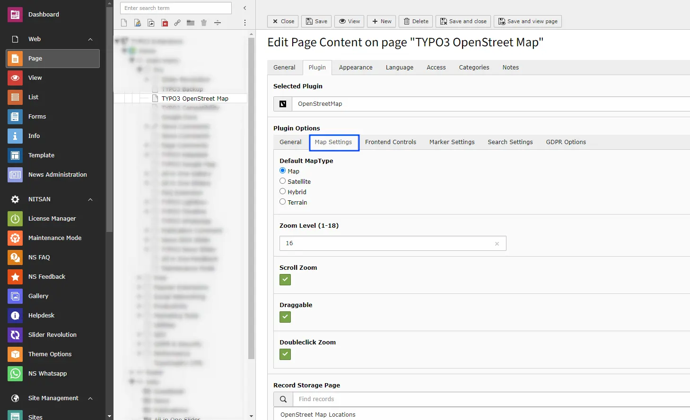

Add OpenStreet Map Plugin from the Plugin options.

## 2.1 General Settings

- **Address** -> Select the locations you want to display on the Map with Location marker.
- **Height** -> Set the height of Map
- **Record Storage Page** -> Select the storage folder to display the Map Location from that folder.

## 2.2 Map Settings

- **Map Type** -> Select the Map type you want to display from Map, Satellite, Hybrid and Terrain
- **Zoom Level** -> Select the default zoom level of map when map is displayed. You can select from range from 1 to 18 with 1 being completely Zoomed Out and 18 being completely Zoomed In.
- **Scroll Zoom** -> Check this to enable Zoom In and Zoom Out using Mouse scroll.
- **Draggable** -> Check this to allow users to drag map using mouse.
- **Doubleclick Zoom** -> Check this to enable Zoom In when user double-click on map.

## 2.3 Frontend Control Settings

- **Zoom Control** -> Check this to display Zoom buttons on map. You can also set position of it on chart as well.
- **Zoom Control Position** -> Select position of the Zoom Controls from Top Left, Bottom right etc.
- **Fullscreen Control** -> Check this to display Full screen button on Map. You can also set position of it on chart as well.
- **Full Screen Control Position** -> Select position of the Full Screen Controls from Top Left, Bottom right etc.
- **Scale Control** -> Check this to display scale bar at the bottom right of Map.

## 2.4 Marker Settings

- **Show alphabet label on marker** -> Check this to display alphabet labels on Location markers. It will start from A-Z.
- **Marker Opacity** -> Set Marker Opacity. Select from 0.1 to 1.0 .
- **Marker Cluster** -> Check this to enable Marker Cluster.

After Enabling Marker Cluster checkbox, "Max Zoom level, Grid Size & Marker Cluster Icon" options will be visible.

- **Max Zoom Level** -> Define the Zoom level, It will zoom in fathest level before the regular markers.
- **Marker Cluster icons** -> Choose marker cluster icon from Default, People, Conversation, Heart, & Pin.

## 2.4 Search Settings

<iframe src="https://app.supademo.com/embed/cmk0z3dn41p2qgmn8sx5hrzhp?embed_v=2&utm_source=embed" loading="lazy" title="AI Co pilot" allow="clipboard-write" frameBorder="0" webkitallowfullscreen="true" mozallowfullscreen="true" allowfullscreen ></iframe>

- **Search Type** -> Select type of search you want to display on your site, select none to display only map & saved locations otherwise choose "Record Based Search OR Radius Search" accordingly.

- **Search In Fields**
  When the **First Search Box** is enabled, you can choose which fields are used to search for an address or location on the map.

  Select the relevant fields such as **Title**, **Info**, or **Content** that contain address or location details.

  The map will display results only from the selected fields, making it easier to quickly find the correct address on the map.

- **Radius Search** -> This feature will allow end user to search for places on OpenStreet Map by providing their preference of City and Point of Interest.

- **Record Based Search** -> This feature will allow end user to search for location on OpenStreet Map, which are stored on the database & according to the selection of backend storage folder.

Based on the selection of "Record Based Search OR Radius Search" following options will be showing to customize input fields.

- **Enable Direction and Distance Feature** -> Check this to allow users to fetch routes b/w the places. It'll also provide the directions for the selected route at the bottom of the Map.
- **Auto Complete Location** -> Check this to enable the auto suggestion on the address field appear above the map.
- **Allow Current Location to Fill Address** -> Check this to enable the access for Allow/Deny the user location.

## 2.4 GDPR Settings

- **GDPR Box** -> Make sure your website collects all required user consent. OpenStreetMap allows you to display consent notices.

## Figures

