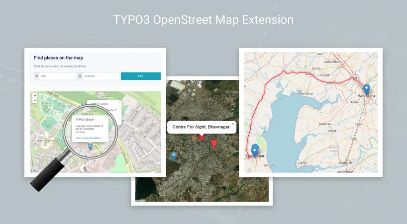

## NS Open Streetmap

## What does it do?

The easiest to use OpenStreet maps plugin! Add a customized OpenStreet map to your TYPO3 website quickly and easily with the NS OpenStreet Map. Perfect for contact page maps, routes, maps, restaurants, hospitals areas and any other use you can think of!
OpenStreet Maps allows you to create a OpenStreet map with as many markers as you like.

## Helpful Links

<Note>

- **Product:** https://t3planet.de/typo3-openstreetmap-erweiterung
- **TYPO3 Backend Live Demo:** https://demo.t3planet.de/live-typo3/t3t-extensions/typo3/?TYPO3_AUTOLOGIN_USER=editor-openstreet-map
- **Front End Demo:** https://demo.t3planet.de/t3-extensions/openstreet-map
- To make any domain-related changes or whitelist any development and staging domains, please reach our support center: https://t3planet.de/support

</Note>
