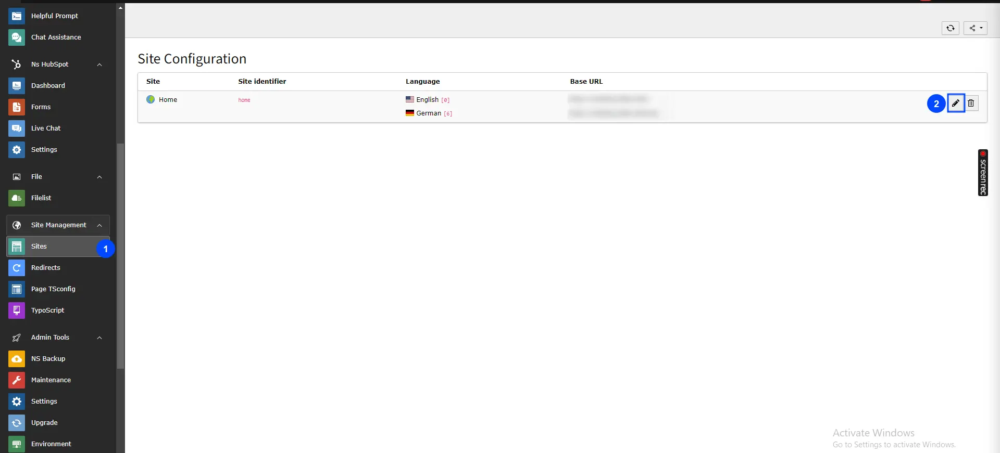
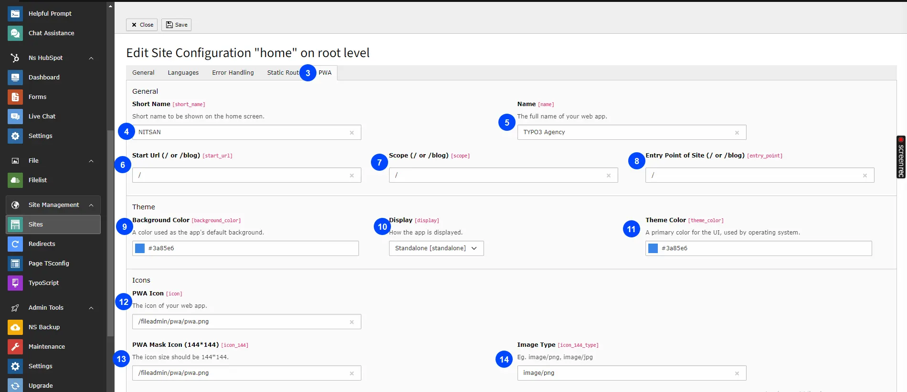
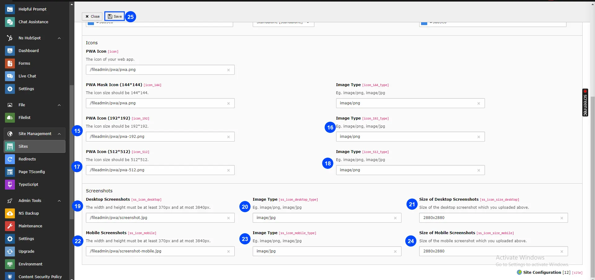

You can configure all the settings of pwa as described below:

- **Step 1:** Go to Sites module.
- **Step 2:** Edit root page.

- **Step 3:** Go to TAB "PWA"
- **Step 4:** Application short name.

Now, you can configure all the options which you want eg., Short name,name,Start url etc., See below screenshots.

- **Step 5: Name** Add application name,It will show in FE in application Preview.
- **Step 6: Start Url (/ or /blog):** The start_url property specifies the URL of the page that opens when the PWA is launched from the homescreen. This can be a relative URL, in which case it will be relative to the scope, or an absolute URL. The start url must be same as your typo3 site's base value.
- **Step 7: Scope (/ or /blog):** The scope property specifies the URL prefix for all the URLs that the PWA will handle. This determines which pages the PWA can be launched from, and which pages it can control while running. So, the scope must be same as your typo3 site's base value.
- **Step 8: Entry Point of Site (/or /blog):** This property used for generating the manifest file from your site path.So, the entrypoint must be same as your typo3 site’s base value.
- **Step 9: Background Color:** Selet background color you want to show in Application preview.
- **Step 10: Diplay:** Select type display,Which you want to show in FE.
- **Step 11: Theme color:** Select theme color.
- **Step 12: PWA Icon:** Add path of icon which you want to show in App preview.
- **Step 13: PWA Mask Icon 144\*144:** Add icon path,This is required for generating web app,icon size must be 144\*144 as mentioned in Title,cause we use this in our extensions for generating PWA.
- **Step 14: Image Type:** Pleae add Image type which you've selected in PWA Mask Icon 144\*144 field

- **Step 15: PWA Icon 192\*192:** Add icon path,This is required for generating web app,icon size must be 192\*192 as mentioned in Title,cause we use this in our extensions for generating PWA.
- **Step 16: Image Type:** Pleae add Image type which you've selected in PWA Icon 192\*192
- **Step 17: PWA Icon 512\*512:** Add icon path,This is required for generating web app,icon size must be 512\*512 as mentioned in Title,cause we use this in our extensions for generating PWA.
- **Step 18: Image Type:** Pleae add Image type which you've selected in PWA Icon 512\*512
- **Step 19: Desktop Screenshots:** Please add image for Desktop
- **Step 20: Image Type:** Pleae add Image type which you've selected in Desktop Screenshots
- **Step 21: Size of Desktop Screenshots:** :The width and height of desktop Screenshot must be atleast 370px and at most 3840px: Pleae add image as mentioned in title itself. Please enter the size of desktop screenshot you uploaded (it’s required),Add Exact size of image which you uploaded for desktop.
- **Step 22: Mobile Screenshots:** Please add image for Desktop
- **Step 23: Image Type:** Pleae add Image type which you've selected in Mobile Screenshots
- **Step 24: Size of Mobile Screenshots:** The Width and height of mobile Screenshot must be atleast 370px and at most 3840px : Pleae add image as mentioned in title itself.Please enter the size of mobile screenshot you uploaded above (it’s required): Add Exact size of image which you uploaded for mobile.
- **Step 25:** After all,Save the Configuration and you can See PWA icon in URL Segment!

That's it,Now you can configure it as per your requirements.:)
