## 1.Personio Job List Plugin

Follow below steps to configure this exension:

**Step 1.** Click on “Plugin” menu

**Step 2.** Create New Content Element > Insert Plugin > Personio Job List

## 1.1 General

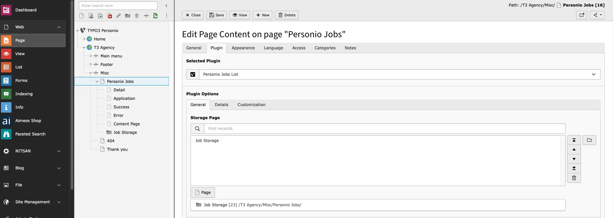

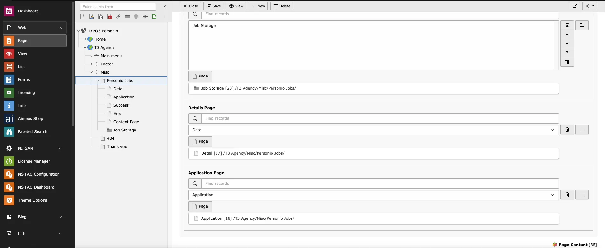

**Storage page:** Select Storage page id where your API data is stored

**Details Page:** Configure id of detail page

**Application Page:** Configure id of Application page

## 1.2 Details

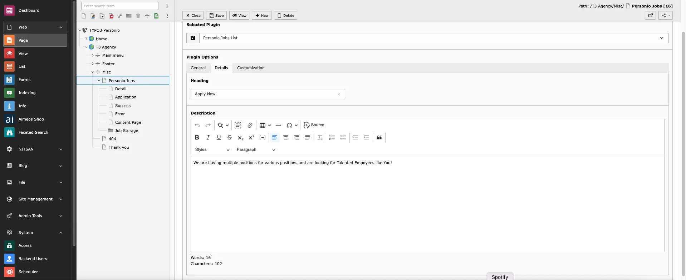

**Add Heading and Description**

## 1.3 Customization

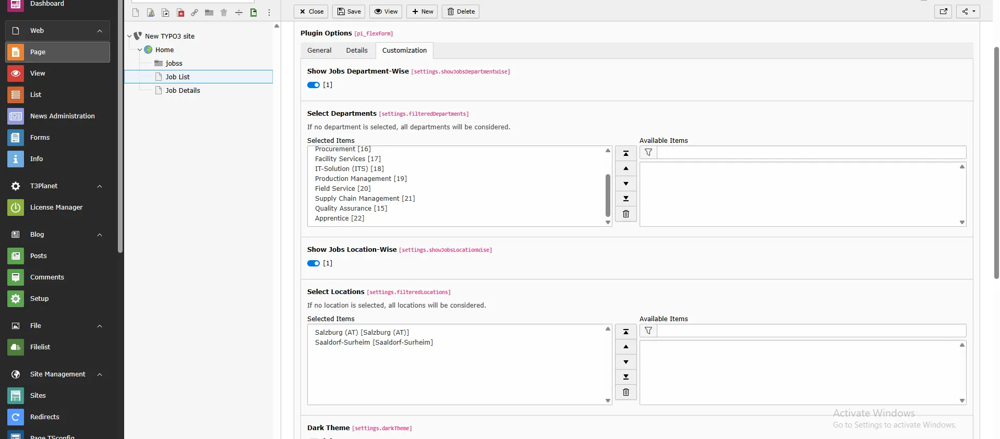

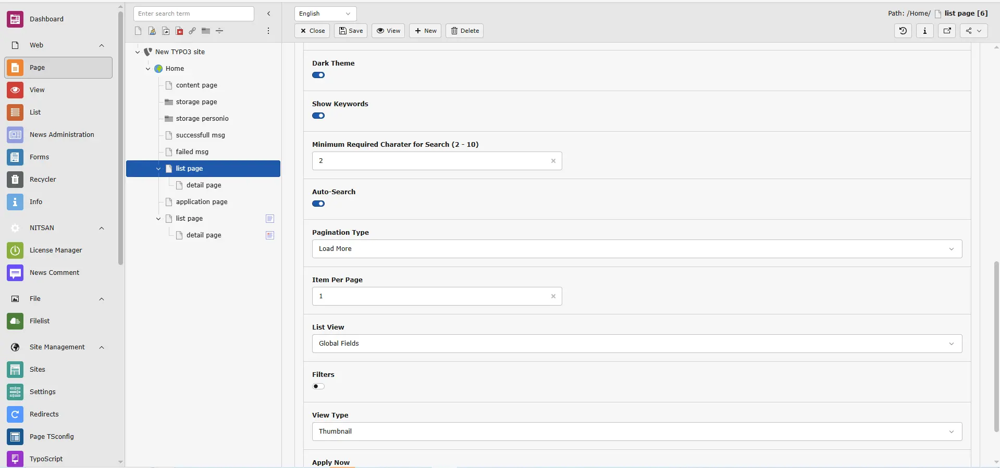

**Dark mode:** You can enable or disable dark mode for listing page

**Show Keywords:** By enabling the “Show Keywords” option, you can display all assigned keywords on the frontend

**Auto-Search:** Enable this option to display an auto-search hint in the search bar and automatically trigger the search while typing.

**Minimum Required Character for Search (2 - 10):** Specify how many characters a user must type before the search is triggered. **This setting works only when Auto-Search is enabled** and must be between 2 and 10.

**Pagination:** You can select Type of Pagination

**Item per Page:** You can set Item per page

**List View:** You can select List view type from dropdown

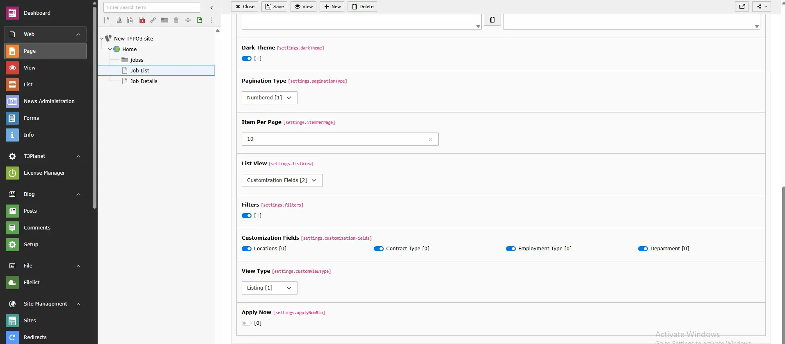

**List View>Customization fields:** You can enable of diable Fields for visibility on FE!

**Filter**

You can enable filters for job applications:

- **Job Department Filter** Allows users to select and filter by specific job departments.

<Note>
When the scheduler runs to fetch new jobs and departments:

- If a previously selected department is **not available** in the new API data, it will be **automatically unselected**.
- If new departments are found (compared to the previous data), they will **not be automatically selected**. You must manually add them from the plugin settings.
</Note>

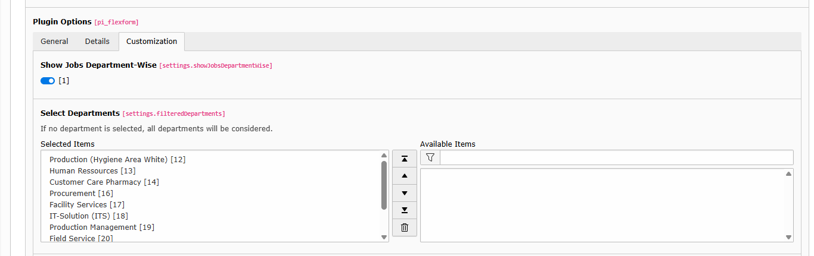

- **Job Location Filter** Supports filtering by both *Office* and *Additional Office* locations.

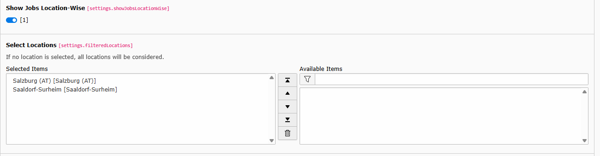

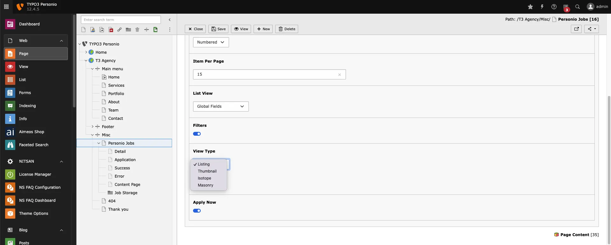

**View type:** YOu can select listing view type from Dropdown to render in Filter

**List View:** By this you can show list in Frontend

**Thumbnail:** By this You can show Applications aa thumbnails

**Isotop:** By this you can Show applications in isotop view

**Masonry:** By this you can show application in masonry view

**Apply now:** By this option you can show apply now button on listing page

## 2.Personio Job Detail Plugin

**Step 1.** Click on “Plugin” menu

**Step 2.** Create New Content Element > Insert Plugin > Personio Job Details

**Dark Theme:** You can enable/Disable dark mode

**Show Keywords:** By enabling the “Show Keywords” option, you can display all assigned keywords on the frontend

**List Page:** Configure List page id

**Application page:** Configure application Page Id

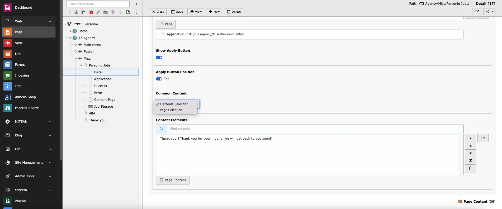

**Show Apply button:** By this option you can enable or disable apply now botton in detail page

**Apply Button Position:** By this option you can set Position on top in detail page by enabling it

**Common content:** You Can select Content elements/Pages for showing in Detail page

## 3.Personio Jobs Application Plugin

**Step 1.** Click on “Plugin” menu

**Step 2.** Create New Content Element > Insert Plugin > Personio Job Details

## 3.1 General

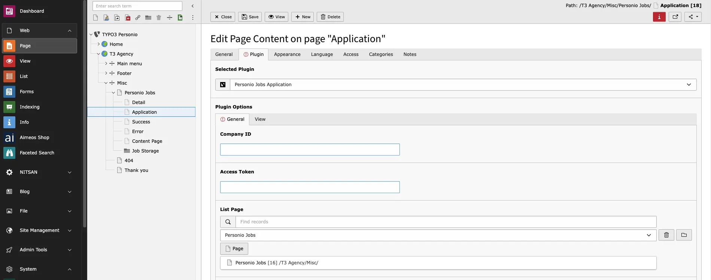

You can configure Comapny id and Access token from your personio account,learn more from [https://developer.personio.de/docs/getting-started-with-the-personio-api](https://developer.personio.de/docs/getting-started-with-the-personio-api)

**Company id:** Add Company id

**Access token:** Add access token

**List page:** Configure list page id

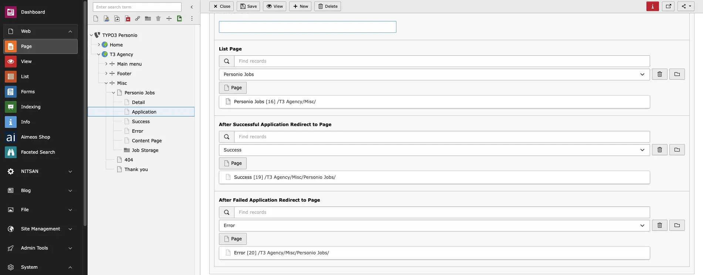

**After Successful Application Redirect to Page:** After Successful submition of Application redirected to this configured page

**After Failed Application Redirect to Page:** If Application submission failed it will redirect to this page

## 3.2 View

**Dark theme:** You can enable or disble dark theme for application form page

**Show header:** You can Enable/disable header visibility in Frontend

**Show Keywords:** By enabling the “Show Keywords” option, you can display all assigned keywords on the frontend.

**Application Message:** You can add message for application page

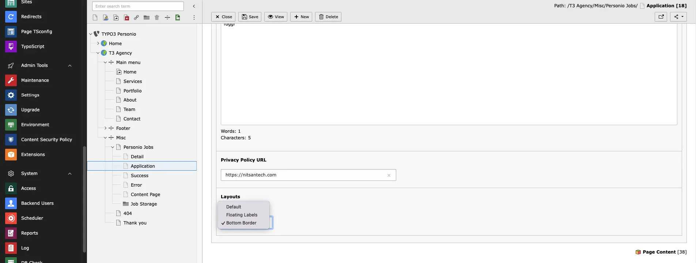

**Privacy policy URL:** Add Privacy policy URL for application form

**Layout:** You can select Layout of form from Dropdown

Thats..it you can now check your job listing on Your website!
