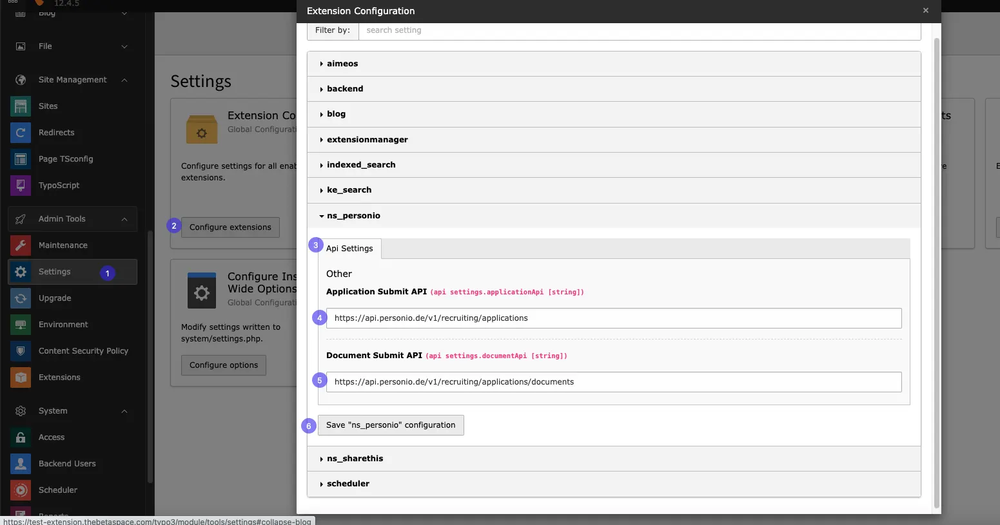
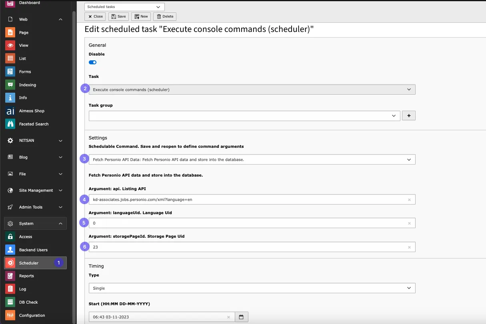

Before adding plugins to page configure personio APIs and Scheduler!

Please configure this API for Submitting application form and to upload Documents successfully from plugin.



<Warning>

This API configuration is mandatory. Without it, users won't be able to upload documents or submit applications.

- **Application Submit API:**
  https://api.personio.de/v1/recruiting/applications
- **Document Submit API:**
  https://api.personio.de/v1/recruiting/applications/documents

</Warning>

Follow Below steps to Configure API

**Step:1** Go to Admin tools>Settings

**Step:2** Click on configure extensions

**Step:3** Select ns_personio

**Step:4** Add Application submit API

**Step:5** Add Documents Submit API and save the configuration

# Configure Scheduler

Please configure schedular for fatching Data from personio API



**Step:1** Go to System>Scheduler

**Step:2** Select Task

**Step:3** Select Schedulable Command

**Step:4** Add Personio Account API,You can get It from https://support.personio.de/hc/en-us/articles/207576365-Integrate-positions-from-Personio-into-your-company-website-via-XML

**Step:5** Add Language Uid from site management, you can create Multiple scheduler according to diffrent languages!

**Step:6** Page ID where to persist new or updated jobs

**All done now you can configure plugins to your pages!**

# Server-Side Cron Job Configuration

Please refer to the official [Typo3 Documentation](https://docs.typo3.org/c/typo3/cms-scheduler/main/en-/us/Installatio/CronJob/Index#unix-mac) for detailed guidance on setting up cron jobs on server.

**Example:**

```bash
*/15 * * * * www /usr/local/bin/php /home/user/www/vendor/bin/typo3 scheduler:run --task=2
```

This example sets up a cron job to run a specific task (identified by --task=2) every 15 minutes.
