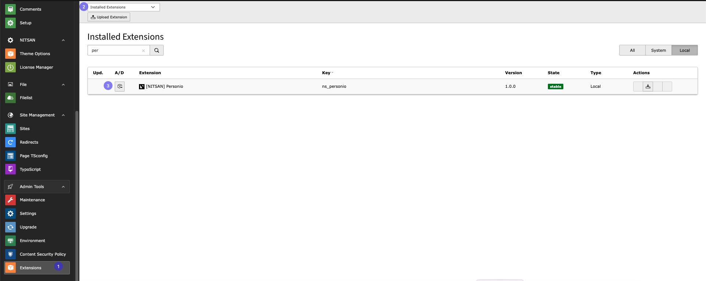
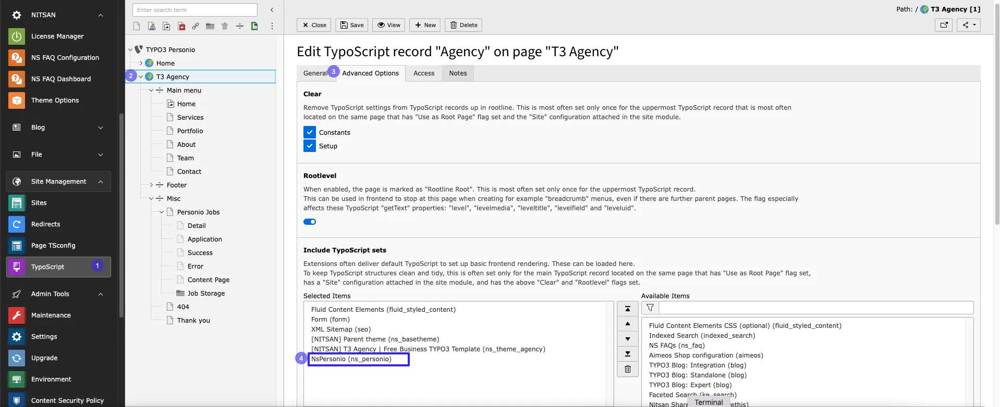

Just install this extension the usual way like any other TYPO3 extension.

## For Premium Version - License Activation

To activate license and install this premium TYPO3 product, Please refere this documentation [https://docs.t3planet.de/en/latest/License/Index.html](/License/Index)

## 1. Get the extension

**Via Composer using Command Line**

```php
composer req nitsan/ns-personio --with-all-dependencies
```

**Via Extensions Module**

In the TYPO3 backend you can use the extension manager (EM).

Step 1. Switch to the module “Extension Manager”.

Step 2. Get the extension

Step 3. Get it from the Extension Manager: Press the “Retrieve/Update” button and search for the extension key ns_personio and import the extension from the repository.

Step 4. Get it from typo3.org: You can always get the current version from [https://extensions.typo3.org/extension/ns_personio/](https://extensions.typo3.org/extension/ns_personio/) by downloading either the t3x or zip version. Upload the file afterwards in the Extension Manager.



## 2. Activate the TypoScript

The extension ships some static TypoScript code which needs to be included.

Step 1. Switch to the root page of your site.

Step 2. Switch to the Template/TypoScript module and select Info/Modify.

Step 3. Click the link Edit the whole template record and switch to the tab Includes.

Step 4. Select [NITSAN] Personio at the field Include static (from extensions):

Step 5. Include [NITSAN] Personio at the last place.

[](../../_images/activate_typoscript3.webp)

## Pre-configured Speaking URLs for Job Pages

**Speaking URLs** are user-friendly, readable URLs that describe the content or purpose of a page, making navigation easier for users and enhancing SEO. For example, instead of using a complex URL like:

**Standard URL**

```python
example.com/index.php?id=123&tx_nspersonio_pi2[action]=detail&tx_nspersonio_pi2[controller]=Job&tx_nsperso...
```

**A Speaking URL would look like:**

```python
example.com/page-title/software-developer
```

### How to Enable Speaking URLs for Job Details and Application Form Pages?

To configure Speaking URLs specifically for jobs and application form pages in your TYPO3 site, add the following code to your main `config.yaml` file:

```python
imports:
  - { resource: "EXT:ns_personio/Configuration/Routes.yaml" }
```

## How to Install TYPO3 Extension ns_personio

**Extension Installation Via without Composer mode**
[https://www.youtube.com/watch?v=SN5HoFQcDM4](https://www.youtube.com/watch?v=SN5HoFQcDM4)

**Extension Via Composer**
[https://www.youtube.com/watch?v=_7ILu4lwU-k](https://www.youtube.com/watch?v=_7ILu4lwU-k)
