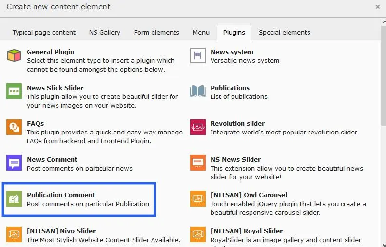
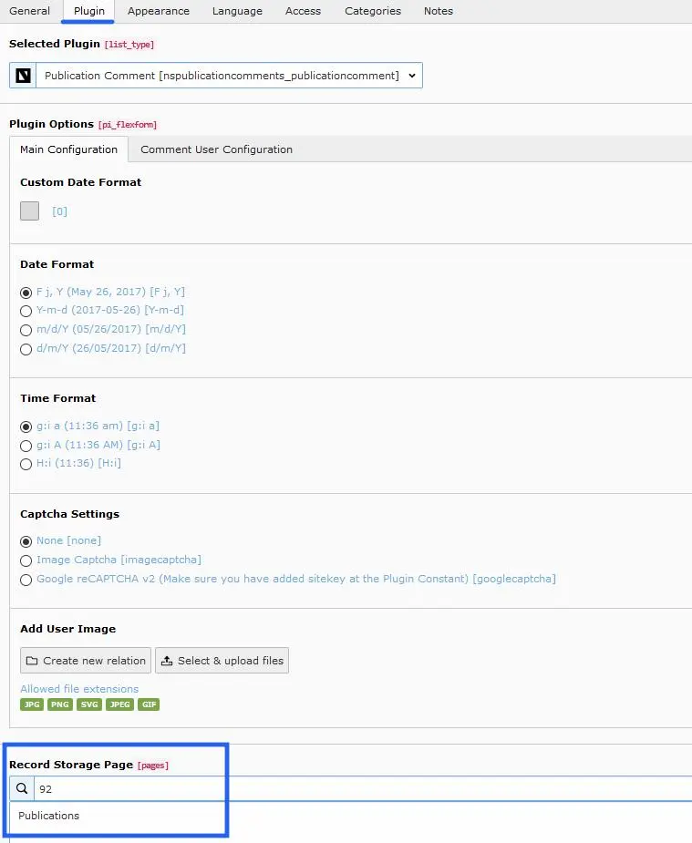
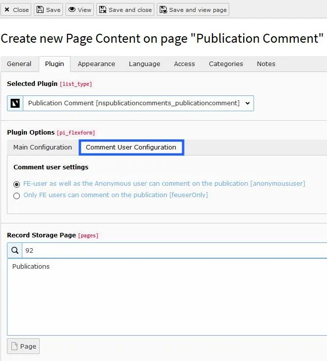
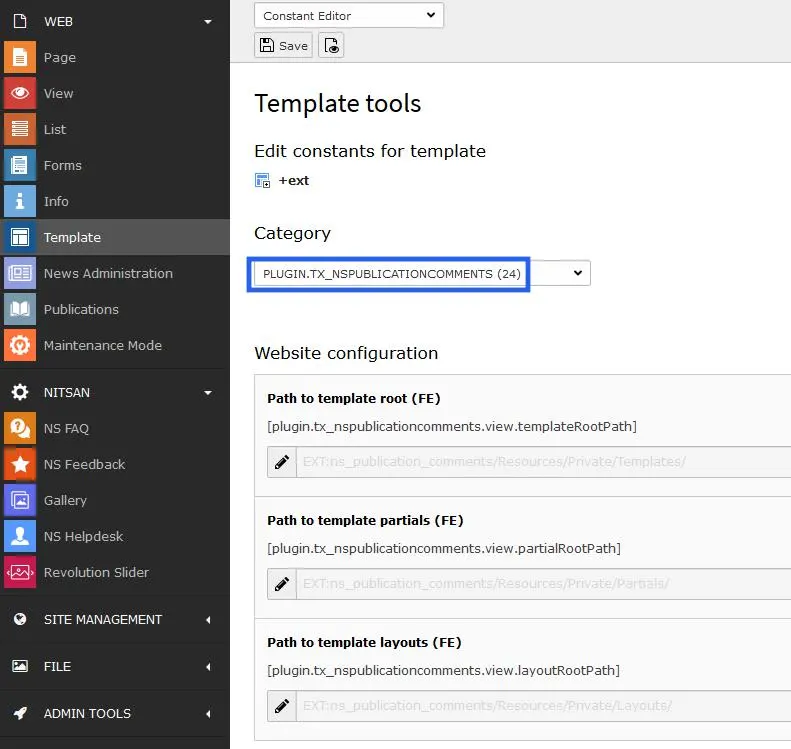

First you need to install the publication extension from typo3 repository, After than install the ns_publication_comment that will enhance the detail view of each publication within comment module.
You can configure the comment settings like, enable/disable comment approval, change date/time format, add custom CSS/JS, E-mail configurations, Google recaptcha etc much more.

<Steps>
  <Step title="Step 1">
Insert publication comment extension from the plugin element
  </Step>
  <Step title="Step 2">
Select the record storage id, Edit date/time formate, captcha setting, user image etc according to your website need from main configurations.
  </Step>
  <Step title="Step 3">
You can do the Comment user configurations also.
  </Step>
  <Step title="Step 4">
Furthermore, another configurations will be managed from constant editor.
  </Step>
</Steps>

## Back End Screenshots

