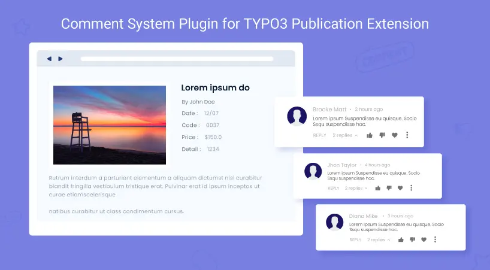

## NS Publication Comments

## What does it do?

Comment Extension for Ext: Publications is a special TYPO3 comment extension developed for Publication TYPO3 extension that enables your website visitors to leave comments on your website. It is a powerful comment extension for great discussions with nesting & easy reading.

<Note>

You can replace the book image from the template file on publication detail page.

</Note>

## Helpful Links

<Note>

- **Product:** https://t3planet.de/ns-publication-comments-pro
- **Front End Demo:** https://demo.t3planet.de/t3-extensions/publication-comment
- To make any domain-related changes or whitelist any development and staging domains, please reach our support center: https://t3planet.de/support

</Note>
