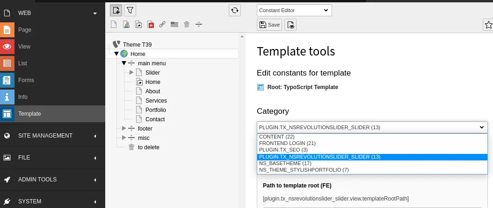
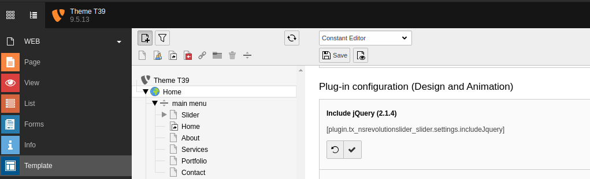
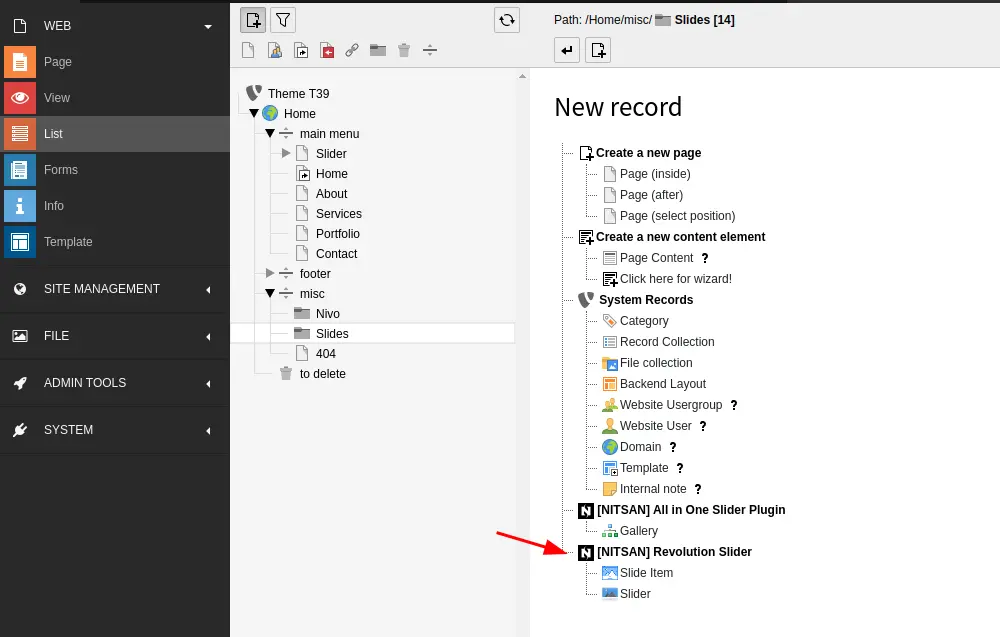
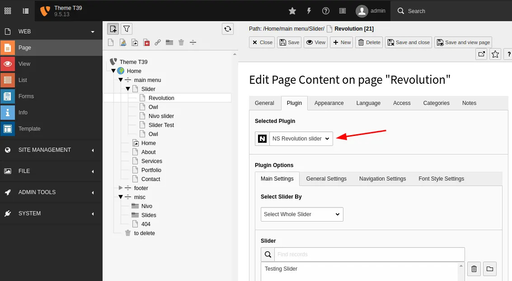

# Configuration

## Setup Slider Revolution

1. Switch to the *Template module* and select *Constant Editor*

2. Global Configuration: Select Category as follows *PLUGIN.TX_NSREVOLUTIONSLIDER_SLIDER (13)* You can configure it as per your requirement.

3. *Include Jquery* if you have not included yet in your project.

4. Create *Storage Folder* and Add "Slider" and "Slider Item" Records.

5. Now, Just Insert "NS Slider Revolution" Plugin, Choose your Storage Folder & Configure Slider Options.

## Clearing the cache

Please use the buttons 'Flush frontend caches' and 'Flush general caches'
from the top panel. The 'Clear cache' function of the install tool will also
work perfectly.
