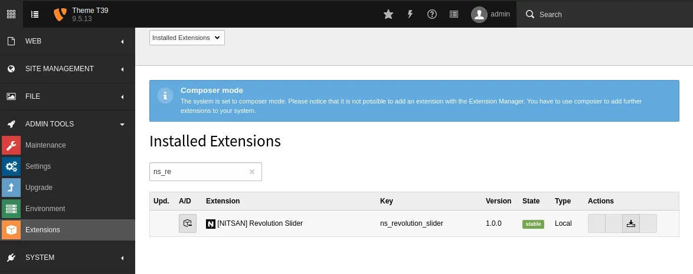
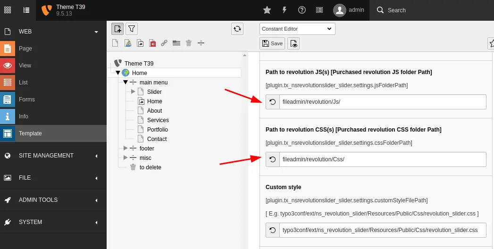

# Installation

Just install this extension the usual way like any other TYPO3 extension.

## For Premium Version - License Activation

To activate license and install this premium TYPO3 product, Please refere this documentation [License documentation](/License/Index)

## For Free Version

1. Get the extension

   In the TYPO3 backend you can use the extension manager (EM).

   1. Switch to the module “Extension Manager”.
   2. Get the extension
   3. **Get it from the Extension Manager:**
      Press the “Retrieve/Update” button and search for the extension key
      *ns_revolution_slider* and import the extension from the repository.
   4. **Get it from typo3.org:** You can always get the current version from
      https://extensions.typo3.org/extension/ns_revolution_slider/ by downloading either
      the t3x or zip version. Upload the file afterwards in the Extension Manager.

2. Activate the TypoScript

   The extension ships some static TypoScript code which needs to be included.

   1. Switch to the root page of your site.
   2. Switch to the **Template module** and select *Info/Modify*.
   3. Click the link **Edit the whole template record** and switch to the tab
      *Includes*.
   4. Select **[NITSAN] Slider Revolution (ns_revolution_slider)** at the field *Include static
      (from extensions):*

3. Buy License from ThemePunch

   1. Get License version of Resolution Slider jQuery from https://revolution.themepunch.com/jquery/
   2. Go to Web > Template > Choose PLUGIN.TX_NSREVOLUTIONSLIDER_SLIDER (13)
   3. Set JS and CSS files path of your purchased Slider Revolution (see below screenshot)

## How to Install TYPO3 Extension ns_revolutionslider

**Extension Installation Via without Composer mode**
https://www.youtube.com/watch?v=SN5HoFQcDM4

**Extension Via Composer**
https://www.youtube.com/watch?v=_7ILu4lwU-k
