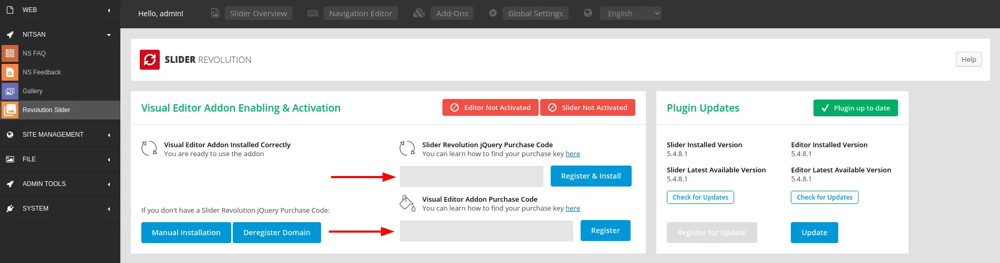
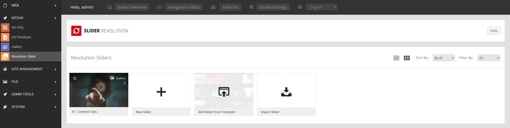
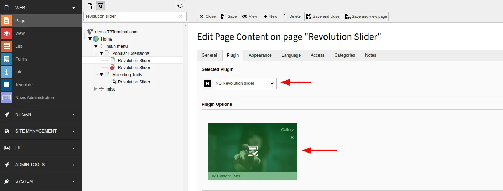
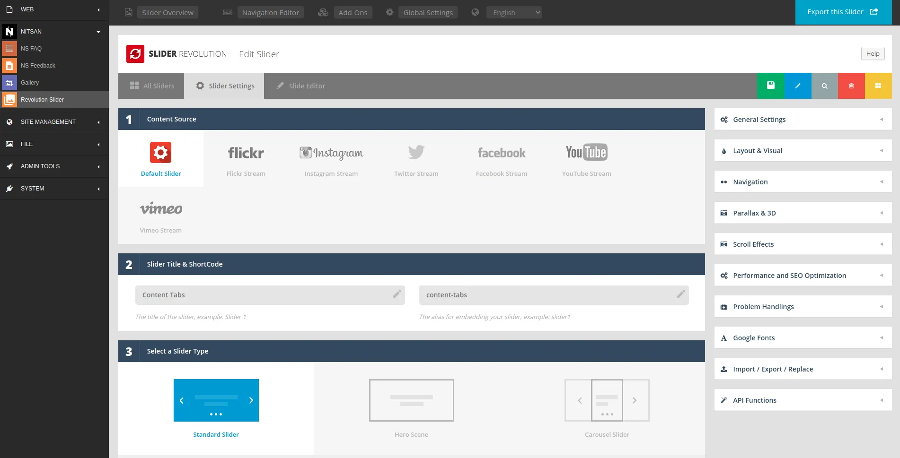
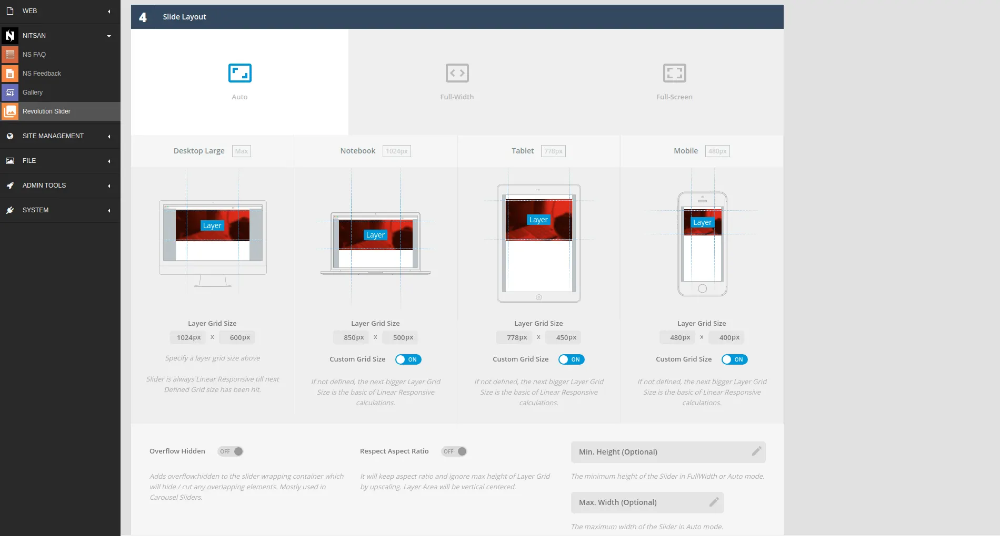
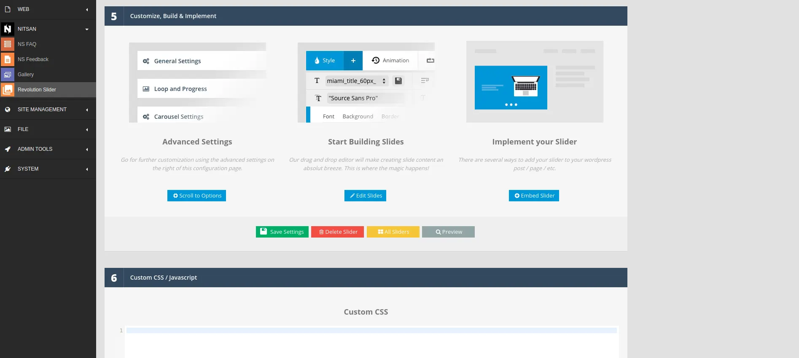
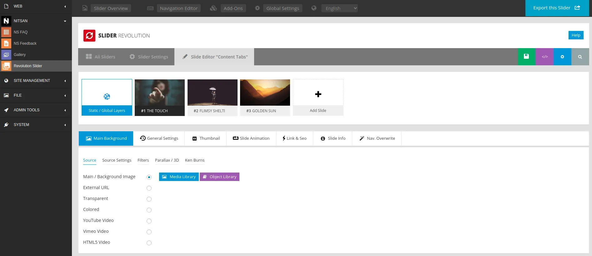
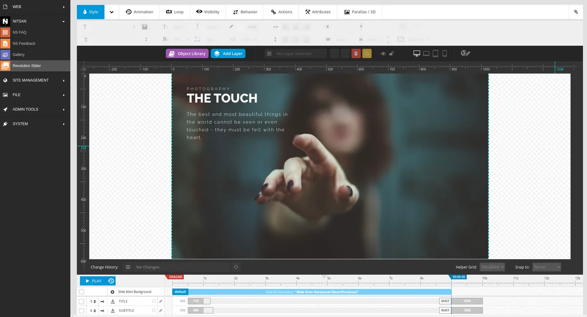
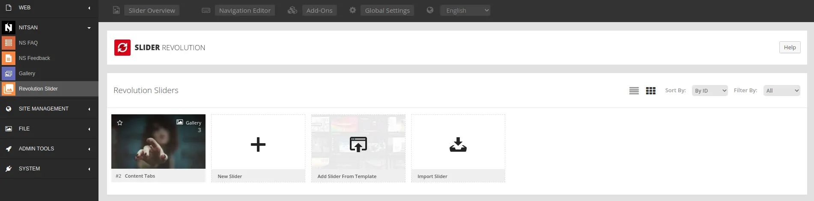

# Configuration

## Activate Revolution Licenses

**Step 1:** Go to NITSAN > Slider Revolution Module at TYPO3 Backend.

**Step 2:** Add your License key at "Slider Revolution Responsive jQuery"

**Step 3:** Add your License key at "Revolution jQuery Visual Editor"

<Warning>

Use the same license key (from T3Planet) which you have used to Activate and Install the TYPO3 extension.

</Warning>

## Backend Module: Manage Slider Revolution

1. Switch to the NITSAN > Slider Revolution Backend Module.
2. Create unlimited number of Slider Revolutions with all awesome features.

<Warning>

If are getting any errors/issues with "Slider Revolution visual-editor" backend module, then you need to make sure PHP and other compatibilities with revolution jQuery visual editor.

</Warning>

## Frontend Plugin: Insert Slider Revolution

1. Go to Page > Choose your page where you want to insert Slider Revolution
2. Insert "NS Slider Revolution" Plugin
3. Choose your favourite slider (from your created at Slider Revolution backend module).

## Clearing the cache

Please use the buttons 'Flush frontend caches' and 'Flush general caches' from the top panel. The 'Clear cache' function of the install tool will also work perfectly.

## Global Settings

## Slider Settings

## Drag-n-Drop Slider

## Manage Sliders

