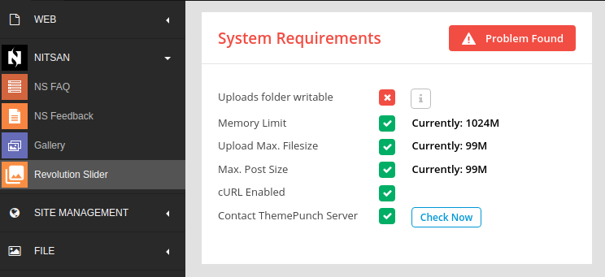
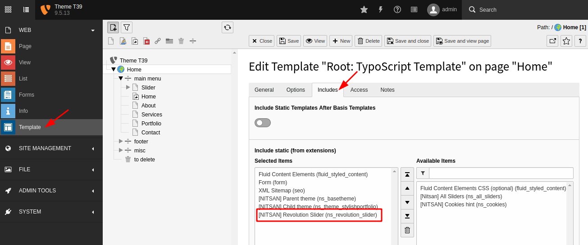

# Installation

## License Activation & Installation

To activate license and install this premium TYPO3 product, Please refer this documentation [License documentation](/License/Index)

## Include the TypoScript

> The extension ships some static TypoScript code which needs to be included.
>
>
> 1. Switch to the root page of your site.
> 2. Switch to the **Template module** and select *Info/Modify*.
> 3. Click the link **Edit the whole template record** and switch to the tab
>    *Includes*.
> 4. Select **[NITSAN] Slider Revolution (ns_revolution_slider)** at the field *Include static
>    (from extensions):*
>

1. Check System Requirements of Slider Revolution

   1. Switch to NITSAN > Slider Revolution
   2. Check "System Requirements" section at Dashboard, Please make sure to have all green-signals ;)

## How to Install TYPO3 Extension ns_revoltionslider

**Extension Installation Via without Composer mode**
https://www.youtube.com/watch?v=SN5HoFQcDM4

**Extension Via Composer**
https://www.youtube.com/watch?v=_7ILu4lwU-k

## Figures

