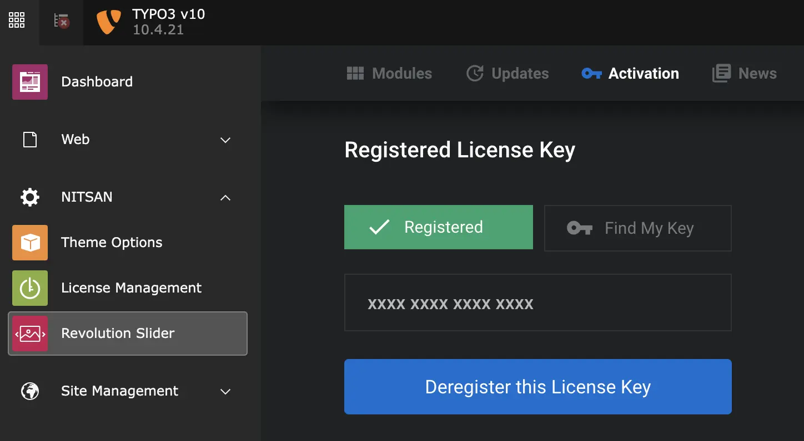
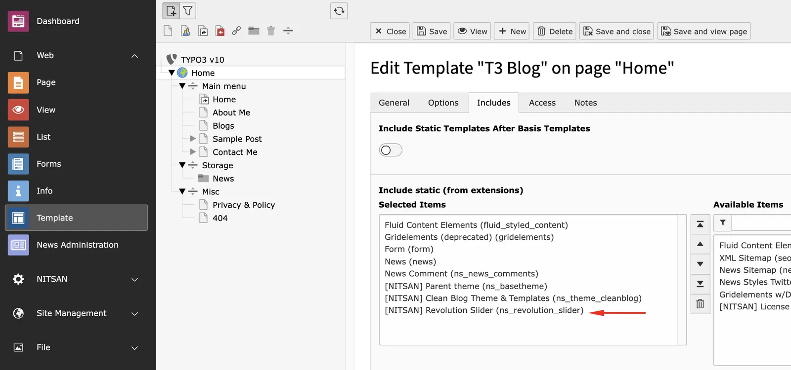
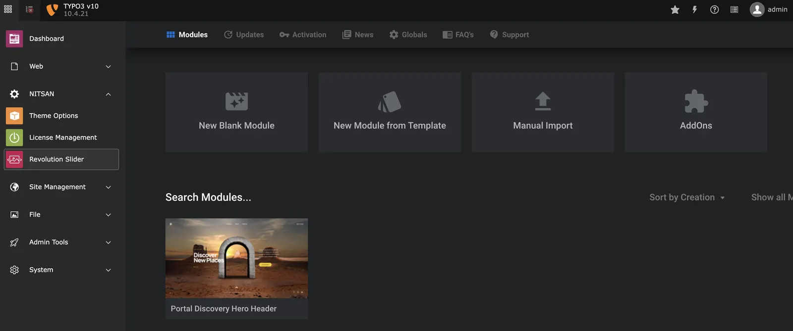
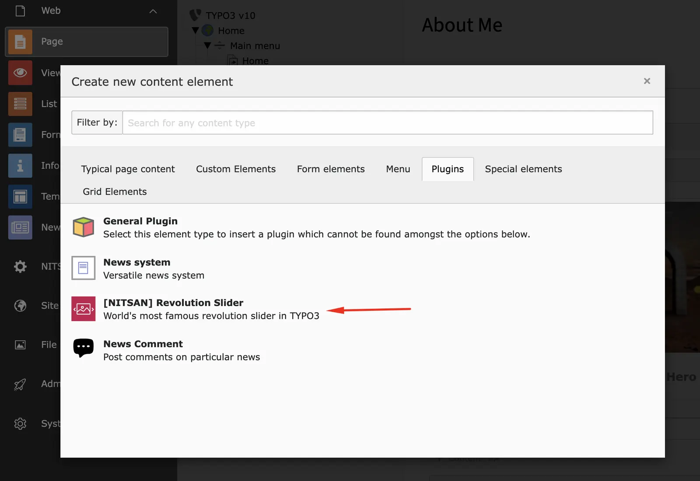
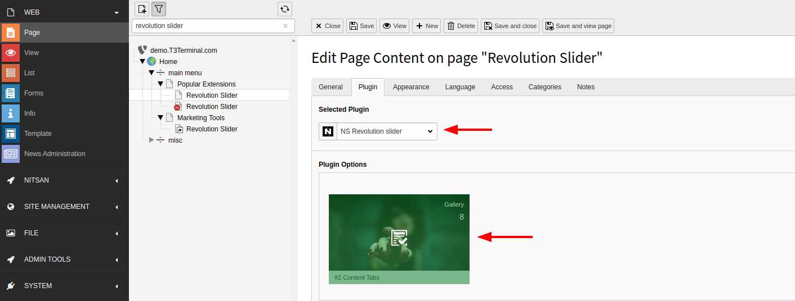

# Configuration

## Activate Revolution Licenses

**Step 1:** Go to NITSAN > Slider Revolution Module at TYPO3 Backend.

**Step 2:** Click on "Activation" and registered our provided license key.

<Warning>

Use the same license key (from T3Planet) which you have used to Activate and Install the TYPO3 extension.

</Warning>

## Include TypoScript

1. Switch to Web > Template module
2. Click on "Edit the whole template record" > Includes tab
3. Add "[NITSAN] Slider Revolution (ns_revolution_slider)"

## Enable/Disable jQuery

You can enable or disable jQuery form "Constant Editor". By default, the extension enable jQuery to include at frontend. If your website already contains jQuery then you can disable it for better speed and performance.

## Backend Module: Manage Slider Revolution

1. Switch to the NITSAN > Slider Revolution Backend Module.
2. If you are beginner to Slider Revolution, then we highly recommend to learn it from official documentation at https://www.sliderrevolution.com/help-center/

## Frontend Plugin: Insert Slider Revolution

1. Go to Page > Choose your page where you want to insert Slider Revolution
2. Insert "[NITSAN] Slider Revolution" Plugin
3. Choose your favourite slider (from your created at Slider Revolution backend module).

## Clearing the cache

Please use the buttons 'Flush frontend caches' and 'Flush general caches' from the top panel. The 'Clear cache' function of the install tool will also work perfectly.

## Figures

