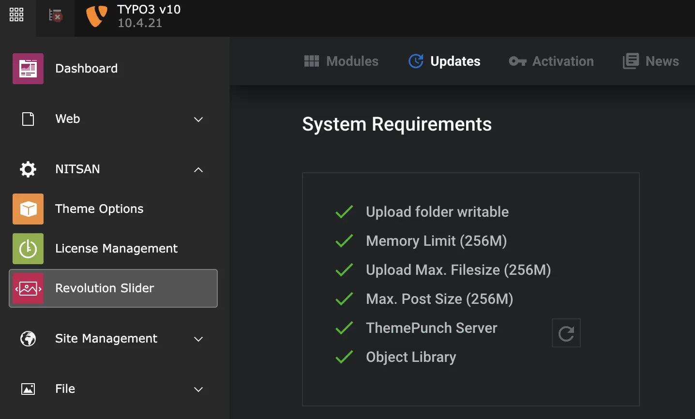

# Installation

## License Activation & Installation

To activate license and install this premium TYPO3 product, Please refer this documentation [License documentation](/License/Index)

<Warning>

For TYPO3 >= v11 composer-based TYPO3 instance, Please don't forget to run below commands.

</Warning>

```python
vendor/bin/typo3 extension:setup
vendor/bin/typo3 nsrevolution:setup
```

## Check System Requirements

>
> 1. Switch to NITSAN > Slider Revolution
> 2. Click on "Updates" and check system requirements. Please make sure to have all green-signals ;) If something is wrong then adjust your server according to needs.
>

