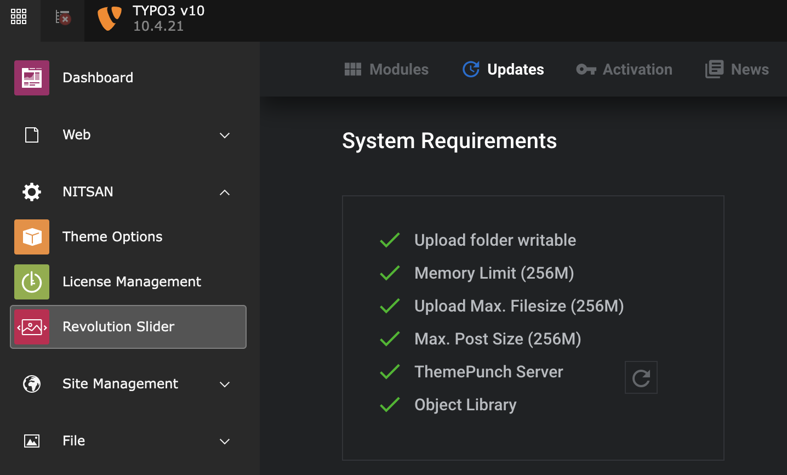

## License Activation & Installation

To activate license and install this premium TYPO3 product, Please refer this documentation [https://docs.t3planet.de/en/latest/License/Index.html](/License/Index)

<Warning>
For TYPO3 >= v11 composer-based TYPO3 instance, Please don’t forget to run below commands.
</Warning>

```python
vendor/bin/typo3 extension:setup
vendor/bin/typo3 nsrevolution:setup
```

## Symlink Assets to TYPO3

For the composer based instance, it is very imporatnt to Symlink all the assets to TYPO3’s fileadmin.

**For TYPO3 v11 and below**

```python
- mkdir fileadmin/revslider
- mv typo3conf/ext/ns_revolution_slider/vendor/wp/wp-content/uploads fileadmin/revslider/uploads
- chmod -R 755 fileadmin/revslider/uploads
- rm -rf typo3conf/ext/ns_revolution_slider/vendor/wp/wp-content/uploads
- ln -sf ../../../../../../../public/fileadmin/revslider/uploads/ typo3conf/ext/ns_revolution_slider/vendor/wp/wp-content/
```

**For TYPO3 v12 and above**

```python
- mkdir fileadmin/revslider
- mv vendor/nitsan/ns-revolution-slider/Resources/Public/vendor/wp/wp-content/uploads public/fileadmin/revslider
- chmod -R 755 fileadmin/revslider/uploads
- rm -rf vendor/nitsan/ns-revolution-slider/Resources/Public/vendor/wp/wp-content/uploads
- ln -sf ../../../../../../../../public/fileadmin/revslider/uploads vendor/nitsan/ns-revolution-slider/Resources/Public/vendor/wp/wp-content/uploads
```

## Check System Requirements

> Switch to NITSAN > Slider Revolution
> Click on “Updates” and check system requirements. Please make sure to have all green-signals ;) If something is wrong then adjust your server according to needs.
>
>
> [](../../../_images/TYPO3-Revolution-Slider-System-Check1.png)
