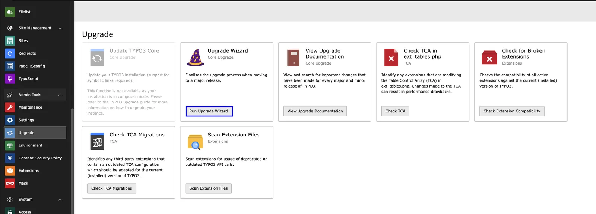
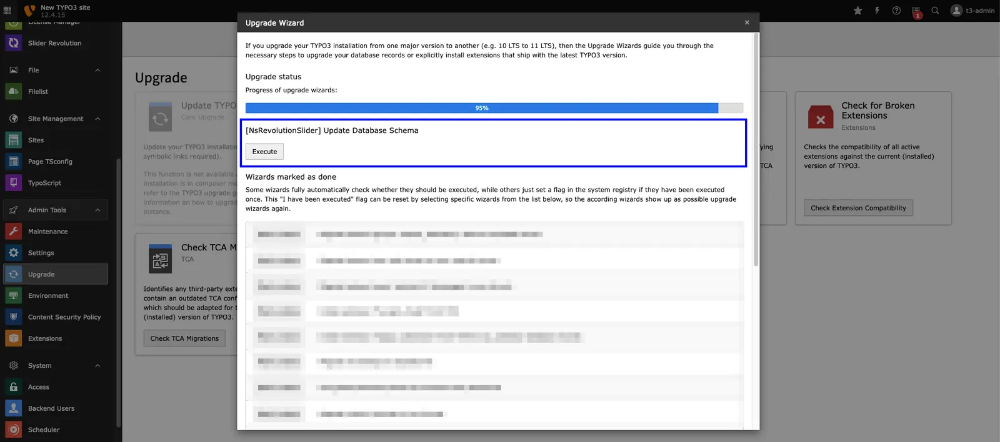

## Non-Composer TYPO3 Instance

Well, we don’t have any major migration steps from v3 to latest version >=v12. Just keep follow our mentioned steps at Update Version Guide at [https://docs.t3planet.de/en/latest/License/UpdateVersion/Index.html](/License/UpdateVersion/Index)

## Composer TYPO3 Instance

Good news! Team T3Planet proudly launches a new composer-way installation, heaven for our beloved TYPO3 customers and their TYPO3 team.

In the past, we used the concept of **composer vcs + local :@dev`** TYPO3 extension installation and manually downloaded the latest version from the TYPO3 backend license manager module. It was challenging to install, update & maintain the version of your premium TYPO3 extensions.

Our new composer way of TYPO3 extensions installation is just like official composer-things like packagist.org & packagist.com

You will use **`composer req`** for installation and **`composer update`** to automatically get the latest version of your purchased TYPO3 extensions. For example, We support **DevOps Auto-deployment CI/CD**.

We highly recommend migrating the new composer way with the below step-by-step guide.

<Warning>
Before you start the migration, we recommend taking a backup (code & database) of your TYPO3 instance. During the migration, If any problem occurs, then you can roll back your TYPO3 instance. So, please take a backup now :)
</Warning>

## Migration on New Composer-way

**Step 1.** Move Your Assets & Make Symlink

**For TYPO3 v11 and below**

```python
- mkdir fileadmin/revslider
- mv typo3conf/ext/ns_revolution_slider/vendor/wp/wp-content/uploads fileadmin/revslider/uploads
- chmod -R 755 fileadmin/revslider/uploads
- rm -rf typo3conf/ext/ns_revolution_slider/vendor/wp/wp-content/uploads
- ln -sf ../../../../../../../public/fileadmin/revslider/uploads/ typo3conf/ext/ns_revolution_slider/vendor/wp/wp-content/
```

**For TYPO3 v12 and above**

```python
- mkdir fileadmin/revslider
- mv vendor/nitsan/ns-revolution-slider/Resources/Public/vendor/wp/wp-content/uploads public/fileadmin/revslider
- chmod -R 755 fileadmin/revslider/uploads
- rm -rf vendor/nitsan/ns-revolution-slider/Resources/Public/vendor/wp/wp-content/uploads
- ln -sf ../../../../../../../../public/fileadmin/revslider/uploads vendor/nitsan/ns-revolution-slider/Resources/Public/vendor/wp/wp-content/uploads
```

**Step 2.** Remove the TYPO3 extension

```python
composer remove nitsan/ns-revolution-slider
composer dump-autoload
composer clear-cache
```

**Step 3.** Manually remove folder from rm -rf typo3conf/ext/ns_revolution_slider

**Step 4.** Update EXT:ns_license

```python
composer update nitsan/ns-license

vendor/bin/typo3 typo3 extension:setup
```

**Step 5.** Run Composer Command

```python
composer config repositories.nitsan composer https://composer.t3planet.cloud
```

```python
composer config repositories.nitsan '{
   "type": "composer",
   "url": "https://composer.t3planet.cloud",
   "only": ["nitsan/ns-revolution-slider"]
}'
```

```python
composer config http-basic.composer.t3planet.cloud USERNAME LICENSE-KEY
```

```python
composer req nitsan/ns-revolution-slider --with-all-dependencies
```

```python
vendor/bin/typo3 typo3 extension:setup
```

<Note>
We have already sent the license key & composer credentials (like username, license key) via Email. If you need any help, then write to our support team [https://t3planet.de/support](https://t3planet.de/support)
</Note>

## Migration Asset Path

If you want to migrate from Typo3 version 11 and below to TYPO3 v12, please run this upgrade wizard to migrate the asset paths.

To migrate Asset path please follow below Steps,

**Step 1:** Go to Upgrade Module

**Step 2:** Click on Run Upgrade wizard

> [](../../../_images/Upgarde_wizard.webp)

**Step 3:** Click on Execute Button

> [](../../../_images/Migrate_asset_path.webp)
