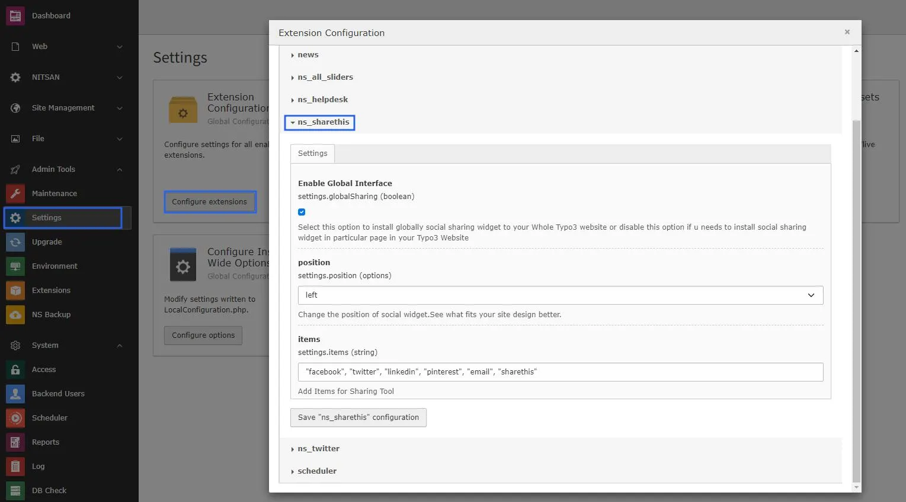
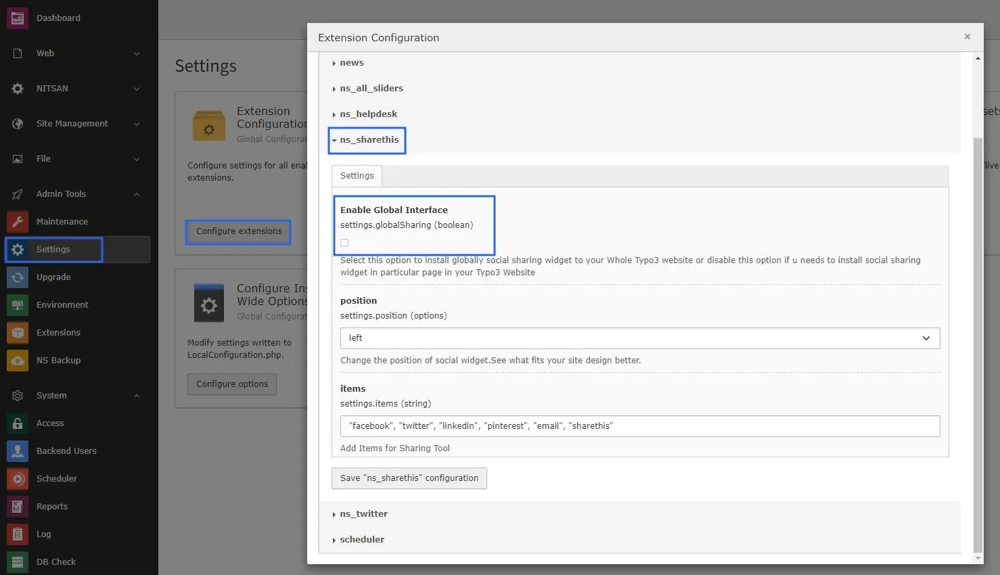
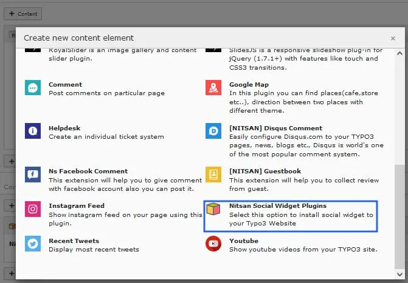
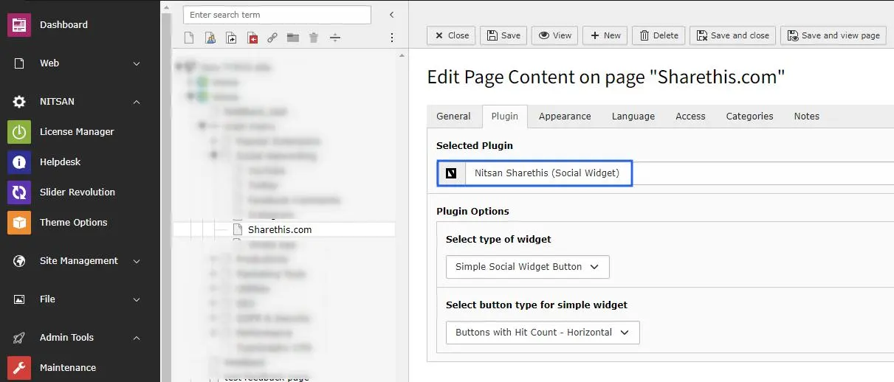

# Configuration

## Quick & Easy "Global" configuration of Sharethis.com

### Global Configuration

1. Go to the Setting module & click on the Configure Extension, now you will see the ns_sharethis settings.

2. Enable Global Interface into this **settings** Take a look at screenshots as follows.

### Setup "Particular Page Only" configuration of Sharethis.com

1. Go to the Setting module & click on the Configure Extension, now you will see the ns_sharethis settings and then **Disable Global Interface** into this *settings*.

2. Now add extension Above/Below page as per your requirement.

3. Now select plugin **Nitsan Social widget** and configure it as per requirement, Checkout this screenshot.

   >

   >

## Clearing the cache

Please use the buttons 'Flush frontend caches' and 'Flush general caches'
from the top panel. The 'Clear cache' function of the install tool will also
work perfectly.
