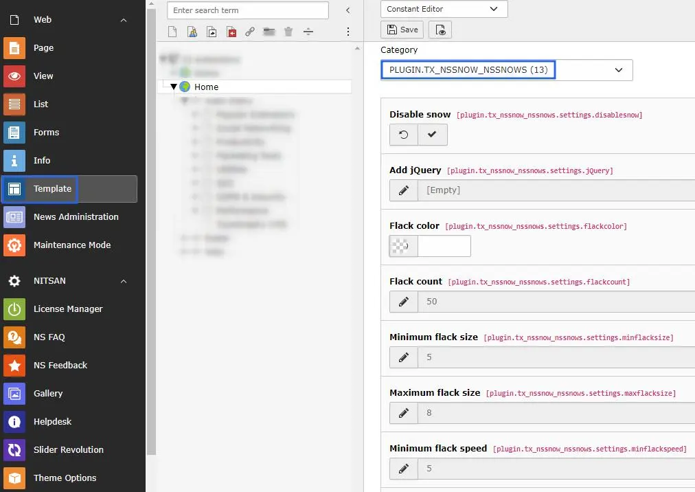
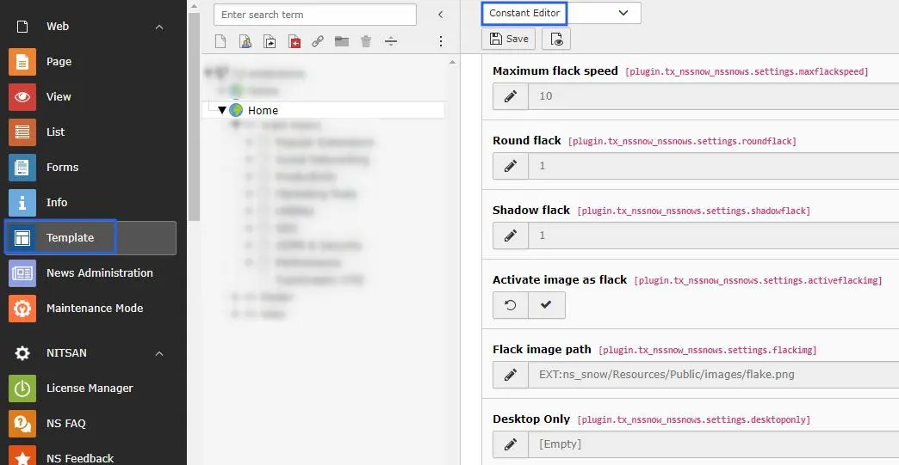

You can configure all the settings of Snow as described below:

- **Step 1:** Go to Template.
- **Step 2:** Select root page.
- **Step 3:** Select Constant Editor > Plugin.Tx_Nssnow_Nssnow (13).
- **Step 4:** Now, you can configure all the options which you want eg., Enable/Disable Snow, Flack color, Flack count etc., See below screenshot.

