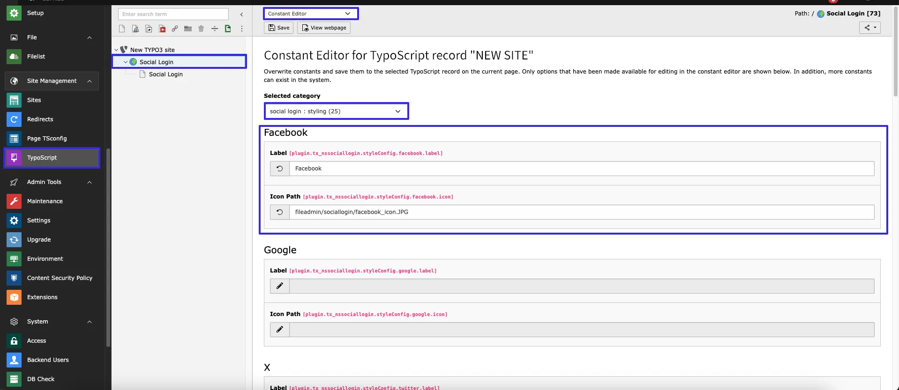
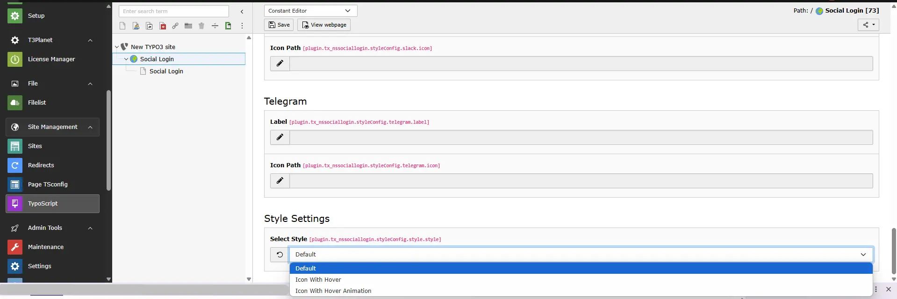
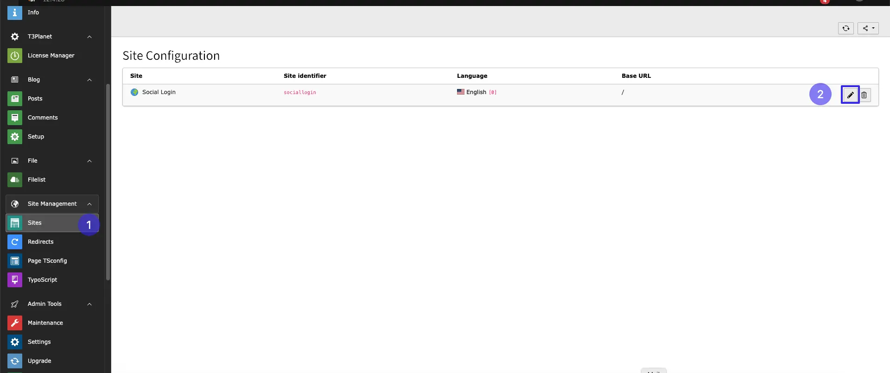
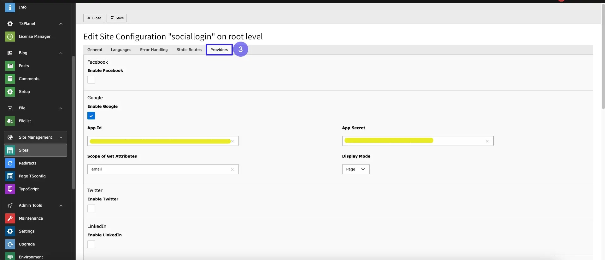
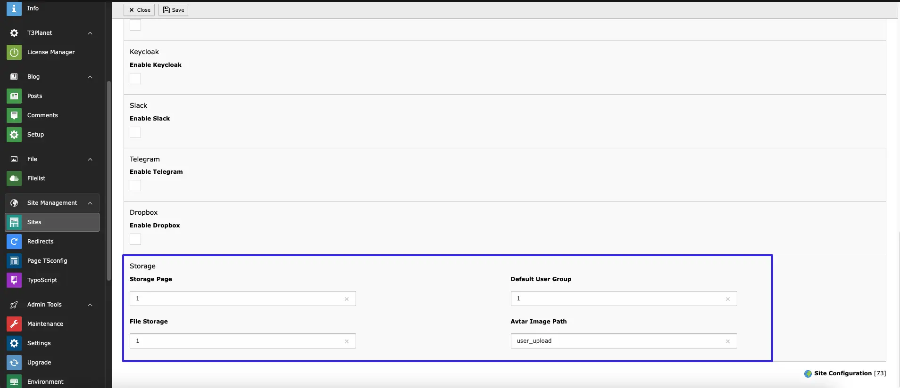
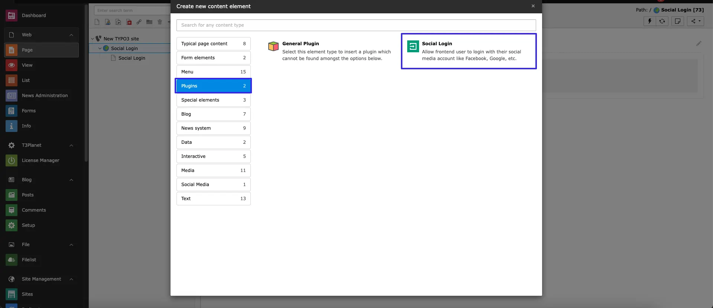
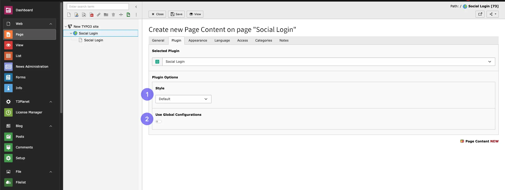

First of all, to configure styling for the follow steps below

- Step 1: Go to TypoScript module
- Step 2: Select root page.
- Step 3: Select Constant Editor from drop-down.
- Step 3: Select Constant Editor > **social login : styling**
- Step 4: Set label and iconpath for the social login provider.you can set for all providers or for specific providers.

You can select styles as per your requirement.

## Provider Configuration

To configure the extension, follow these steps:

- Step 1: Navigate to **Site Management > Sites Configuration** in the TYPO3 backend.
- Step 2: Edit your selected site configuration and open the **Providers** tab.

Here, you can enable and configure social login providers such as Google, Facebook, etc.

## **Additional Configuration**

- **Storage Page**: Set up file storage as per requirement.
- **Default User Group**: Assign the default user group for new users.
- **File Storage:** Define the folder where frontend user records will be stored.
- **Avatar Image Path:** Set the path for storing user avatar images.

## **Google Credential Setup**

1. Visit https://console.cloud.google.com/

2. Create a new project

3. Navigate to **APIs & Services > Credentials**

4. Click **Create Credentials > OAuth Client ID**

5. Choose **Web Application**

6. Add the following:

   - **Authorized JavaScript Origins:** e.g., `https://yourdomain.com`
   - **Authorized Redirect URIs:** e.g., `https://yourdomain.com/oauth`

7. Under **OAuth Consent Screen**, add your domain (without `http://` or `https://`) to the **Authorized Domains** section

## Plugin Configuration

To add the plugin to your page, follow these steps:

- **step 1:** Go to the page where you want to add the plugin.
- **step 2:** Click on the plus icon to add a new content element.
- **step 3:** Search for the plugin by typing "Social Login" in the search bar.

- **step 4:** select styles from the list of available styles or enable global styles.

## Figures

