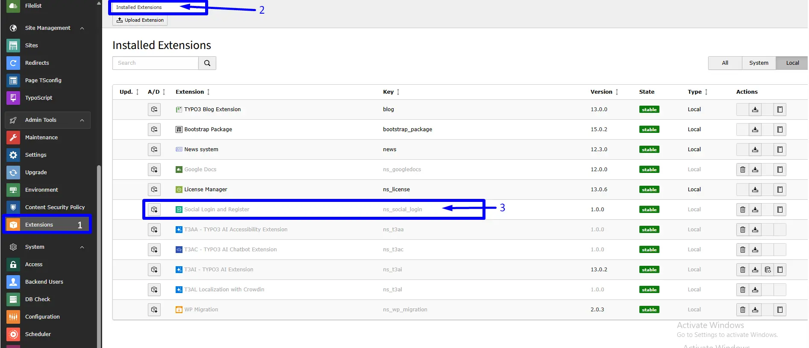
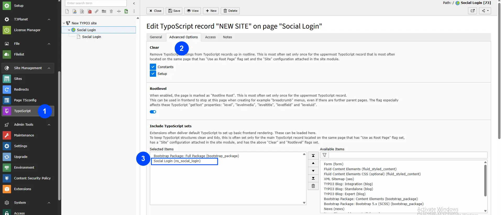

# Installation

You can install the TYPO3 Social Login Extension using either the Extension Manager or Composer, depending on your TYPO3 project setup.

**Premium Version – License Activation**

To install and activate the premium version, follow the official guide:
[License documentation](/License/Index)

**Free Version – Installation via Extension Manager (EM)**

- Step 1: In the TYPO3 backend, navigate to the Extension Manager module.
- Step 2: Click **Retrieve/Update** to fetch the latest extensions.
- Step 3: Search for the extension key: `ns_social_login`. Install it directly from the TYPO3 Extension Repository (TER).

## Activating TypoScript

To enable functionality, include the static TypoScript configuration:

1. Navigate to the root page of your TYPO3 site.
2. Open the **Template or TypoScript** module and choose **Edit the whole template record**.
3. Go to the **Includes** tab.
4. Under **Include static (from extensions)**, add: `Social Login (ns_social_login)`
5. Ensure the static template is placed at the end of the list.

## Video Tutorials

- **Installation without Composer:**
  https://www.youtube.com/watch?v=SN5HoFQcDM4
- **Installation via Composer:**
  https://www.youtube.com/watch?v=_7ILu4lwU-k
