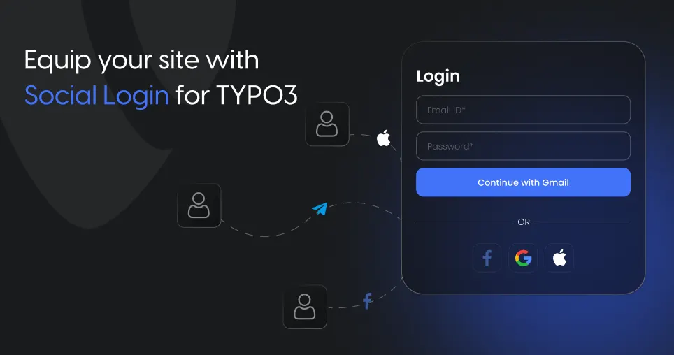

## Introduction

**EXT:ns_social_login**

The TYPO3 Social Login Extension offers a comprehensive solution to streamline user login and registration workflows on TYPO3 websites. Instead of requiring users to create a new account, this extension allows login via existing social media credentials. This simplifies the process, enhances user experience, and encourages more sign-ups.

### Helpful Links

<Note>

- **Product Page:** https://t3planet.de/typo3-social-login-extension
- **Support Portal:** https://t3planet.de/support

</Note>
