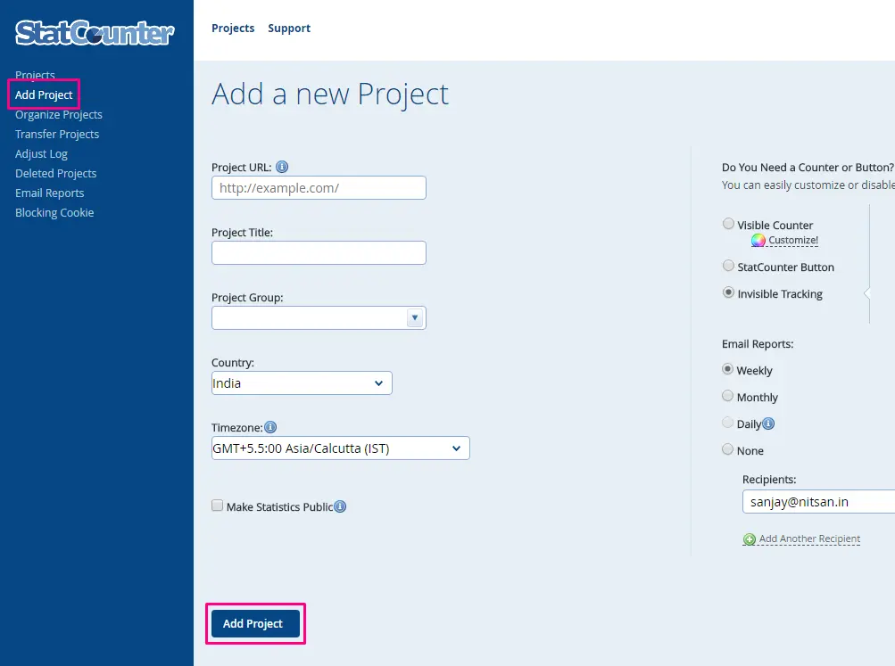
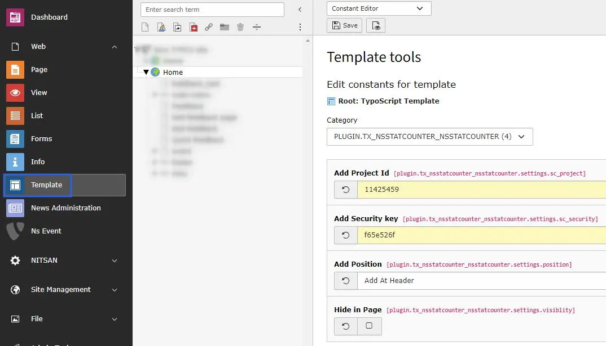

# Configuration

## Quick & Easy configuration of "StatCounter" into TYPO3

### To activate the StatCounter service for your TYPO3 site:

1. Sign Up with StatCounter [https://statcounter.com/sign-up/](https://statcounter.com/sign-up/)

2. Add Your Project URL [http://statcounter.com/add-project/](http://statcounter.com/add-project/)

3. Use "Default Installation Instructions" to get all to get Project Id and Security Key.

### Setup all the configuration of www.StatCounter.com

1. Switch to the root page of your site.

2. Switch to the **Template module** and select *Constant Editor*.

3. Select Category = PLUGIN.TX_NSSTATUSCOUNTER (4)

4. Please setup all the fields from www.StatCounter.com, Checkout following screenshot.

## Clearing the cache

Please use the buttons 'Flush frontend caches' and 'Flush general caches'
from the top panel. The 'Clear cache' function of the install tool will also
work perfectly.
