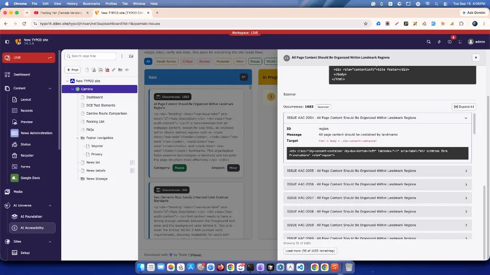

**Fix Hub** is where you **assign, track, verify, and close** accessibility
work for the selected page path.

**A scan reports findings. Fix Hub is where the work happens.**

Findings on the board come from:

* **Scanner** runs (HTML / WCAG-oriented checks)
* **Lighthouse** runs (PageSpeed accessibility audits)

Both sources appear as cards/rows you can filter, open, and move through status
until completed. Fix Hub does **not** run the scan itself.

<iframe src="https://app.supademo.com/embed/cmu2a3j030m7cqmrxsj41amvz?utm_source=link" loading="lazy" title="T3AA Fix Hub Feature Demo" allow="clipboard-write; fullscreen" frameBorder="0" webkitallowfullscreen="true" mozallowfullscreen="true" allowfullscreen></iframe>

## Fix Hub board

## How to open Fix Hub

1. Open **AI Accessibility**.
2. Select a page in the page tree.
3. Open the **Fix Hub** tab.

If the board is empty, run a **Scanner** check first, then return here. Use
**Go to Scans** when the empty state offers it.

Findings from **Scanner** and **Lighthouse** both appear on this board after a
completed run (see above).

## Board view

| Column | Meaning |
| --- | --- |
| New | Not started |
| In Progress | Work has started |
| Completed | Fixed / verified / closed |

## Filters

Use the toolbar to show only what you need:

* All, Needs Review
* Critical / Serious / Moderate / Minor
* Passes
* WCAG A / AA / AAA, Best Practice, WCAG 4.1.2

## Issue detail

Click a card to open the detail panel. Typical content:

* Description, WCAG / guideline tags, impact
* Source label (**Scanner** or **Lighthouse**)
* **How to fix** and related guidance
* Occurrences with target selectors and HTML snippets
* **Status** (**New** / **In Progress** / **Completed**) with **Update**

Use occurrences to move from the rule to the specific markup that needs fixing.

## Color contrast checker

The toolbar (and empty state) can open a **color contrast checker**.

* Check a foreground / background pair against WCAG 1.4.3 (AA) and 1.4.6 (AAA)
* No AI provider, no key, and no scan required
