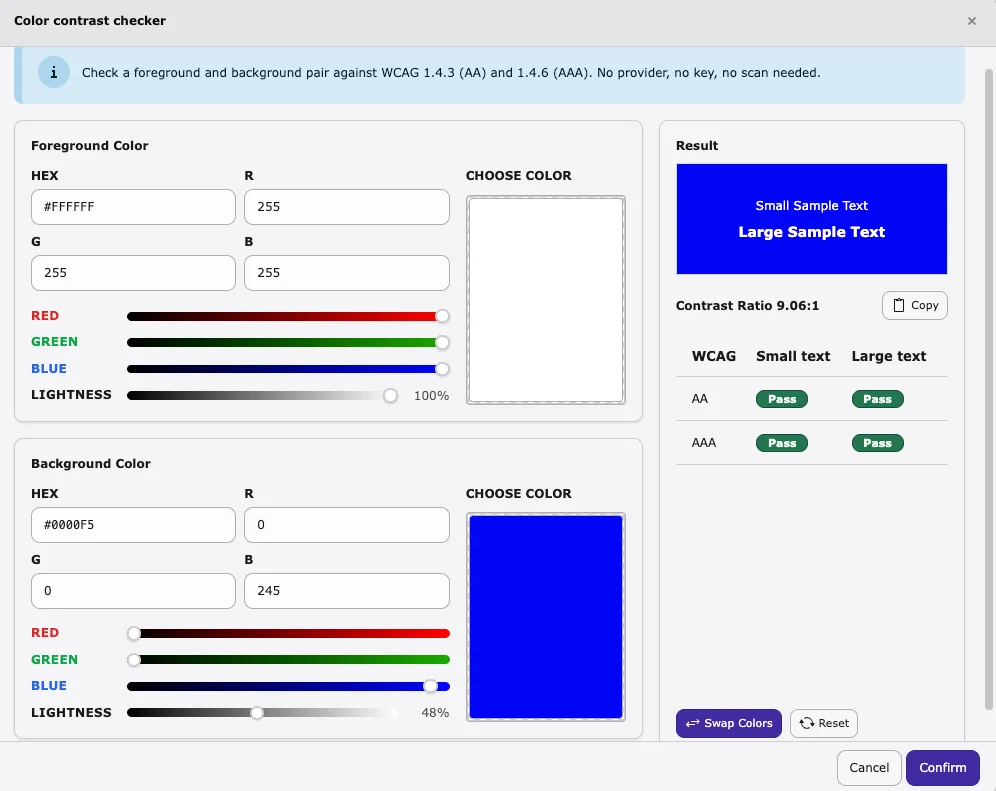

**Fix Hub** is where you **assign, track, verify, and close** accessibility
work for the selected page path.

Findings on the board come from **Scanner** runs (HTML / WCAG-oriented checks).
Eligible Scanner issues appear as cards/rows you can filter, open, and move
through status until completed.

<iframe src="https://app.supademo.com/embed/cmu2a3j030m7cqmrxsj41amvz?utm_source=link" loading="lazy" title="T3AA Fix Hub Feature Demo" allow="clipboard-write; fullscreen" frameBorder="0" webkitallowfullscreen="true" mozallowfullscreen="true" allowfullscreen></iframe>

## How to open Fix Hub

1. Open **AI Accessibility**.
2. Select a page in the page tree.
3. Open the **Fix Hub** tab.

If the board is empty, run a **Scanner** check first, then return here. Use
**Go to Scans** when the empty state offers it.

Findings appear on this board after a completed **Scanner** run.

## Board view

| Column | Meaning |
| --- | --- |
| New | Not started |
| In Progress | Work has started |
| Completed | Fixed / verified / closed |

## Filters

Use the toolbar to show only what you need:

* All, Needs Review
* Critical / Serious / Moderate / Minor
* Passes
* WCAG A / AA / AAA, Best Practice, WCAG 4.1.2

## Issue detail

Click a card to open the detail panel. Typical content:

* Description, WCAG / guideline tags, impact
* Source label (**Scanner**)
* **How to fix** and related guidance
* Occurrences with target selectors and HTML snippets
* **Status** (**New** / **In Progress** / **Completed**) with **Update**

Use occurrences to move from the rule to the specific markup that needs fixing.

## Color contrast checker

**Color contrast checker** is a built-in Fix Hub tool for checking text and
background colour pairs against WCAG contrast rules — without running a scan
and without an AI provider or API key.

Open it from the Fix Hub **toolbar** (also available from the empty-state
actions when the board has no findings yet).

### What you can do

* Set **Foreground** and **Background** colours (HEX, RGB, sliders, or colour picker)
* Preview **small** and **large** sample text on the chosen background
* Read the live **contrast ratio** (with copy)
* See **Pass / Fail** for WCAG **1.4.3 (AA)** and **1.4.6 (AAA)** on small and large text
* **Swap colours** or **Reset** the pair, then **Confirm** or **Cancel**

Use it when you are remediating contrast findings from Scanner, or to check a
proposed colour pair before you publish.
