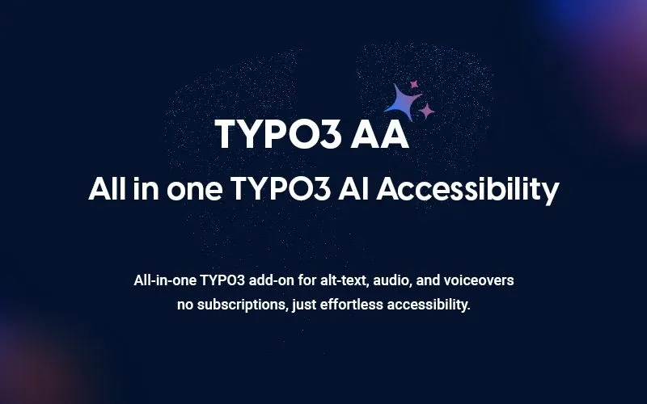

## EXT:ns_t3aa

## EXT:ns_t3aa - What does it do?

T3AA helps TYPO3 teams improve accessibility-related content work with AI-assisted tools.
It supports workflows such as image metadata, alt text, AI audio, voiceover, simplified text, CKEditor accessibility checks, and performance-related guidance.

T3AA now works as a child extension of AI Foundation (`ns_t3af`), which provides the shared AI providers, authentication, common configuration, and core AI services used by the extension.

For the shared setup, see:

- [AI Foundation Introduction](/en/latest/ExtNsT3AF/Introduction/Index)
- [AI Foundation Installation](/en/latest/ExtNsT3AF/Installation/Index)
- [AI Foundation System Requirements](/en/latest/ExtNsT3AF/SystemRequirements/Index)

## Helpful Links

    - Product Page: https://t3planet.de/en/t3aa-typo3-extension
    - Support Portal: https://t3planet.de/support
