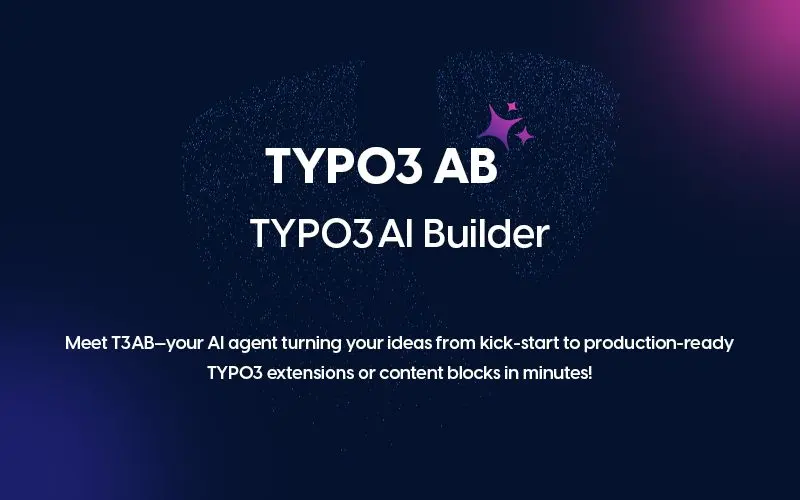

## Introduction

## EXT:ns_t3ab

## EXT:ns_t3ab - What does it do?

T3AB – TYPO3 AI Builder is an intelligent TYPO3 extension designed to simplify and accelerate the creation of TYPO3 content blocks, forms, and complete extensions using Artificial Intelligence.

Built for developers, agencies, and businesses, T3AB empowers users to build TYPO3 solutions through natural language prompts, eliminating the need for repetitive coding.

## Helpful Links

- **Product Page**: [https://t3planet.de/t3ab-typo3-erweiterung](https://t3planet.de/t3ab-typo3-erweiterung)
- **Support Portal**: [https://t3planet.de/support](https://t3planet.de/support)
