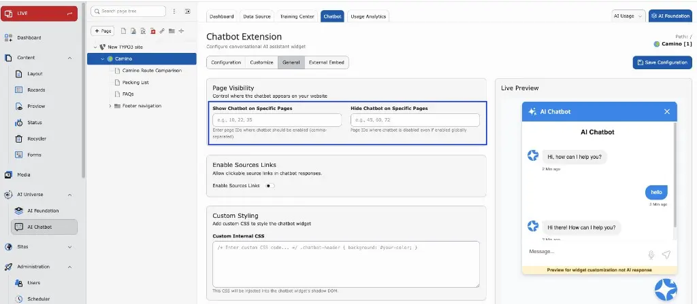
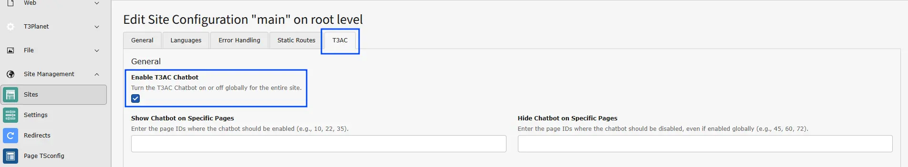
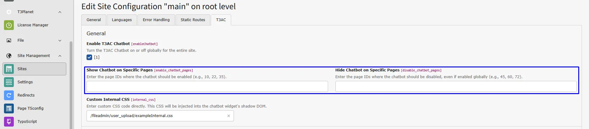
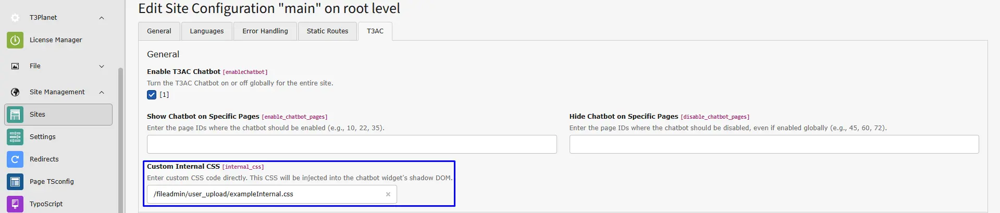
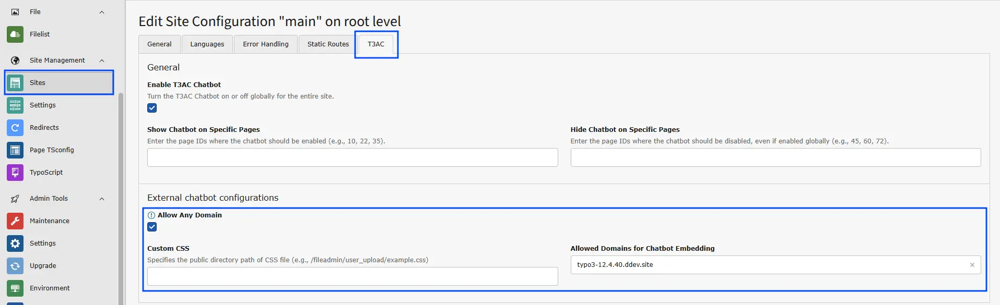

T3AC uses T3AF for provider setup, model selection, shared prompts, and core AI services.
Complete the T3AF setup first, then return to T3AC for chatbot-specific configuration.

Helpful T3AF references:

- [T3AF Configuration](/ExtNsT3AF/Configuration/Index)
- [AI Providers](/ExtNsT3AF/Configuration/AIProviders/Index)
- [AI Features](/ExtNsT3AF/Configuration/AIFeatures/Index)
- AI Prompts

## Step 1: Open AI Features in T3AF

<iframe src="https://app.supademo.com/embed/cmrabse4l0btvqmhx59tvn83q?utm_source=link" loading="lazy" title="AI FileMeta Overview Demo" allow="clipboard-write" frameBorder="0" webkitallowfullscreen="true" mozallowfullscreen="true" allowfullscreen></iframe>

Shared AI settings for T3AC are managed in T3AF — not under **Admin Tools > Settings > Configure Extensions**.

1. Go to the **TYPO3 backend**.
2. Open **T3AF** → **AI Features**.
3. Open the **T3AC** (`ns_t3ac`) feature card.
4. Configure provider/model overrides and feature options used for chatbot and training workflows.
5. Click **Save**.
6. Return to the **T3AC** module for chatbot, data source, and training-specific settings.

For the shared module overview, see [T3AF AI Features](/ExtNsT3AF/Configuration/AIFeatures/Index).

## Step 2: Add Required API Keys

Ensure that the required provider API keys are configured in T3AF.

- **OpenAI** — [Create an API key](https://platform.openai.com/api-keys) in your OpenAI account. For full technical details, see the [OpenAI API reference](https://platform.openai.com/docs/api-reference/introduction).

## AI Chatbot Features

T3AC focuses on chatbot-related AI workflows built on top of the shared T3AF setup.
Use these features when you want to control how the chatbot answers questions, how data is trained, and how the chatbot is shown on your site or external websites.

Key T3AC capabilities include:

- Chatbot configuration and behavior control
- Training and data-source-based answer generation
- Dashboard, logs, and analytics for chatbot activity
- External embed support for approved domains

For shared model routing and central AI behavior, see [T3AF AI Features](/ExtNsT3AF/Configuration/AIFeatures/Index).

## Step 4: Chatbot Configuration

<iframe src="https://app.supademo.com/embed/cmjcy43b44pnzf6zpnlmzp7nj?embed_v=2&utm_source=embed" loading="lazy" title="AI FileMeta Overview Demo" allow="clipboard-write" frameBorder="0" webkitallowfullscreen="true" mozallowfullscreen="true" allowfullscreen></iframe>

- **Show and Hide Chatbot on Specific Pages**

Configure page visibility, source links, and custom CSS under **Chatbot → General**, with Live Preview on the right.

- **Show Chatbot on Specific Pages**
  - Enter the Page IDs where the chatbot should be visible (e.g., 10, 22, 35).
- **Hide Chatbot on Specific Pages**
  - Enter the Page IDs where the chatbot should be hidden, even if it is enabled globally (e.g., 45, 60, 72).
- **Internal CSS Configuration**
- **Custom CSS**
  - Use your own styles to customize the chatbot appearance.

<Note>
Make sure your CSS files are available inside the public directory, and the path should start with `fileadmin/`.
</Note>

## Step 5: External Chatbot Configuration

To configure chatbot embedding for external domains:

1. Go to the **T3AC** module.
2. Navigate to **Chatbot > External Embed**.

Available options:

- **Custom CSS**
Use your own styles to customize the chatbot appearance.
- **Allowed Domains for Embedding**
Specify the domains where the chatbot can be embedded, e.g. `example.com`, `trusted-domain.com`.
- **Allow Any Domain**
Enable this option to permit embedding on any domain without restrictions.

## Providers & MCP Tools

<iframe src="https://app.supademo.com/embed/cmrabygkm0chzqmhx3nanm13o?utm_source=link" loading="lazy" title="T3AC Providers and MCP Tools Demo" allow="clipboard-write" frameBorder="0" webkitallowfullscreen="true" mozallowfullscreen="true" allowfullscreen></iframe>

T3AC uses T3AF for provider selection and any shared MCP-based integrations.
Review this setup when you want to confirm the active provider, available models, and connected MCP tools that support chatbot workflows.

See also:

- [AI Providers](/ExtNsT3AF/Configuration/AIProviders/Index)
- MCP Server
- MCP Tools

