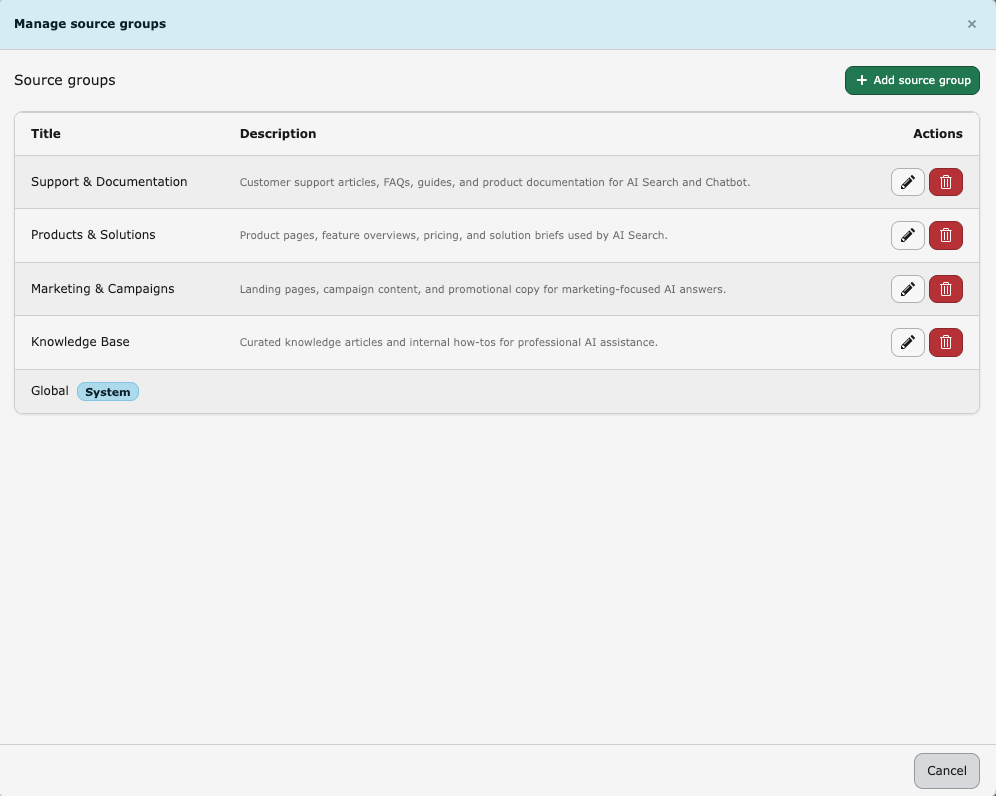
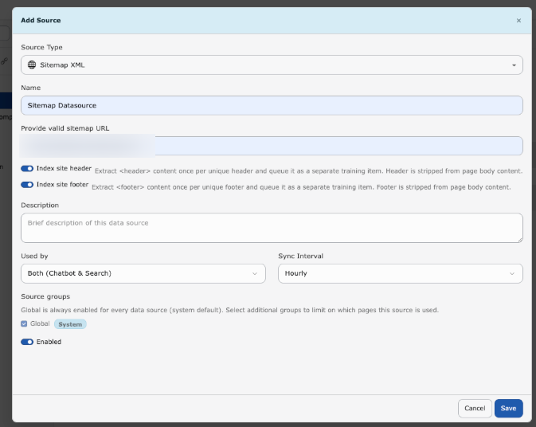
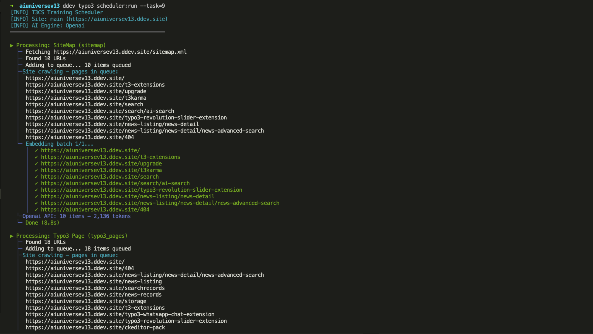
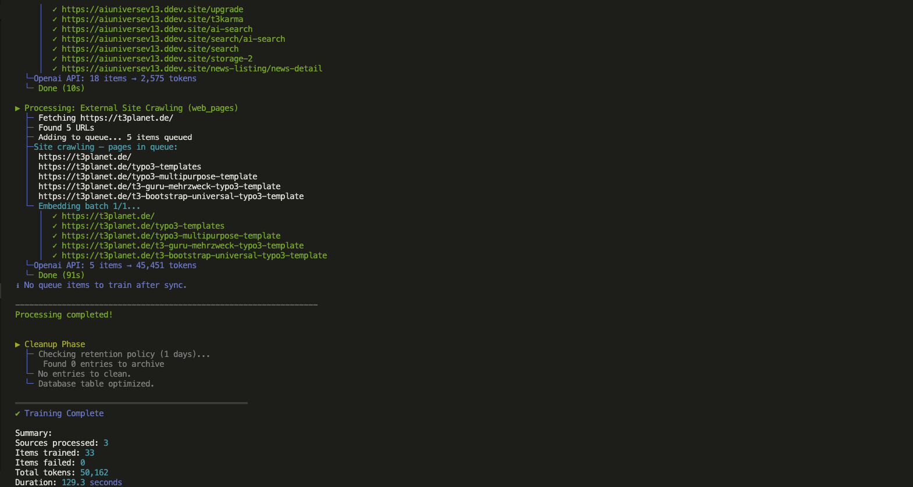

## Purpose

Add and manage the sources of content that will be used for AI search and the AI chatbot (e.g. website pages, PDFs, Q&A).

## Adding a data source

1. Click **+ Add Source**.
2. Choose the **type of source**, for example:
  - **Sitemap XML** – Your sitemap URL(s) (e.g. `https://example.com/sitemap.xml`).
  - **PDF Documents** – Folder path where PDFs are stored (and optionally upload PDFs).
  - **TYPO3 Pages** – Content from specific TYPO3 pages.
  - **Web Pages** – A website URL; optionally limit to a path (e.g. `https://example.com/blog/*`).
  - **Q&A Pairs** – Manual question-and-answer content.
  - **Indexed Search / Ke Search / Solr** – If the corresponding extensions are installed and indexed content is available.
3. Fill in the requested details (URLs, folder path, page selection, etc.) and give the source a **Name** (e.g. `Main Website`) and optional **Description**.
4. Set **Sync interval**: how often content should be refreshed (e.g. **Hourly**, **Daily**, **Weekly**). **Custom** means no automatic schedule (manual sync only).
5. Set **Used by** (formerly **Type**) to control whether this source is available for **AI Search**, **AI Chatbot**, or **Both**.
6. Set **Enabled** to on if the source should be active.
7. Click **Save**.

After saving, T3AC will:

- Create or update the data source.
- Sync content into the training queue (new or changed items).
- **Automatically create** the **T3AF Training** Scheduler task for this site (if it does not exist yet) and **run it at the frequency you set** (e.g. Hourly, Daily, Weekly). You do not need to create the scheduler task manually—it is created when the source is saved and will execute according to the chosen sync interval.

## Editing or deleting a source

Use the actions next to each data source to **edit** (type, URLs, interval, usage) or **delete** it.

## Source Groups | Page-Level Source Configuration

Source Groups allow administrators and editors to organize data sources and control which content is available to AI Search and the AI Chatbot on a page-by-page basis.
This gives you precise control over retrieval because only the selected Source Groups are considered for that page.

Source Groups are used only during content retrieval.
They do **not** affect AI training, vector indexing, Scheduler execution, embedding generation, or data synchronization.
The filtering is applied by the **VectorService** during retrieval.

### Backend Configuration

#### Manage Source Groups

Go to **Data Sources -> Source Groups** to manage Source Groups.
Administrators can:

- create Source Groups
- edit Source Groups
- delete Source Groups



Create, edit, or delete Source Groups. The **Global** group is a system default and cannot be changed.

<Note>
The **Global** Source Group is a system group and cannot be edited or deleted.
</Note>

#### Assign Source Groups to Data Sources

When creating or editing a data source, users can:

- select one or more Source Groups
- rely on the **Global** Source Group, which is assigned automatically
- configure the **Used by** field (formerly **Type**) to control where the source is available

Available **Used by** options:

- **AI Search**
- **AI Chatbot**
- **Both AI Search and AI Chatbot**

This setting controls where the data source can be used after retrieval starts.

#### Page-Level Configuration (T3AS / T3AC)

1. Open the desired TYPO3 page.
2. Open **Page Properties**.
3. Go to the **AI Search** tab.
4. Find the **Source groups** field.
5. Select the Source Groups that should be available on that page.


Choose Source Groups under **Page Properties → AI Search** so AI Search and AI Chatbot use only those sources on that page.

Only data sources assigned to the selected Source Groups are used on that page and their child/recursive pages.
This filtering applies to both **AI Search** and **AI Chatbot**, and different pages can use different Source Groups.

#### Practical Example

A company has separate documentation for **Products**, **HR**, and **Internal Policies**.

Three Source Groups are created:

- **Products**
- **HR**
- **Internal**

On product pages, only the **Products** Source Group is selected, so AI Search and AI Chatbot return product-related information.
On HR pages, only the **HR** Source Group is selected, so HR content is used while product information is excluded.

<Note>
Source Groups only affect content retrieval. Existing training data, embeddings, vector indexing, and scheduled synchronization continue to operate normally.
</Note>

<Note>
If no custom Source Groups are selected, the **Global** Source Group remains available according to the configured behavior.
</Note>

### Header / Footer for Sitemap and Web-Page Source Types

These options help you keep repeated layout content out of the main page body while still making shared site information available to chatbot and search retrieval.



Enable **Index site header** and **Index site footer** when adding or editing a Sitemap XML or Web Pages data source.

**Index Site Header**

Use **Index Site Header** when the site header contains useful shared information that should be indexed only once.

Purpose:

- extract the website `<header>` content one time for each unique header
- store that content as a separate training item
- remove the same header content from the page body before indexing

Benefits:

- reduces duplicate information across many pages
- keeps repeated navigation or shared header text from being indexed over and over
- preserves useful shared site information for retrieval

When to enable:

- when the header contains meaningful text that supports AI answers
- when many pages share the same header content

Recommended use cases:

- websites with shared product navigation or service overviews in the header
- websites where the header contains reusable company or category information

**Index Site Footer**

Use **Index Site Footer** when the site footer contains shared information that should be indexed only once.

Purpose:

- extract the website `<footer>` content one time for each unique footer
- store that content as a separate training item
- exclude that footer content from the page body during indexing

Benefits:

- prevents duplicate footer text from being trained again on every page
- keeps the main page content cleaner for retrieval
- preserves useful global site information such as company details or support links

When to enable:

- when the footer contains helpful shared text for chatbot or search answers
- when the same footer appears on many pages

Recommended use cases:

- websites with shared contact details, policy references, or company summaries in the footer
- large sites where repeated footer content would otherwise be indexed many times

<Note>
Enable **Index Site Header** and/or **Index Site Footer** in the data source form when creating or editing a **Sitemap XML** or **Web Pages** source.
</Note>

<Info>
Deleting a data source also removes its training queue and embedded data for that source.
</Info>

## Sync

**Sync** (per source or **Sync all**) refreshes content from the source into the training queue.

- Sync does **not** run AI training by itself.
- Training is performed by the Scheduler task or manually (see **Training Center**).

## Scheduler

**T3AF Training** is the shared console command `nst3af:training` (AI Foundation / T3CS). It powers automatic indexing for **AI Chatbot (T3AC)**.

When you create a data source, T3AC will automatically create the **T3AF Training** Scheduler task for this site (if it does not exist yet) and **run it at the frequency you set** (e.g. Hourly, Daily, Weekly). You do not need to create the scheduler task manually—it is created when the source is saved and will execute according to the chosen sync interval.

From the Dashboard you can open the TYPO3 Scheduler and locate the automatic training task (typically named **T3AF Training** for this site). Use **Run All** or **Run Task Now** to process the training queue immediately.

When the scheduler runs this task for a site, it:

1. **Syncs** enabled data sources for that site (crawl or refresh content into the **training queue**).
2. **Trains** pending queue items (chunks content and **generates embeddings** via your configured AI provider or T3Planet Credits).
3. **Cleans up** old completed/failed queue rows according to the retention setting (optional archive to CSV).

<Note>
**Sync** in the Data Sources UI only marks content for refresh. It does **not** call the AI or create embeddings by itself. Embeddings are created when **T3AF Training** runs (scheduler, CLI, or **Training Center** actions that trigger the same pipeline).
</Note>

You can run the same command manually from the project root (for example with DDEV). Replace `<rootPageId>` with your site root page ID and `<taskUid>` with the numeric UID from the Scheduler module (do **not** assume a fixed ID such as `9`).

**Argument**

**`rootPageId` (optional when using `scheduler:run --task=`)**
Site root page ID. Required for direct CLI runs unless the scheduler passes it via the task.

**Options**

**`--source=ID`**
Process only one data source (must belong to the site).

**`--detailed`**
Verbose output (each URL, PDF, and similar). **Enabled by default** on the automatic scheduler task. It will show the detailed progress in the CLI command.

**`--dry-run`**
Preview only — no API calls and no database updates.

**`--limit=N`**
Process at most *N* queue items per data source.

**`--batch-size=N`**
Embedding batch size (default: extension **Batch size** or 100). **Set on the scheduler task** from extension settings when the task is created or updated.

**`--skip-cleanup`**
Skip the post-training cleanup phase.

**`--cleanup-only`**
Run cleanup only (no sync, no embedding).

**`--retention-days=N`**
Delete or archive queue rows older than *N* days (default: extension **Retention days** or 30). **Set on the scheduler task** from extension settings.

**`--no-archive`**
Delete old queue rows without writing a CSV archive first.

**`--optimize-db`**
Run `OPTIMIZE TABLE` after cleanup.

**`--queue-failed`**
Move **Failed** queue items back to **Pending** before processing.

**`--force` / `-f`**
Re-train all: set all queue items (completed/failed/processing) back to **Pending** and process.

It does **not** automatically set `sync_requested`. Sync still requires the **Sync** action from the DataSource tab.

**What the automatic scheduler task uses**

Only `rootPageId`, `--batch-size`, `--retention-days`, and `--detailed`. All other options are for **manual CLI** or custom scheduler tasks you create yourself.

**Example commands**

Composer / TYPO3 v13+ (typical):

```bash
ddev typo3 scheduler:run --task=<taskUid> -f
ddev typo3 nst3af:training <rootPageId> --detailed
ddev typo3 nst3af:training <rootPageId> --dry-run
ddev typo3 nst3af:training <rootPageId> --source=5 --limit=20
ddev typo3 nst3af:training <rootPageId> --cleanup-only
```

Legacy non-Composer installs may use `scheduler:execute` instead of `scheduler:run`; see [TYPO3 Scheduler CLI documentation](https://docs.typo3.org/c/typo3/cms-scheduler/13.4/en-us/Administration/ConsoleTools/Running.html).



Example of scheduler task output in the terminal.



Example showing queue processing and training completion summary.

These **T3CS / AI Chatbot & Search** settings are applied when the scheduler task is configured:

- **Batch size** → `--batch-size` on the task
- **Retention days** → `--retention-days` on the task
- **Chunk size**, **Max link crawl**, rate limits — affect sync and embedding behavior during the run
- **Log archive path** (optional) — where cleanup CSV archives are stored

More options for other AI Foundation scheduler commands (MCP cleanup, and so on) are listed under **AI Foundation → Scheduler & CLI** in the TYPO3 backend.

<div className="t3-embed"><iframe src="https://app.supademo.com/embed/cmraclzms0e0pqmhxm0sztm2a?embed_v=2&utm_source=embed" loading="lazy" title="Interactive demo" allow="clipboard-write" frameBorder="0" webkitallowfullscreen="true" mozallowfullscreen="true" allowfullscreen></iframe></div>

<div className="t3-embed"><iframe src="https://app.supademo.com/embed/cmragsj3t0n4vqmhx0pe4jtgt?embed_v=2&utm_source=embed" loading="lazy" title="Interactive demo" allow="clipboard-write" frameBorder="0" webkitallowfullscreen="true" mozallowfullscreen="true" allowfullscreen></iframe></div>
