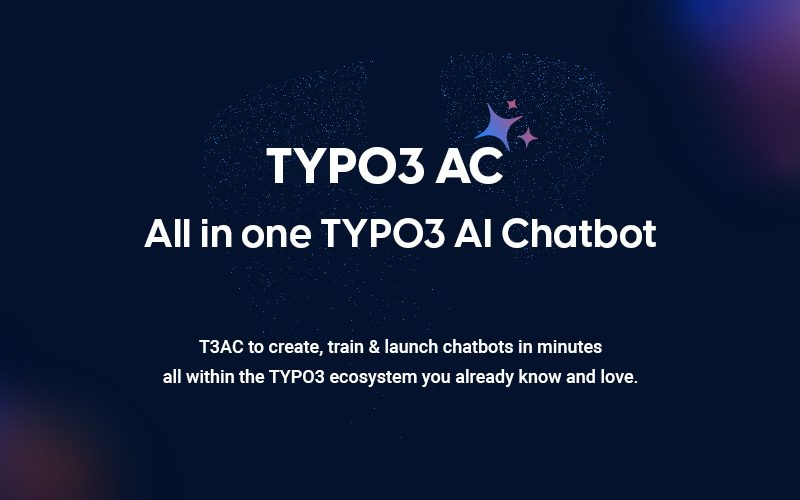

## EXT:ns_t3ac

T3AC adds an AI-powered chatbot to TYPO3 so teams can answer user questions with trained project data.
It supports chatbot configuration, training, data sources, usage tracking, and embedded chatbot delivery for supported websites.

T3AC now works as a child extension of T3AF (`ns_t3af`), which provides the shared AI providers, authentication, common configuration, and core AI services used by the extension.

For the shared setup, see:

- [T3AF Installation](/T3AF/Installation/Index)
- [T3AF Configuration](/T3AF/Configuration/Index)
- [T3AF System Requirements](/T3AF/Installation/Index#ns-t3af-system-requirements)

### System Requirements

- TYPO3 v11 - v13
- PHP v8.2 - v8.4

**Required TYPO3 Extensions:**

- EXT:backend
- EXT:filelist
- EXT:dashboard
- EXT:ns_t3af
- EXT:ns_t3cs
- EXT:fluid
- EXT:seo
- EXT:ns_license
- EXT:sitemap_locator (This extension is only required when using T3AC version 1.4.0 or earlier for sitemap crawling. It is not required in the latest versions of the extension.)

## Helpful Links

<Note>
- Product Page: [https://t3planet.de/t3ac-typo3-erweiterung](https://t3planet.de/t3ac-typo3-erweiterung)
- Support Portal: [https://t3planet.de/support](https://t3planet.de/support)
</Note>
