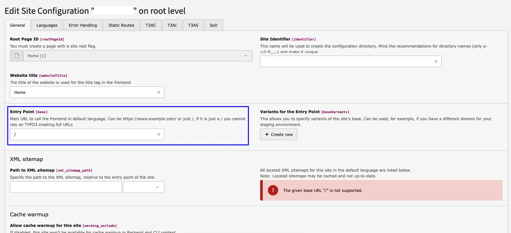

To update the **T3AC Premium** extension, please follow the official update documentation before upgrading your installation:
[https://docs.t3planet.de/en/latest/License/UpdateVersion/Index.html](/License/UpdateVersion/Index)

<Info>
**Migration Steps**

**Step 1 — Remove the current extension**

Uninstall `EXT:ns_t3ac` from your TYPO3 installation before proceeding with the update.

**Step 2 — Update EXT:ns_license**

Make sure the latest version of the License Manager extension is installed. Update `EXT:ns_license` first before downloading the new T3AC version.

**Step 3 — Re-activate your license**

**Without Composer**

Go to **Admin Tools** → **License Manager**, remove the existing license key, enter the license key again, and activate it. The new extension version will be downloaded automatically.

**With Composer**

Completely remove T3AC from your project first. Then, in your `composer.json` file, update the `only` parameter in the Composer `repositories` configuration:

```json
"only": [
  "nitsan/ns-t3ac",
  "nitsan/ns-t3cs"
]
```

Install the latest T3AC package and update dependencies. Confirm that T3AF (`EXT:ns_t3af`) is installed — either with Composer or from the TYPO3 Extension Repository (TER) via **Admin Tools** → **Extensions** → **Get Extensions**.

Download / TER page: [https://extensions.typo3.org/extension/ns_t3af](https://extensions.typo3.org/extension/ns_t3af)

Full details:
[https://docs.t3planet.de/en/latest/License/LicenseActivation/Index.html](/License/LicenseActivation/Index)

**Step 4 — Run the Database Analyzer**

Go to **Admin Tools** → **Maintenance** → **Database Analyzer** and apply all pending database changes.

**Step 5 — Configure T3AF**

Install and configure `EXT:ns_t3af` first. Then configure the AI Provider from T3AF before using T3AC.

**Step 6 — Complete T3AC setup**

Follow the T3AC documentation for the full setup:
[https://docs.t3planet.de/en/latest/ExtNsT3AC/Index.html](/ExtNsT3AC/Index)
</Info>

<Note>
Always create a complete backup of your database, uploaded files, and project before performing an update. This helps prevent data loss and allows you to restore the previous version if any compatibility issues occur during the upgrade.
</Note>

<Info>
Whenever you update the extension to version **1.4.0**, please ensure that the base URL is not set to `/`.
The base URL should match your site URL.

**Example:**

If your site URL is `https://typo3v11.com/`, then your base URL should be `https://typo3v11.com/`, not `/`.

You can change this configuration in the **Site** module.
</Info>


