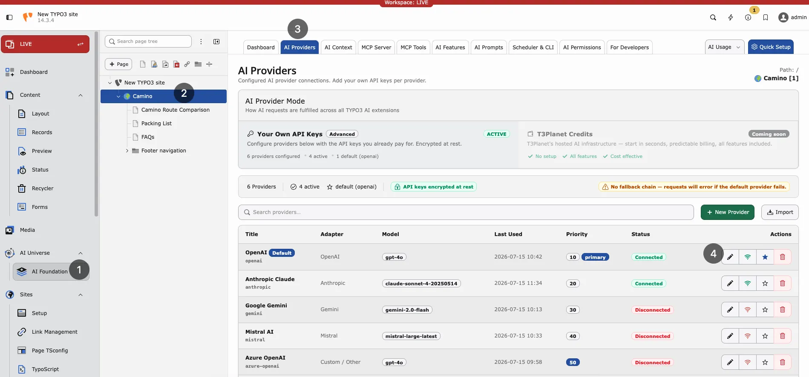
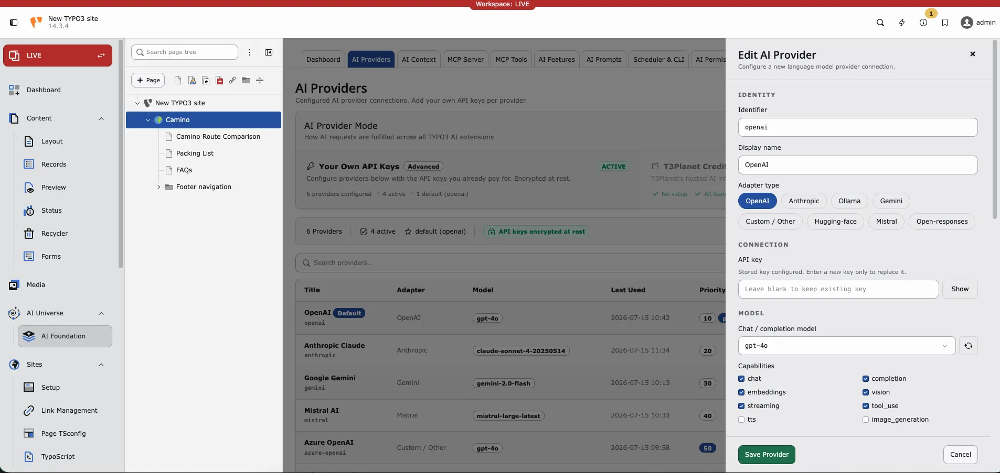

Providers represent connections to AI services. Each provider stores an adapter
type, optional endpoint, encrypted credentials, models, and capability flags.

**Path:** AI Foundation > AI Providers

Follow this interactive walkthrough, then continue with the details below.



AI Providers list — configured adapters, models, connection status, and
default provider.

Without at least one working provider, no AI feature runs.

Alternatively, use [AI Credits](/en/latest/ExtNsT3AF/T3Planet-Credit-System/Index) when you want AI without configuring your own vendor API keys. Your Own API Keys stays the default.

## Adding a provider

1. Open AI Foundation > AI Providers.
2. Click Add provider.
3. Fill in the required fields:
  - **Display name** — Friendly label for your team (for example `OpenAI
  production`).
  - **Adapter type** — Vendor protocol (OpenAI, Anthropic, Gemini, Azure,
  Mistral, DeepSeek, xAI, Ollama, or custom OpenAI-compatible).
  - **API key** — Cloud vendors need a key. Leave empty for local Ollama.
  - **Model ID** — Completion model (for example `gpt-4o-mini`).
4. Optionally set the endpoint URL, embedding model, capabilities, temperature,
and pricing fields.
5. Click Save.
6. Enable Default on exactly one provider.

<Tip>
For first-time setup, use Quick Setup in the AI Foundation module
header. It walks through provider creation with fewer decisions.
</Tip>



Edit AI Provider — adapter type, API key, chat model, and capability flags.

## Testing a connection

After saving a provider, click Test connection to verify the setup.
The test calls the provider API and reports:

- Connection status (success or failure)
- Error details on failure
- Model / capability hints when the adapter can list them

<Note>
Self-hosted endpoints (such as Ollama) must be reachable from the TYPO3
server. Typical causes of a failed test:

- Wrong host or port in Endpoint URL (default
`http://localhost:11434` for Ollama)
- Docker/network isolation between PHP and the model host
- Outbound HTTPS blocked for cloud vendors

Local adapters usually do not need an API key. Cloud adapters do.
</Note>

If your server reaches the internet only through a corporate proxy, configure
TYPO3 HTTP settings:

config/system/additional.php

```php
$GLOBALS['TYPO3_CONF_VARS']['HTTP']['proxy'] = 'http://proxy.example.com:8080';
```

## Editing and deleting providers

<div className="t3-embed"><iframe src="https://app.supademo.com/embed/cmrbo0w7i0d96qmo57ifnabvz?utm_source=link" loading="lazy" title="T3AF Providers Demo" allow="clipboard-write; fullscreen" frameBorder="0" webkitallowfullscreen="true" mozallowfullscreen="true" allowfullscreen></iframe></div>

- Click a provider row to edit its settings in the drawer.
- Use Test connection after rotating an API key or changing the
model.
- Use Delete to remove a provider. Features that pointed at that
provider fall back to the global default (or fail until another provider is
assigned).

<Warning>
Deleting the only default provider leaves child extensions without a global
fallback. Set another provider as Default first.
</Warning>

## Supported adapters

Built-in and discovered adapters include:

- `symfony.openai` — OpenAI
- `symfony.anthropic` — Anthropic Claude
- `symfony.gemini` — Google Gemini
- `symfony.mistral` — Mistral AI
- `symfony.ollama` — Local Ollama
- `symfony.openrouter` — OpenRouter
- `nst3af.openai_compatible` — Custom / OpenAI-compatible endpoints
- Additional Symfony AI bridges when their Composer packages are installed
(for example Azure, DeepSeek, xAI)

Custom adapters: [Custom AI Providers](/en/latest/ExtNsT3AF/DeveloperGuide/CustomProviders/Index#ns-t3af-custom-ai-providers).

## Capabilities

Pick a model that supports what you need. Test connection helps
validate the choice.

- **Chat** — Text generation
- **Streaming** — Live response display in the backend
- **Embeddings** — Search and similarity features
- **Vision** — Image analysis
- **Tool use** — MCP agent workflows

## Multiple providers — when and why

**Dev and live** — Separate rows with different API keys per environment.

**Cost saving** — Cheap model as global default; premium model assigned in
[AI Features](/en/latest/ExtNsT3AF/Configuration/AIFeatures/Index#ns-t3af-ai-features) for important tasks.

**EU hosting** — Mistral or Azure in an EU region for data residency
requirements.

## Provider fields

Fields below map to the AI Providers drawer and the
`tx_nst3af_provider` table.

### Required

<ResponseField name="identifier" type="string" required>
Unique slug for programmatic access (for example `openai-prod`,
`ollama-local`). Must be unique.
</ResponseField>

<ResponseField name="title" type="string" required>
Display name shown in the backend and dropdowns.
</ResponseField>

<ResponseField name="adapter_type" type="string" required>
Adapter protocol identifier, for example `symfony.openai` or
`nst3af.openai_compatible`.
</ResponseField>

### Connection

<ResponseField name="api_key" type="string">
API key for authentication. Stored as sodium ciphertext with an
`enc:v1:` prefix — raw keys are never kept in the database. Required for
cloud adapters; usually empty for local Ollama.
</ResponseField>

<ResponseField name="endpoint_url" type="string" default="Adapter default">
Custom API base URL. Required for OpenAI-compatible and Ollama-style
adapters when the default host is wrong for your network.
</ResponseField>

<ResponseField name="model_id" type="string">
Default completion / chat model ID.
</ResponseField>

<ResponseField name="embedding_model_id" type="string">
Default embedding model ID when embeddings are enabled.
</ResponseField>

### Optional configuration

<ResponseField name="capabilities" type="string list">
Enabled capabilities: `chat`, `completion`, `embeddings`, `vision`,
`streaming`, `tool_use`.
</ResponseField>

<ResponseField name="temperature" type="float" default="0.7">
Default sampling temperature (`0.0`–`2.0`).
</ResponseField>

<ResponseField name="system_prompt" type="text">
Optional provider-level system message prepended to requests.
</ResponseField>

<ResponseField name="is_default" type="bool" default="false">
Mark as the global default. Keep exactly one default among enabled rows.
</ResponseField>

<ResponseField name="is_enabled" type="bool" default="true">
Soft on/off switch without deleting the row.
</ResponseField>

<ResponseField name="priority" type="integer" default="50">
Ordering hint (`0`–`100`) when multiple providers are listed.
</ResponseField>

<ResponseField name="be_groups" type="backend groups">
Restrict this provider to selected backend groups. Empty means available to
all groups.
</ResponseField>

<ResponseField name="privacy_level" type="string" default="standard">
Logging privacy only — how much is stored in the local request log
(`standard`, `reduced` without prompt fingerprint, or `none`). This
does not redact or block prompts, brand context, or documents sent to the
AI provider.
</ResponseField>

### Governance and status

Optional pricing (`pricing_input_per_1m`, `pricing_output_per_1m`,
`pricing_currency`, `cost_center`), retention overrides, dashboard analytics
flags, and read-only status fields (`last_status`, `last_status_at`,
`last_status_message`, `last_used_at`) support monitoring and cost tracking.
Status fields update after Test connection and live requests.

## Troubleshooting

**Test fails** — Check the API key, model ID, endpoint URL, and outbound
HTTPS/firewall rules.

**Rate limit** — Wait or upgrade the vendor plan.

**Vision returns empty** — Use a vision-capable model (for example GPT-4o with
vision).

**Module works but child extension fails** — Check
[AI Features](/en/latest/ExtNsT3AF/Configuration/AIFeatures/Index#ns-t3af-ai-features) for per-task overrides.

## Security

- Rotate keys every 90 days
- Use one key per environment (dev, staging, live)
- Restrict access via [AI Permissions](/en/latest/ExtNsT3AF/Configuration/AIPermissions/Index#ns-t3af-ai-permissions)
- Never commit API keys to Git

## Where to get API keys

<Note>
- OpenAI: [https://platform.openai.com/api-keys](https://platform.openai.com/api-keys)
- Anthropic: [https://console.anthropic.com/](https://console.anthropic.com/)
- Google Gemini: [https://aistudio.google.com/apikey](https://aistudio.google.com/apikey)
- Mistral: [https://console.mistral.ai/](https://console.mistral.ai/)
- Azure OpenAI: [https://portal.azure.com/](https://portal.azure.com/)
</Note>

More links: [Helpful Links](/en/latest/ExtNsT3AF/HelpfulLinks/Index#ns-t3af-helpful-links)
