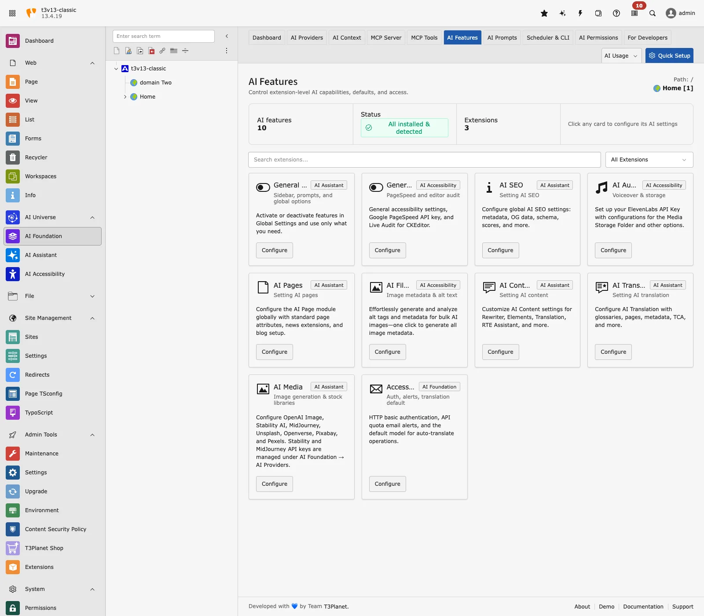
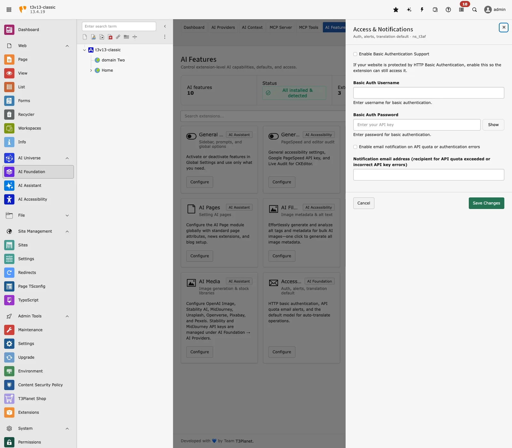

Configure **T3AF** after installation. You need a minimum working setup before connected extensions can use AI.

This section also covers the T3AF backend modules used day to day: providers, context, prompts, features, AI Label, usage, and access control.

## Two configuration areas

**AI Providers** — **Path:** T3AF > AI Providers. API keys, models, and defaults.

**AI Features** — **Path:** T3AF > AI Features. Per-site cards for connected extensions. AI Foundation's own card is **Access & Notifications** (Basic Auth and quota email alerts). MCP options are on T3AF > MCP Server > Advanced.

**Extension settings** — Translation APIs, Basic Auth, notifications, and MCP switches (including `enableMcpServer`). Prefer T3AF > MCP Server > Advanced for MCP options. These keys live in T3AF settings, not the classic TYPO3 Admin Tools > Settings > Extension Configuration form.

## Minimum working setup

1. One AI provider with a valid key and model
2. Test connection passes
3. Provider marked **Default**
4. (Optional) DeepL or Google keys for translation APIs
5. (Optional) MCP enabled if you use AI agents

## AI Providers (primary)

**Path:** T3AF > AI Providers

Connect at least one provider, set a model, run Test connection, and mark exactly one row as Default.

DeepL Translate, Google, OpenAI, Anthropic, Gemini, and Ollama are provider rows here — not a separate key list.

Full field reference: [Provider fields](/en/latest/ExtNsT3AF/Configuration/AIProviders/Index). Guide: [AI Providers](/en/latest/ExtNsT3AF/Configuration/AIProviders/Index)

## Extension settings

T3AF stores translation helpers, Basic Auth, notifications, and MCP switches in extension settings (including `enableMcpServer`). Prefer T3AF > MCP Server > Advanced for MCP options.

Where a classic Extension Configuration form is still used for optional keys, open Admin Tools > Settings > Extension Configuration and select `ns_t3af`.

### Translation (optional)

- `deepl_api_key` — DeepL translation
- `google_api_key` — Google translation
- `defaultModelForTranslation` — Default translation model

### OpenAI usage statistics (optional)

- `openai_admin_api_key` — Organization usage charts (not the chat API key)

### Access & Notifications (HTTP Basic Auth)

**Path:** T3AF > AI Features → **Access & Notifications**

Access & Notifications — Basic Auth and API quota email alerts.

- **Enable Basic Authentication Support** — Let AI Foundation fetch URLs protected by HTTP Basic Auth (`basicAuthEnabled`)
- **Basic Auth Username** (`basicAuthUsername`)
- **Basic Auth Password** (`basicAuthPassword`)
- **Enable email notification on API quota or authentication errors**
- **Notification email address** — Recipient for quota or auth-error emails

### MCP Server

- `enableMcpServer` — Master switch (default: on)
- `mcpBasePath` — HTTP endpoint (default: `/mcp`)
- `requireAuth` — Require login (default: on)
- `accessTokenLifetime` — OAuth token TTL

Full guide: [MCP Server](/en/latest/ExtNsT3AF/Integrations/MCPServer/Index)

## Per-feature providers

**Path:** T3AF > AI Features

Override the default provider per task: SEO, Pages, Content, Translation.

See [AI Features](/en/latest/ExtNsT3AF/Configuration/AIFeatures/Index).

## AI Label

**Path:** T3AF > AI Label

Record, confirm, and disclose AI-generated or AI-modified content for EU AI Act Article 50 workflows. Covers module tabs, settings, visitor labels, bulk actions, and evidence export.

Full guide: [AI Label](/en/latest/ExtNsT3AF/Configuration/AILabel/Index)

## Security checklist

- Limit backend admin access
- Use HTTPS in production
- Rotate API keys every 90 days
- Enable [AI Permissions](/en/latest/ExtNsT3AF/Configuration/AIPermissions/Index) for large teams
- Never store keys in Git or email

## When to reconfigure

- After key rotation — run **Test connection** again
- When adding a new child extension — check [AI Features](/en/latest/ExtNsT3AF/Configuration/AIFeatures/Index)
- Before enabling MCP in production — read [MCP Server](/en/latest/ExtNsT3AF/Integrations/MCPServer/Index) security section
- After OSS license key renewal — confirm the key is still valid
