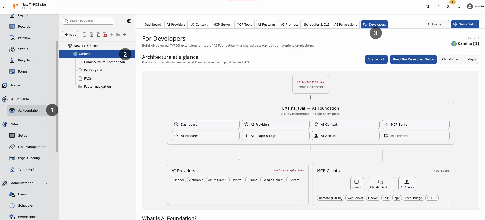

## Overview



Architecture at a glance — extensions call T3AF, which routes to AI providers and MCP clients.

T3AF is a shared foundation layer:

```
Consuming Extension Code
        |
        v
AiServiceInterface
        |
        v
AdapterRegistry -> Provider adapters
        |
        v
   Provider APIs
```

Parallel support:

```
AiStatisticsService -> OpenAiOrganizationUsageService -> OpenAI Usage API
HttpAuthUtility    -> Protected URL fetching with optional Basic Auth
```

## Main components

- **Request orchestration**: `AiServiceInterface` and `AiService`
- **Provider adapters**: `AdapterRegistry` and `AdapterInterface` implementations
- **Statistics processing**: `AiStatisticsService` and `OpenAiOrganizationUsageService`
- **Engine configuration filtering**: `AiEngineConfiguration`
- **Utility and environment helpers**: `AiUniverseUtilityHelper`
- **HTTP auth helper**: `HttpAuthUtility`

## Configuration model

Runtime AI requests resolve through provider rows in [AI Providers](/ExtNsT3AF/Configuration/AIProviders/Index). Optional extension settings cover translation helpers, Basic Auth, notifications, and MCP switches. See [Configuration](/ExtNsT3AF/Configuration/Index).

This includes:

- provider adapters, encrypted API keys, and model IDs
- default provider selection
- optional temperature and capability flags on provider rows
- optional Basic Auth settings for protected URL fetching

## Caching

The extension registers cache `nst3af_statistics` in `ext_localconf.php`.

Statistics service stores processed data in this cache to reduce repeated usage API calls.

## Constraints

- No native frontend plugin and no Fluid frontend output in this package.
- Primary role is reusable service infrastructure.
