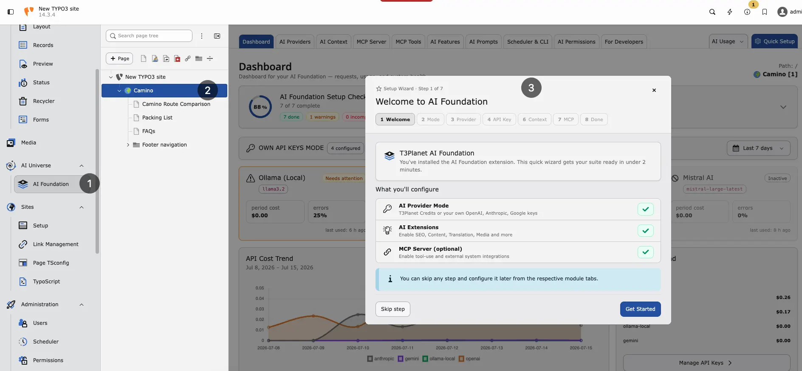

## Quick start


<div className="t3-embed"><iframe src="https://app.supademo.com/embed/cmrbnnxgy0cp3qmo5e1ciofeq?utm_source=link" loading="lazy" title="T3AF Quick Setup Demo" allow="clipboard-write" frameBorder="0" webkitallowfullscreen="true" mozallowfullscreen="true" allowfullscreen></iframe></div>
The recommended way to install this extension is via Composer.

Install the license extension first (if it is not already present), then
T3AF (`EXT:ns_t3af`):

Install via Composer

```bash
composer require nitsan/ns-license
composer require nitsan/ns-t3af
./vendor/bin/typo3 extension:setup
./vendor/bin/typo3 cache:flush
```

Classic TYPO3 sites can also install from the
[TYPO3 Extension Repository (TER)](https://extensions.typo3.org/extension/ns_t3af).

After installation:

1. Activate the extensions in Admin Tools > Extensions.
2. Open T3AF > Dashboard and confirm the module group is
available.
3. Connect providers and API keys in T3AF > AI Providers.
4. Complete guided options with Quick Setup in the T3AF
module header.
5. Clear caches in Admin Tools > Maintenance.

Follow this interactive walkthrough for Quick Setup, then continue with the
details below.



Quick Setup wizard — guided first-time configuration in the T3AF module.

Continue with [Configuration](/ExtNsT3AF/Configuration/Index#ns-t3af-configuration) for providers, MCP, and
day-to-day module setup.

## Composer installation

### Requirements

Ensure your system meets these requirements:

- **TYPO3** — 12.4 LTS, 13.4 LTS, or 14.x
- **PHP** — 8.2 or higher (8.3 recommended), including `ext-sodium`
- **Composer** — 2.x
- **Database** — MySQL 8.0+ or MariaDB 10.3+
- **Network** — Outbound HTTPS for AI provider API calls

### Required Extensions

Install and activate these extensions before T3AF:

- **ns_license** — License activation and premium feature validation
- **scheduler** — Background AI jobs and scheduled tasks
- **workspaces** — Draft workspaces, MCP workflows, and safe content editing

`scheduler` and `workspaces` ship with TYPO3. Activate them if they are
not already enabled.

### Install the license extension

`EXT:ns_license` must be installed first. T3AF depends on it for
license checks. The extension is free on the
[TYPO3 Extension Repository](https://extensions.typo3.org/extension/ns_license).

Install ns_license via Composer

```bash
composer require nitsan/ns-license
```

Or use Admin Tools > Extensions > Get Extensions, search for
`ns_license`, install and activate it, then flush caches.

### Install T3AF

`EXT:ns_t3af` must be installed after `EXT:ns_license`. Find it on the
[TYPO3 Extension Repository](https://extensions.typo3.org/extension/ns_t3af).

Install T3AF via Composer

```bash
composer require nitsan/ns-t3af
```

Or use Admin Tools > Extensions > Get Extensions, search for
`ns_t3af` (or **T3AF**), install and activate it, then flush caches.

### Get your free license key

A free license key is required to activate T3AF. After you install
`EXT:ns_t3af`, get your free license key and enter it before you continue
with configuration:

[https://t3planet.de/en/ai-foundation-for-typo3#c19775](https://t3planet.de/en/ai-foundation-for-typo3#c19775)

#### Activate the extension

Confirm `ns_t3af` is active in Admin Tools > Extensions.

#### Set up the database and clear caches

Extension setup and cache flush

```bash
./vendor/bin/typo3 extension:setup
./vendor/bin/typo3 cache:flush
```

## Manual installation

If you cannot use Composer, install both extensions from the TER in this order:

1. Open Admin Tools > Extensions > Get Extensions.
2. Search for `ns_license`, install and activate it, then flush caches.
3. Search for `ns_t3af` (or **T3AF**), install and activate it.
4. Run **Analyze Database Structure**.
5. Flush caches again.

<Warning>
Manual installation requires manual dependency management. Composer
installation is strongly recommended.
</Warning>

## Verify the installation

Confirm that:

- `ns_license` and `ns_t3af` are listed as active in
Admin Tools > Extensions
- The **T3AF** module group appears in the backend sidebar
- **Analyze Database Structure** reports no pending changes for `ns_t3af`

If the module is missing, flush caches and run
`./vendor/bin/typo3 extension:setup` again.

## Next steps

Open T3AF > AI Providers to connect at least one provider,
then review [Configuration](/ExtNsT3AF/Configuration/Index#ns-t3af-configuration).
