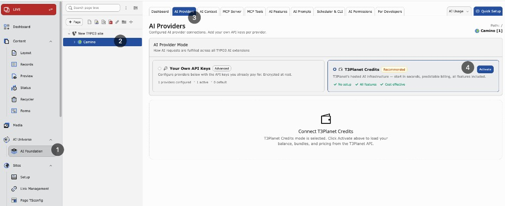
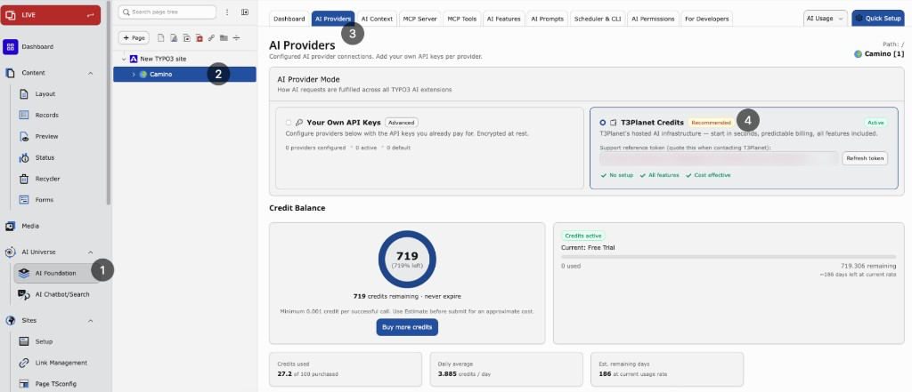

Turn on T3Planet Credits from AI Foundation and manage limits and top-ups.

**Path:** AI Foundation > AI Providers

## Before you start

- AI Foundation (`EXT:ns_t3af`) installed and active
- Valid T3Planet license available (`EXT:ns_license`)
- Server can reach the T3Planet API

## Activate Credits

1. Open AI Foundation > AI Providers.
2. Choose T3Planet Credits.
3. Confirm if asked.
4. Click Activate if shown.
5. Wait for success → page reloads.

Select T3Planet Credits, then click Activate.

After activation — T3Planet Credits active, balance panel, and
Buy more credits.

<Note>
If Activate fails, check that your T3Planet license is valid, the server can
reach the T3Planet API, and try again. See
[Troubleshooting](/ExtNsT3AF/T3Planet-Credit-System/Troubleshooting/Index#t3planet-credits-troubleshooting) for common fixes.
</Note>

## After activation

When Credits is active:

- Billable AI calls go through T3Planet and use your credit balance
- Usage is logged in AI Usage as `t3planet_credits`
- Credits panels appear and the own provider list is hidden
- Balance is available on the Dashboard and Credits panel
- Switching back to Your Own API Keys restores your saved providers

## Group limits

Set per-group usage caps in AI Foundation > AI Permissions.

1. Open AI Permissions.
2. Select the backend usergroup.
3. Configure credit-related limits for that group.

What can be capped:

- **Monthly credit limit** — Maximum credits the group may use per month
- **Daily request limit** — Maximum AI requests the group may send per day

Administrator users are exempt from these caps.

## Buy more credits

When your balance is low, open Buy more credits on the Credits
panel or Dashboard. You complete purchase on the T3Planet checkout page;
invoices stay in your T3Planet account.

<Warning>
If T3Planet returns a rate-limit message, wait for the shown cooldown before
retrying.
</Warning>
