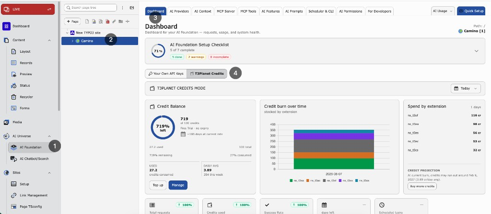

**T3Planet Credits** is T3Planet’s managed AI access for AI Foundation. Use it when you want AI features **without storing or managing your own vendor API keys**.

When Credits is active, billable AI requests go to T3Planet. T3Planet runs the AI work and reduces your credit balance. In **AI Usage**, those requests are stored with provider id `t3planet_credits`.

**Path:** **AI Foundation > AI Providers**

<Note>
On **AI Providers** choose **Your Own API Keys** or **T3Planet Credits**.
</Note>

*Dashboard — **T3Planet Credits** mode with remaining balance, credit burn over time, and spend by extension.*

## What it is

- Optional add-on for AI Foundation
- Pays for AI usage only
- Does not replace the OSS license key
- Credits are used only when billable AI requests run through T3Planet
- You'll receive 50 credits once upon signup
- One shared credit balance for this installation
- Balance on the Dashboard and AI Providers Credits panel
- Usage history in **AI Usage** (provider `t3planet_credits`)

## What it is not

- Not the default setup mode
- Not required when you use your own API keys
- Not a license for AI Foundation

## BYOK vs T3Planet Credits

**BYOK / Your Own API Keys (default)** — Your TYPO3 server sends prompts directly to the provider you configure.

**T3Planet Credits (optional)** — T3Planet routes your content to third-party model providers on your behalf. Credits pay for usage only.

When Credits is active, billable AI requests go to T3Planet and reduce your credit balance. Saved BYOK providers stay in the database and return when you switch back to **Your Own API Keys**.

## Licensing and billing

- AI Foundation is 100% OSS (GPL-2.0-or-later)
- Activate the OSS license key via **T3Planet Shop** > **AI Universe** > **AI Foundation** > **Start**
- T3Planet Credits covers AI usage only
- Credits never replace the OSS license key
- Plan credits never roll over

## Where to configure it

1. Open **AI Foundation > AI Providers**.
2. Choose **T3Planet Credits**.
3. Complete **Activate** if shown.

Default stays **Own API Keys** until you select Credits and finish activation.

## What's covered

When Credits is active:

- Text completion
- Streaming
- Embeddings
- Text-to-speech (TTS)
- Image generation

## When to use it

Use Credits when editors need AI quickly without key setup.

Use Own API Keys when you already manage vendor accounts and keys yourself.
