You can also customize your preferences with any model or feature directly from Settings

<iframe src="https://app.supademo.com/embed/cmfp1kwdp23xb1d3nf2y9woib?embed_v=2&utm_source=embed" loading="lazy" title="AI Co pilot" allow="clipboard-write" frameBorder="0" webkitallowfullscreen="true" mozallowfullscreen="true" allowfullscreen></iframe>

- Navigate to the “Extension Settings” tab.
- Verify your settings.
- Click on “NS_AI Setting.”
- Choose the the desired AI model and features.
- Click on “Save Settings.”

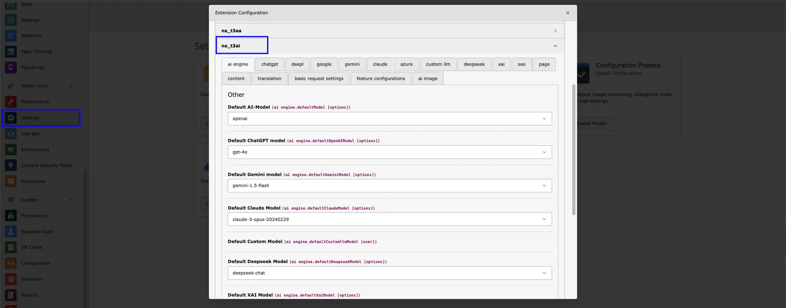

## AI Logs

<iframe src="https://app.supademo.com/embed/cmrbpsdl20frlqmo521y5if8m?utm_source=link" loading="lazy" title="T3AI AI Logs Demo" allow="clipboard-write" frameBorder="0" webkitallowfullscreen="true" mozallowfullscreen="true" allowfullscreen></iframe>

<iframe src="https://app.supademo.com/embed/cmfnzbytm19xg1d3nv60rq329?embed_v=2&utm_source=embed" loading="lazy" title="TYPO3 AI Setup wizard" allow="clipboard-write" frameBorder="0" webkitallowfullscreen="true" mozallowfullscreen="true" allowfullscreen></iframe>

Track all AI system activities and monitor how your backend users interact with the AI models,follow below steps to check AI log.

- **Step 1** - Log in to your TYPO3 backend and navigate to the T3AI Module.
- **Step 2** - Select the **‘AI Log’** Button showing in Corner of the T3AI Module.

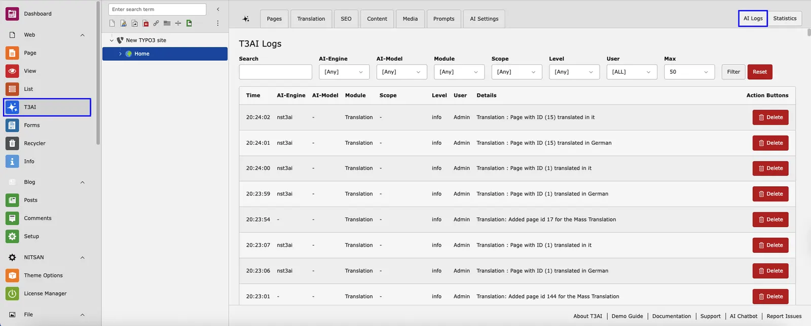

- **Step 3** - Simply search for the page and select all the required fields from the dropdown menu. **AI Engine** - It displays the types of AI engine logs you want to view.
**AI Models** - Select AI Engine Model types. For i.e GPT 4.0
**Module** - This Indicates T3AI module Logs. For SEO, Translation.
After Selecting Your Required field Click on Filter and your AI model Logs are generated.

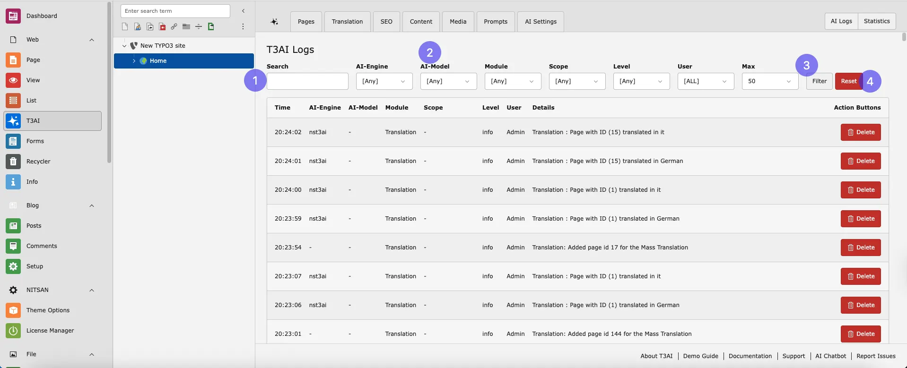

- **Step 4** - You can reset your AI model logs by clicking on the ‘Reset’ button.

## Statastics

<iframe src="https://app.supademo.com/embed/cmfnzchrg19yk1d3nfyx5nru0?embed_v=2&utm_source=embed" loading="lazy" title="TYPO3 AI Setup wizard" allow="clipboard-write" frameBorder="0" webkitallowfullscreen="true" mozallowfullscreen="true" allowfullscreen></iframe>

Access all your AI model analytics in one place with predefined AI model statistics.

## Persona

<iframe src="https://app.supademo.com/embed/cmfo1ibx61e271d3ndexk4qdw?embed_v=2&utm_source=embed" loading="lazy" title="TYPO3 AI Setup wizard" allow="clipboard-write" frameBorder="0" webkitallowfullscreen="true" mozallowfullscreen="true" allowfullscreen></iframe>

Get started with T3AI quickly and easily using our Persona ! Follow simple steps to set up T3AI on your TYPO3 site, so you can start enjoying AI-powered features in no time. The wizard guides you through the process, making installation smooth!

This features help you during installtion of T3AI TYPO3 AI Extension.

## Feature Toggles

<iframe src="https://app.supademo.com/embed/cmfp0kk7e23451d3nu1ohify7?embed_v=2&utm_source=embed" loading="lazy" title="AI Co pilot" allow="clipboard-write" frameBorder="0" webkitallowfullscreen="true" mozallowfullscreen="true" allowfullscreen></iframe>

Activate or deactivate features in Global Settings and use only what you need.

## System AI Log

Track all AI system activities and monitor how your backend users interact with the AI models.

- Go to T3AI Module, now navigate to AISetting tab.
- Open Feature Toggle Modue
- Navigate to feature toggle tab and find “ Enable System Log Solution “ options.
- Check the option and save changes
- **Step 2** - Now move to System module and navigate to log tab.

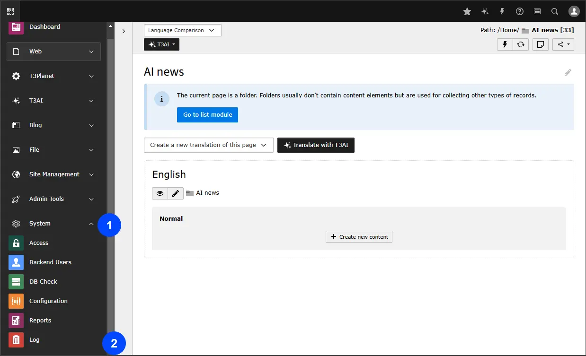

- **Step 3** - Go to your System log and click on AI suggestion.

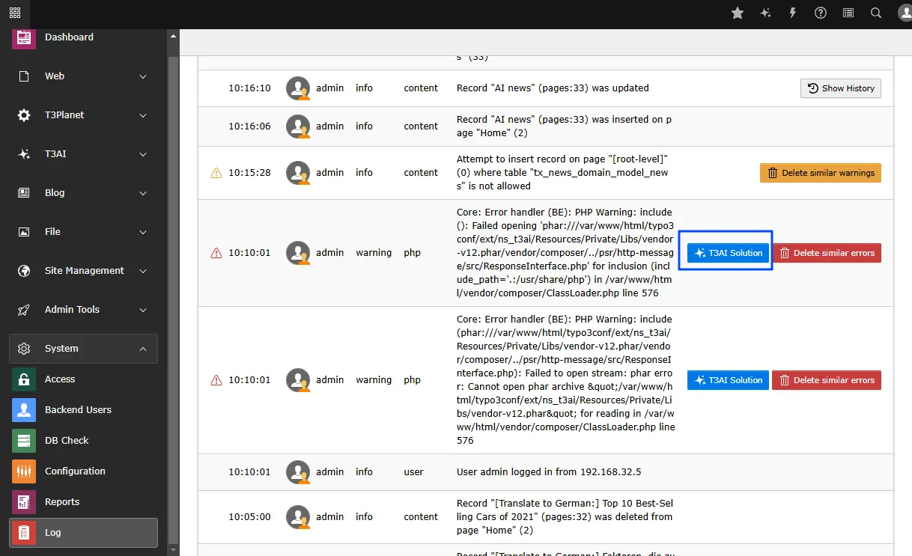

- **Step 4** - Click the button to have the AI suggest solutions for your system log errors.

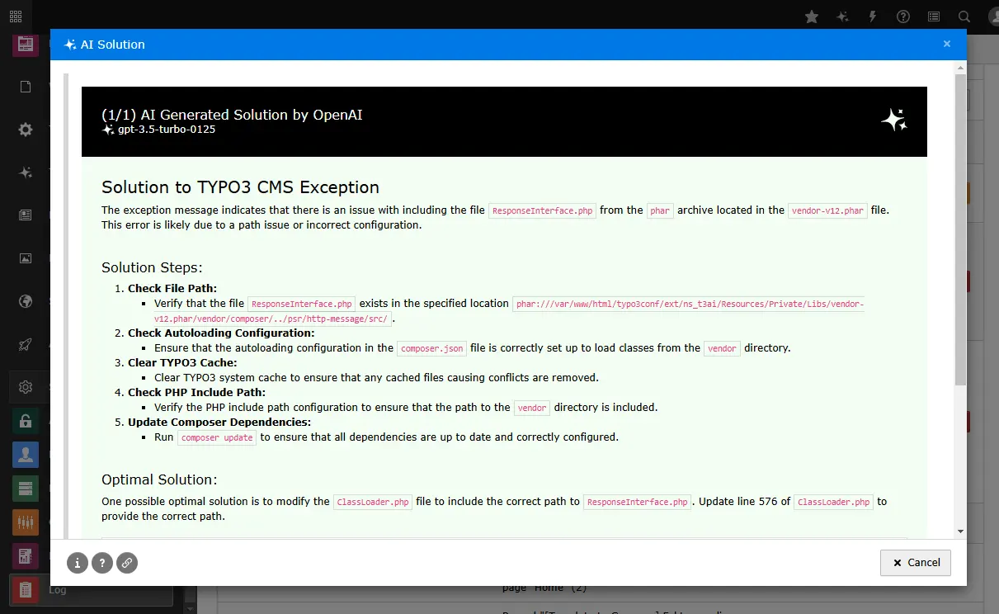

## Setting AI SEO

<iframe src="https://app.supademo.com/embed/cmfp29si124pg1d3nfiuqj3mj?embed_v=2&utm_source=embed" loading="lazy" title="AI Co pilot" allow="clipboard-write" frameBorder="0" webkitallowfullscreen="true" mozallowfullscreen="true" allowfullscreen></iframe>

Configure global AI SEO settings: metadata, OG data, schema, scores, and more.

## Pages

<iframe src="https://app.supademo.com/embed/cmfp2btj324qa1d3ncufn5gb3?embed_v=2&utm_source=embed" loading="lazy" title="AI Co pilot" allow="clipboard-write" frameBorder="0" webkitallowfullscreen="true" mozallowfullscreen="true" allowfullscreen></iframe>

Configure the AI Page module globally with standard page attributes, news extensions, and blog setup.

## Content

<iframe src="https://app.supademo.com/embed/cmfp2e2yy24rw1d3nu6pr8z3r?embed_v=2&utm_source=embed" loading="lazy" title="AI Co pilot" allow="clipboard-write" frameBorder="0" webkitallowfullscreen="true" mozallowfullscreen="true" allowfullscreen></iframe>

Customize AI Content settings for Rewriter, Elements, Translation, RTE Assistant, and more.

## T3AI Co-Pilot

The **T3AI Co-Pilot** is your easy-to-use AI assistant in TYPO3. It helps you write, improve, translate, and optimize content quickly - all directly in the backend with just a few clicks.

**Step 1:** Click on Edit Page property

**Step 2:** Go to tab **“Resources”**

**Step 3:** Include **NS t3ai :: Config RTE Preset (ns_t3ai)** in **Include static Page TSconfig (from extensions)** and Save this.

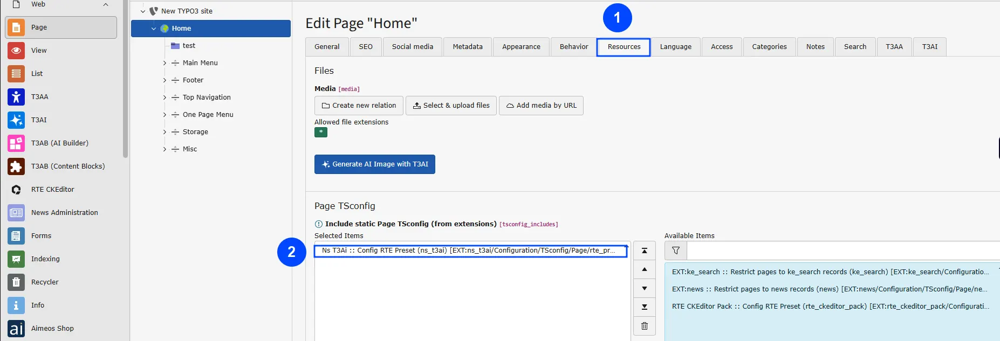

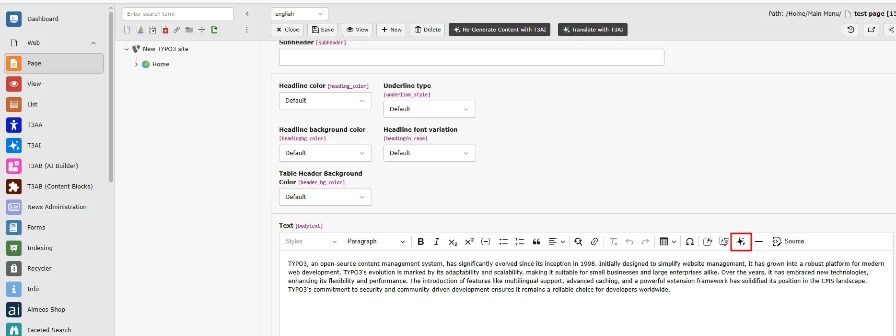

## Translation

<iframe src="https://app.supademo.com/embed/cmfp2fsgn24us1d3ny6e506rn?embed_v=2&utm_source=embed" loading="lazy" title="AI Co pilot" allow="clipboard-write" frameBorder="0" webkitallowfullscreen="true" mozallowfullscreen="true" allowfullscreen></iframe>

Configure AI Translation with glossaries, pages, metadata, TCA, XLF, and more.

## Custom LLM

<iframe src="https://app.supademo.com/embed/cmfp2h7n524xu1d3nmcapna1t?embed_v=2&utm_source=embed" loading="lazy" title="AI Co pilot" allow="clipboard-write" frameBorder="0" webkitallowfullscreen="true" mozallowfullscreen="true" allowfullscreen></iframe>

Manage LLM settings, enable features, and adjust preferences in one place.

## OpenAI ChatGPT

<iframe src="https://app.supademo.com/embed/cmfp2jszv251o1d3nsktdojhf?embed_v=2&utm_source=embed" loading="lazy" title="AI Co pilot" allow="clipboard-write" frameBorder="0" webkitallowfullscreen="true" mozallowfullscreen="true" allowfullscreen></iframe>

Set up OpenAI ChatGPT API with key, model, tokens, temperature, and more.

## Gemini

<iframe src="https://app.supademo.com/embed/cmfp2l9eh25461d3n5wsiqwrj?embed_v=2&utm_source=embed" loading="lazy" title="AI Co pilot" allow="clipboard-write" frameBorder="0" webkitallowfullscreen="true" mozallowfullscreen="true" allowfullscreen></iframe>

Configure access to Gemini’s API, including API key, model selection, and more.

## DeepL

<iframe src="https://app.supademo.com/embed/cmfp2mar0257c1d3nytqfa9h8?embed_v=2&utm_source=embed" loading="lazy" title="AI Co pilot" allow="clipboard-write" frameBorder="0" webkitallowfullscreen="true" mozallowfullscreen="true" allowfullscreen></iframe>

Configure access to DeepL’s API, including API key, API URL, and more.

## Google Translate

<iframe src="https://app.supademo.com/embed/cmfp2nftg259o1d3n80siqcmb?embed_v=2&utm_source=embed" loading="lazy" title="AI Co pilot" allow="clipboard-write" frameBorder="0" webkitallowfullscreen="true" mozallowfullscreen="true" allowfullscreen></iframe>

Set up your connection to Google Translator’s API, including the API URL and other parameters.

## Claude

<iframe src="https://app.supademo.com/embed/cmfp2oh9225b01d3ne9yfqa7t?embed_v=2&utm_source=embed" loading="lazy" title="AI Co pilot" allow="clipboard-write" frameBorder="0" webkitallowfullscreen="true" mozallowfullscreen="true" allowfullscreen></iframe>

Configure access to Claude’s API, including API key, model selection, and additional options.

## DALL-E

<iframe src="https://app.supademo.com/embed/cmfp2pimb25cw1d3nr6une6df?embed_v=2&utm_source=embed" loading="lazy" title="AI Co pilot" allow="clipboard-write" frameBorder="0" webkitallowfullscreen="true" mozallowfullscreen="true" allowfullscreen></iframe>

Configure access to DALL-E’s API, including API key, endpoint, model selection, and more.

## Stability

<iframe src="https://app.supademo.com/embed/cmfp2r1fq25e21d3nfjczu8x8?embed_v=2&utm_source=embed" loading="lazy" title="AI Co pilot" allow="clipboard-write" frameBorder="0" webkitallowfullscreen="true" mozallowfullscreen="true" allowfullscreen></iframe>

Configure access to Stability’s API, including API key, endpoint, model selection, and other options.

## MidJourney

<iframe src="https://app.supademo.com/embed/cmfp2sb3925f01d3njcz0t29r?embed_v=2&utm_source=embed" loading="lazy" title="AI Co pilot" allow="clipboard-write" frameBorder="0" webkitallowfullscreen="true" mozallowfullscreen="true" allowfullscreen></iframe>

Set up access to MidJourney’s API, including API key, endpoint, model selection, and more.

## Unsplash

<iframe src="https://app.supademo.com/embed/cmfp2t9dp25fw1d3nmcnes1fh?embed_v=2&utm_source=embed" loading="lazy" title="AI Co pilot" allow="clipboard-write" frameBorder="0" webkitallowfullscreen="true" mozallowfullscreen="true" allowfullscreen></iframe>

Set up Unsplash API access by configuring the access key and other settings.

## Openverse

<iframe src="https://app.supademo.com/embed/cmfp2u9jt25go1d3nvp7c6nej?embed_v=2&utm_source=embed" loading="lazy" title="AI Co pilot" allow="clipboard-write" frameBorder="0" webkitallowfullscreen="true" mozallowfullscreen="true" allowfullscreen></iframe>

Configure Openverse API access, including Client ID, Client Secret, and other key parameters.

## Pixabay

<iframe src="https://app.supademo.com/embed/cmfp2ve1025hm1d3nl8zkprxo?embed_v=2&utm_source=embed" loading="lazy" title="AI Co pilot" allow="clipboard-write" frameBorder="0" webkitallowfullscreen="true" mozallowfullscreen="true" allowfullscreen></iframe>

Configure Pixabay API access by setting the API key, access key, and additional options.

## Pexels

<iframe src="https://app.supademo.com/embed/cmfp2wh2t25ii1d3nrduadpef?embed_v=2&utm_source=embed" loading="lazy" title="AI Co pilot" allow="clipboard-write" frameBorder="0" webkitallowfullscreen="true" mozallowfullscreen="true" allowfullscreen></iframe>

Set up Pexels API access by configuring the access key and other customizable options.

## For Integrators

Are you a TYPO3 integrator looking to boost the functionality of the T3AI TYPO3 Extension? Enhance your TYPO3 integration skills with T3AI resources tailored for TYPO3 Integrators. Discover how T3AI can elevate your TYPO3 integration capabilities.

## TYPO3 AI Chatbot

Are you seeking help with TYPO3 code as a developer or integrator? Try our custom-made TYPO3 AI Chatbot for assistance.

Explore T3AI - TYPO3 AI Chatbot
[https://chatgpt.com/g/g-MDKrvyZk5-t3ai](https://chatgpt.com/g/g-MDKrvyZk5-t3ai)

## Report an Issue

<iframe src="https://app.supademo.com/embed/cmfpg5l59022j130uk8ek60xr?embed_v=2&utm_source=embed" loading="lazy" title="AI Co pilot" allow="clipboard-write" frameBorder="0" webkitallowfullscreen="true" mozallowfullscreen="true" allowfullscreen></iframe>

## Suggest Features

<iframe src="https://app.supademo.com/embed/cmfpgljut032r130uobcgvex7?embed_v=2&utm_source=embed" loading="lazy" title="AI Co pilot" allow="clipboard-write" frameBorder="0" webkitallowfullscreen="true" mozallowfullscreen="true" allowfullscreen></iframe>

If you find any issues or want to add any custom feature contact us at [Contact](https://t3planet.de/contact)

## Restrict Prompts

As an integrator, If you want to restrict the prompts managers add/edit/delete data (like SEO prompts, Page prompts, etc) to editors. You can simply exclude all prompts management while configuring your editor’s users or user groups..

Using your integrator-level access, You can easily manage prompts with this “Manage Prompts” guidance - [View Prompts](/ExtNsT3AI/Prompts/Index)

If you find any issues or want to add any custom feature contact us at [Contact](https://t3planet.de/contact)

## Block AI Scrapping

<iframe src="https://app.supademo.com/embed/cmfph5l5q03ea130uj100dsfm?embed_v=2&utm_source=embed" loading="lazy" title="Block AI Scrapping" allow="clipboard-write" frameBorder="0" webkitallowfullscreen="true" mozallowfullscreen="true" allowfullscreen></iframe>

Protect your website’s content from unwanted AI bots with our Block AI Scraping feature. Keep your content safe and secure with just one click!

- **Step 1** - Go to site management module in your TYPO3 Backend.

> Select Site tab from list
> Navigate to tab and Edit your site configurations.
> Go to static routes in Site configurations.

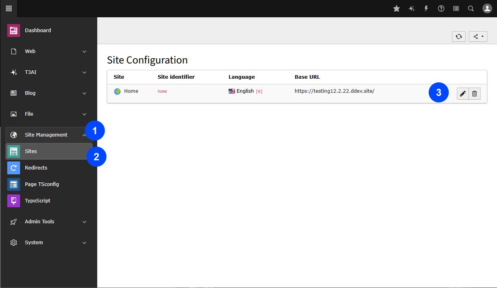

**Step 2** - Prevent bots for scraping your content with customizing required confugurqationns.

> Select type of files & Route Type i.e robots .txt
> Select type of bot to prevent from AI Content scraping.

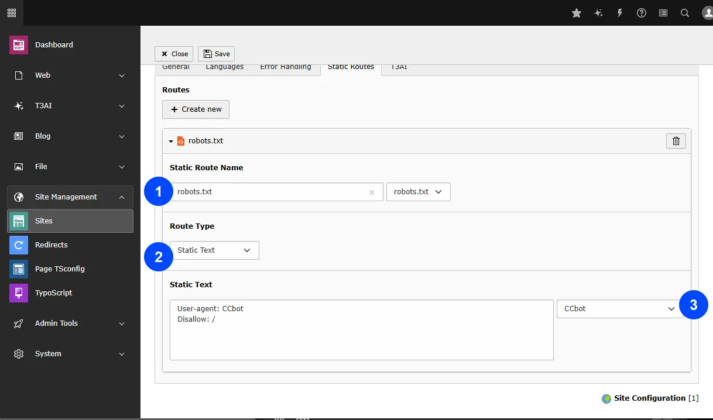

Then, click on ‘Generate AI Scraping File,’ and your web content will now be protected from AI bots.

## Auto-translate-prefix

Tagging for automatically translated pages is now supported with a new control option, allowing users to manage and apply tags easily, improving the organization of translated content on the website.

## User Permissions

You can grant editors or users access to specific features of T3ai using our custom permission settings.follow below steps to configure it.

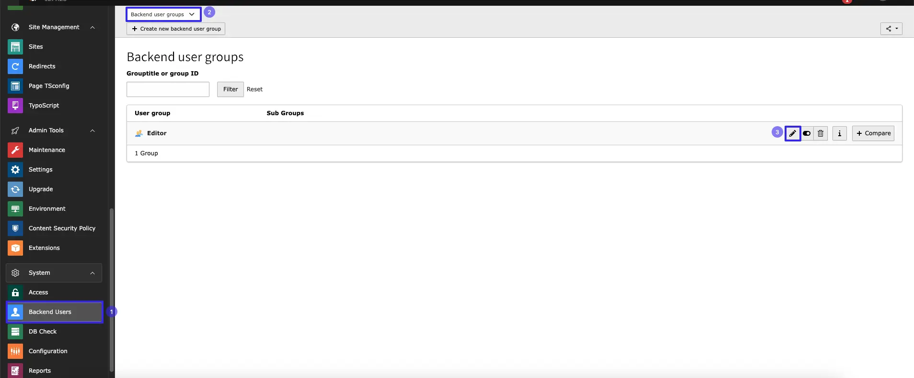

- **Step 1:** Navigate to the Backend Users module in the TYPO3 backend.
- **Step 2** Select the Backend User Group
- **Step 3** Edit the User group

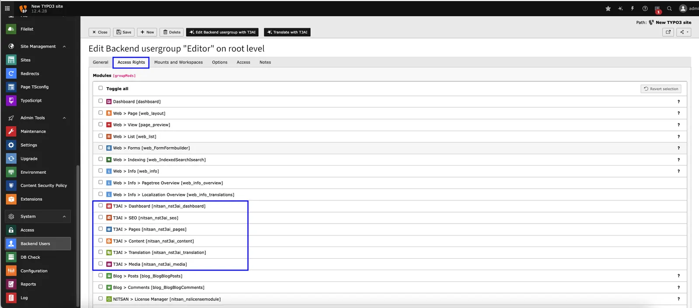

- **Step 4** Go to tab  **Access Rights**

You can enable or restrict access to specific modules for editor users.

To grant more granular control, you can also allow specific features within a particular module for editor users

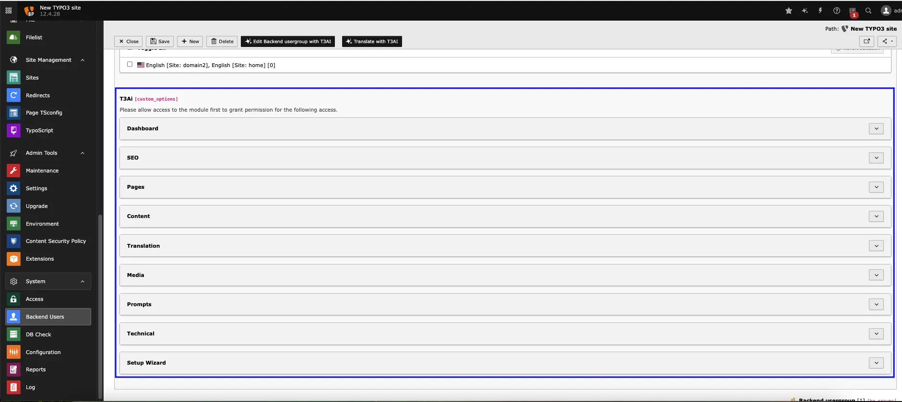

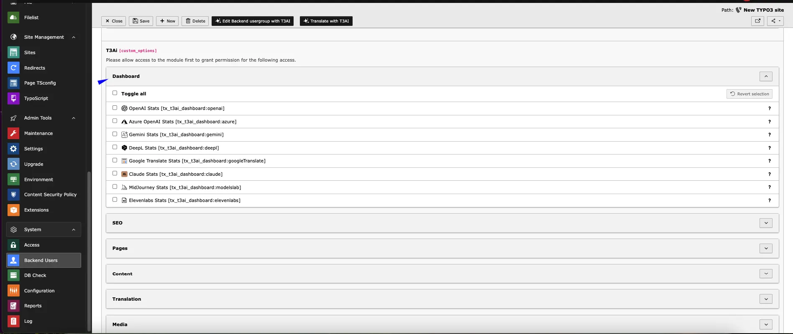

## Interactive demos

<iframe src="https://app.supademo.com/embed/cmrabnhz30bh0qmhx012m66o5?utm_source=link" loading="lazy" title="AI Co pilot" allow="clipboard-write" frameBorder="0" webkitallowfullscreen="true" mozallowfullscreen="true" allowfullscreen></iframe>

