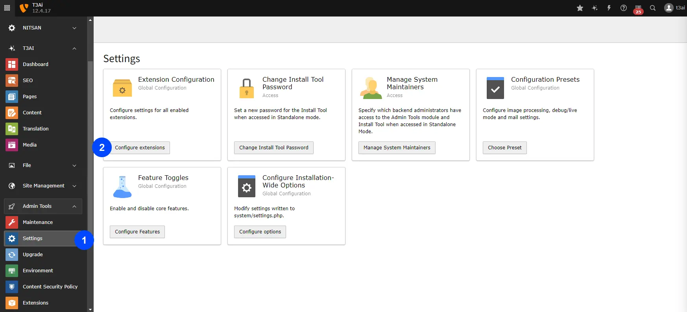
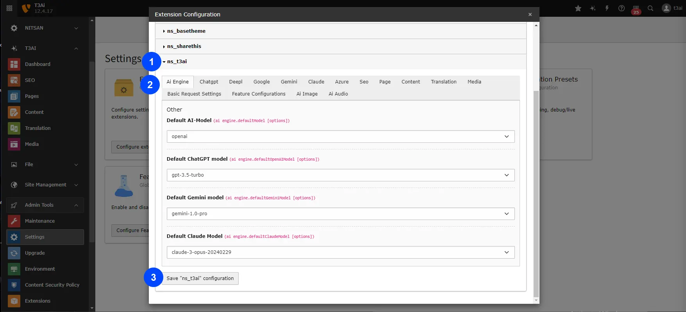

Before using the extensions, you need to configure them. Please follow the settings below to start your T3AI journey.

## Setup Default AI Model

<iframe src="https://app.supademo.com/embed/cmfqfbb6z0tt0130u29fwj54f?embed_v=2&utm_source=embed" loading="lazy" title="AI Co pilot" allow="clipboard-write" frameBorder="0" webkitallowfullscreen="true" mozallowfullscreen="true" allowfullscreen ></iframe>

To set up the API for your AI models, follow these steps:

- Go to Admin Tools > Settings > Click on "Configure extensions"
- Click on "AI Engine" and setup your default AI-Models
- Click "Save ns_t3ai configuration" button

## Configure APIs of AI Model

Next, set up API keys and other information for your desired AI model:

- Go to Admin Tools > Settings > Click on "Configure extensions"
- Click on your choosen AI Model e.g., ChatGPT
- Enter API keys and other informaiton of that AI model
- Click "Save ns_t3ai configuration" button

## API Key Generation Links for T3AI

Below are the links for generating API keys for various AI models used in T3AI. Please follow the respective links to create and obtain your API keys

- [ChatGPT](https://platform.openai.com/docs/api-reference/introduction)
- [Deepl](https://support.deepl.com/hc/en-us/articles/360020695820-API-Key-for-DeepL-s-API)
- [Google Translate](https://cloud.google.com/docs/authentication/api-keys)
- [Gemini](https://ai.google.dev/gemini-api/docs/api-key)
- [Claude](https://docs.anthropic.com/en/api/getting-started#accessing-the-api)
- [Azure](https://learn.microsoft.com/en-us/azure/search/search-security-api-keys)
- [Unsplash](https://help.unsplash.com/en/articles/2511245-unsplash-api-guidelines)
- [Openverse](https://api.openverse.org/v1/)
- [Pixabay](https://pixabay.com/api/docs/)
- [MidJourney](https://docs.midjourney.com/)
- [Stability AI](https://platform.stability.ai/docs/api-referenc)
- [ElevenLabs](https://elevenlabs.io/docs/api-reference/text-to-speech)

## Basic Auth Compatibility

<Note>

T3AI is now fully compatible with websites protected by Basic Authentication
(`.htaccess`).
You can seamlessly use all T3AI features even when the site requires
authentication credentials.

</Note>
